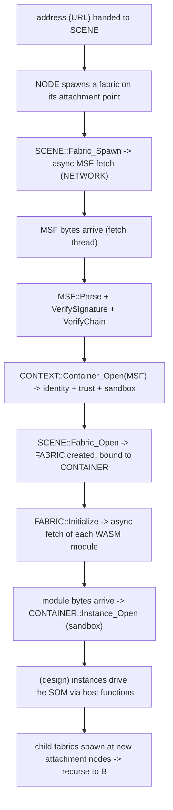

# Fabric Loading

This is the single most important flow in the engine: the path that turns an **address** into a **live, verified, sandboxed branch of the world.** It is the spatial equivalent of a web browser navigating to a URL — except that what arrives is signed code from a stranger, and the engine must verify it, give it an identity, sandbox it, and splice its output into a shared 3D scene already populated by other sources. This page traces that path end to end and names the objects involved at each step. The per-subsystem detail lives in [Scene](../systems/scene.md), [MSF](../systems/msf.md), [Network](../systems/network.md), [Container](../systems/container.md), and [WASM](../systems/wasm.md); here we connect them.

The whole flow is **asynchronous and event-driven.** Nothing blocks waiting for the network. Each stage starts a fetch and registers a callback; when the bytes arrive on a fetch thread, the callback advances to the next stage. Keep that in mind — the diagrams below are causal chains, not a single call stack.

---

## The stages at a glance

---

## Stage 1 — A node asks for a fabric

Loading begins when the scene is told to show an address. `SCENE::Initialize(sUrl)` builds the structural root of the scene — a root node and a **primary node** whose content payload carries `sUrl`. Constructing that node is what kicks the process off: a node whose map-object payload is a *fabric-attachment* type with a non-empty URL asks the scene to spawn a fabric on itself.

This is the recursive seam of the whole system. **Every** fabric attaches to a node, and **any** node can be an attachment point for a child fabric. The root is just the first one. Later, when a loaded fabric's own content contains attachment nodes, the same mechanism spawns *their* fabrics — which is how one source's space can embed another's.

---

## Stage 2 — Fetch the signed manifest

`SCENE::Fabric_Spawn(pNode_Attach, sUrl)` starts an **asynchronous fetch** of the fabric's manifest through the [`NETWORK`](../systems/network.md) singleton, reached via `CONTEXT::Network()` (which forwards to the engine). Fetches actually open against the owning container's `CACHE` handle onto that singleton, so the bytes are cached under the source's identity. The fetch is fire-and-forget with a listener: the scene hands the network a small file-local helper as the `IFILE` listener and returns immediately. The network dispatches the download on one of its background fetch threads (a `JOB_FETCH` on `CONTROL`'s 16-thread fetch pool), caches the bytes on disk, and — on completion — calls the listener back.

The manifest is an **MSF** file: signed JSON in JWS compact serialization. See [MSF](../systems/msf.md) for its shape.

---

## Stage 3 — Parse and verify

When the manifest arrives, the listener delegates to `SCENE::OnMsfReady(pNode_Attach, pFile)` (or `OnMsfFailed` if the fetch failed). This is where untrusted content becomes trusted-or-rejected:

1. Read the file's bytes.
2. Construct an `MSF` and `Parse(jws, url)` it — populating the payload, the embedded certificate chain, and the **fingerprint** (the SHA-256 of the leaf public key that serves as the publisher's stable identity).
3. `VerifySignature()` — confirm the signature matches the leaf certificate's key.
4. `VerifyChain()` — validate the certificate chain against the OS trust store and check expiry.

Parse is deliberately separate from verification: the engine can inspect a manifest's contents before deciding to trust it. The outcome of verification becomes a **trust level** in the next stage. The reasoning behind key-based identity and the trust ladder is in [Trust & Isolation](trust-and-isolation.md).

---

## Stage 4 — Open a container (identity, trust, sandbox)

With a parsed, verified manifest in hand, the scene asks the context for a **container**: `CONTEXT::Container_Open(pMsf)`. The context builds a **CID** (container identity) from the manifest — fingerprint, organization, organization hash, container name — plus the current persona's hash, and assigns a **trust level** derived from the verification results (untrusted if the signature is bad, unverified if the chain is untrusted, expired if the chain has expired, otherwise verified; the special root container used for the structural root is trusted as root).

Containers are **pooled by identity.** The context keys its container map by the CID's key string, so two fabrics published by the same organization share one container — and thus one sandbox, and one each of the `CACHE`, `SILO`, and `STREAM` handles onto the engine singletons. A new container is created only if no matching one exists; either way its reference count is incremented via `Open()`, and the first open is what actually opens those handles. This pooling is what makes "same publisher = same identity" hold across the scene. The **first MSF-bearing container a context opens is its primary**, and the context records that container's key as the anchor for the durable cache-clear record described in [Lifecycle](lifecycle.md#clearing-the-cache-and-logout).

---

## Stage 5 — Create and bind the fabric

`SCENE::Fabric_Open(pNode_Attach, pMsf, sUrl)` now constructs a `FABRIC`, assigns it a scene-global fabric index, registers it in the scene's fabric table, and **binds it to the container** opened in Stage 4. The fabric takes responsibility for the `MSF` (the scene deletes it when the fabric closes). Construction also attaches the fabric to `pNode_Attach`, mutating that node's child-fabric list.

Then `FABRIC::Initialize(sUrl)` runs, which begins Stage 6.

---

## Stage 6 — Fetch and instantiate the modules

A fabric's behavior is its **WASM modules**, listed in the manifest. `FABRIC::Initialize` starts an **asynchronous fetch for each declared module**, each carrying the module's **SRI integrity hash** so the network layer can verify the downloaded bytes against the hash the manifest promised. If the manifest declares no modules, the fabric simply completes.

As each module's bytes arrive (again on a fetch thread), `FABRIC::OnWasmReady` reads them and calls `CONTAINER::Instance_Open(twFabricIx, sUrl, sHash, bytes)`, which compiles and instantiates the module inside the container's sandbox (a per-identity WASM store). The fabric tracks how many module fetches are still pending and reports when the last one resolves. `OnWasmFailed` logs failures to the engine log and the container's console stream.

---

## Stage 7 — Modules drive the scene, recursively

In the full design, an instantiated module runs (init, then open against the fabric) and manipulates the SOM through **host functions** — creating nodes, setting their content, attaching child fabrics — the way page script manipulates the DOM. Nodes that are themselves attachment points spawn their own fabrics, returning to Stage 1 for each, so a single navigation can fan out into a tree of independently-signed, independently-sandboxed sources composited into one scene.

> The orchestration of module execution and the host-function surface that lets a module build the SOM are **partially implemented**. The fetch-verify-instantiate pipeline up to Stage 6 is built; the host functions that let a running module mutate the scene, and the full per-fabric instance run/open sequence, are active work. See the [WASM system](../systems/wasm.md) for exactly what is wired and what is stubbed.

---

## Threads crossing the flow

It is worth being explicit about which thread each stage runs on, because the scene's data structures are touched from several:

- **Stages 1, 5, 6 (the calling side)** run on whatever thread initiated the navigation — typically the engine control thread or a fetch thread that is continuing the cascade.
- **Stages 3 and 6 (the completion side)** run on **network fetch threads** — the MSF and WASM callbacks fire on a fetch worker, not the caller's thread, and they mutate the scene and the container.
- The scene serializes these mutations with a **recursive mutex** (a single source can cascade back into the scene's own locked methods during teardown). See [Threading](threading.md).

The practical consequence: scene mutation and scene *rendering* (the compositor walking the tree) are not yet fully synchronized, which is why navigating away while a load or a render is in flight is a known hazard. See [Current limitations](#current-limitations).

---

## Current limitations

- **Trust is forced for now.** Pending a real trusted signing certificate for test content, the container open path currently pins the trust level rather than acting on the verification result. The verification itself runs; the *decision* it feeds is temporarily overridden. This is a deliberate, clearly-marked stopgap, not the intended behavior.
- **Fetches are not cancellable mid-navigation.** A `Fabric_Spawn` MSF fetch is fire-and- forget; navigating away does not cancel outstanding manifest fetches (module fetches *are* cancelled when their fabric is destroyed).
- **Host-function-driven SOM construction is incomplete.** Stage 7 is the active frontier — modules are instantiated but the full surface for them to build the scene is still being wired.
- **Load and render are not synchronized.** Tearing down or rebuilding the scene while the compositor traverses it is unsafe today; coordinating the two is future work.

---

## See also

- [Scene system](../systems/scene.md) — the SOM, fabrics, nodes, and the spawn cascade in depth.
- [MSF system](../systems/msf.md) — manifest format, signing, and verification.
- [Container system](../systems/container.md) — identity pooling, sandboxing, and reference counting.
- [Network system](../systems/network.md) — the fetch/cache machinery behind every stage.
- [Trust & Isolation](trust-and-isolation.md) — what the trust levels mean and enforce.

---

[Home](../Home.md) · Prev: [Lifecycle](lifecycle.md) · Next: [Threading Model](threading.md)
