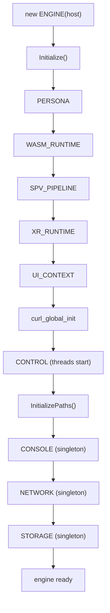
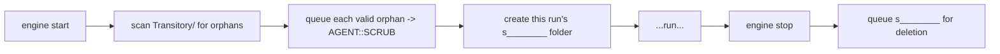

# Lifecycle

[Architecture Overview](overview.md) showed the ownership tree as a static picture. This page shows it in motion: how the tree is **built up** at startup, how **sessions** are opened and closed within it, how it is **torn down** at shutdown, and how the engine's **on-disk cache** is laid out so that transient session data can be cleaned up reliably — including after a crash. If you are embedding Sneeze, this is the page that tells you the order of operations you are signing up for.

One principle governs everything here, and it is worth stating before any detail: **initialization and shutdown are exact mirrors.** Whatever order the engine brings subsystems up in, it tears them down in the precise reverse. This *symmetry* is treated as non-negotiable in the codebase (see [Conventions](conventions.md)), because it is what makes failure handling and teardown predictable.

---

## Why it works this way

Two recurring patterns explain almost every lifecycle decision in the engine.

**Nested initialization, reverse-order shutdown.** Each subsystem is initialized *inside* the success of the previous one. If any step fails, only the subsystems that already came up are shut down, in reverse order — nothing half-initialized is ever touched. In code this appears as deeply nested `if (subsystem->Initialize())` blocks, and as destructors that `delete` members in the reverse of construction order. The benefit is that there is exactly one correct teardown path and the compiler/structure enforces it.

**Add before init, remove after shutdown.** When the engine manages a list of owned children (contexts, and lower down, fabrics and nodes), it adds the child to the list *before* calling `Initialize`, and removes it *after* teardown. The child must be visible to other threads during both its initialization and its destruction — for example, the compositor must be able to see a viewport while that viewport's renderer is being torn down, to service the thread-affinity handshake. This is a universal invariant.

---

## Engine startup

The host constructs an `ENGINE`, passing its `IENGINE` implementation, then calls `Initialize()`. Construction does almost nothing; `Initialize()` does the real work, and it can fail (returning `false`) — the host must check.

`Initialize()` reads configuration from the host (`sAppDataPath()` is required) and then brings up the engine-level subsystems in a fixed nested order:

1. **`PERSONA`** — the local identity proxy is created first (before the host-configuration check, so it always exists).
2. **`WASM_RUNTIME`** — the sandbox runtime.
3. **`SPV_PIPELINE`** — SPIR-V validation.
4. **`XR_RUNTIME`** — XR device access (initializes cleanly even with no headset present).
5. **`UI_CONTEXT`** — the UI toolkit.
6. **curl global init** — the HTTP stack (a true process-global, initialized once here).
7. **`CONTROL`** — the engine thread, agent pools, and metronome start spinning.
8. **Path initialization** — the on-disk cache layout is created (below), which is what supplies the cache root the network singleton needs.
9. **`CONSOLE`** — the engine's singleton developer console.
10. **`NETWORK`** — the engine's singleton resource loader and disk cache, initialized with the cache root from step 8.
11. **`STORAGE`** — the engine's singleton document store.

Steps 9–11 are the three disk-backed subsystems that are now **engine-owned singletons** (one per process, shared by every context — see [Architecture Overview](overview.md)); they come up after paths because they need the cache root, and after `CONTROL` because they post work to its fetch pool. Only if every step succeeds does `Initialize()` set its internal initialized flag and return `true`. Each failure logs a specific message and leaves the engine un-initialized, and the destructor will unwind only what was actually created.



---

## Sessions: opening and closing a context

With the engine running, the host opens a **context** to start a browsing session:

```cpp
CONTEXT* pContext = pEngine->Context_Open (pIContext, sUrl, kSession, bReset);
```

`Context_Open` takes the host's `ICONTEXT` (for inspector callbacks), an optional initial URL, a **session type**, and a **reset flag** (whether to clear this context's cache as it loads — see [Clearing the cache](#clearing-the-cache-and-logout)). It does four things, in order:

1. Creates a fresh **temporary folder** for the session (a viewport-scoped transitory directory — see [cache layout](#on-disk-cache-layout)).
2. Chooses the context's **permanent path** based on session type: a persistent session uses the engine's persistent cache root; a transitory session uses the engine's session folder, so nothing it stores outlives the run.
3. Constructs the `CONTEXT`, **adds it to the engine's context list** (add-before-init), then calls `CONTEXT::Initialize(sUrl)`.
4. On failure, removes the context from the list, deletes it, and queues its temporary folder for cleanup.

Inside `CONTEXT::Initialize`, the context brings up its two owned per-session subsystems in a nested order — **`SCENE` → `VIEWPORT`** — and the scene's `Initialize(sUrl)` is what begins loading the first fabric. The context does not create a console, network, or storage of its own: those are engine singletons, and `CONTEXT::Console()` / `Network()` / `Storage()` simply forward to the engine. Per-source handles onto those singletons (a `CACHE`, a `SILO`, a `STREAM`) are opened later and lazily, when the scene opens a [container](../systems/container.md) for a verified source. The order that remains matters: the scene comes up before the viewport (which renders it).

Closing is the mirror. `Context_Close` captures the session's temporary path, deletes the context (which runs the reverse-order subsystem teardown — viewport first, then scene), removes it from the list, and queues the temporary folder for cleanup. Deleting the context's `SCENE` triggers a cascade: the root fabric's nodes are recursively destroyed, each attachment node closes the fabric attached to it, and each fabric closes its container. A container's last close releases its handles in reverse of how they were opened — WASM store, then `SILO`, then `STREAM`, then `CACHE` — back to the engine singletons. Any containers still registered on the context are then deleted explicitly. The engine singletons themselves are untouched; only this session's handles onto them go away.

### Clearing the cache, and logout

Because the network cache is now a shared engine-wide singleton, "clear this context's cache" is no longer a blanket wipe. A context clears its cache with **`CONTEXT::Reset()`**, which stamps a durable per-primary-container timestamp in the network's `network_reset.json` record: every cached file the context relies on becomes stale and refetches, but the fact of the clear is recorded under the key of the context's *primary* fabric's container so it survives a reload. The `bReset` flag passed to `Context_Open` triggers exactly this stamp when the context's primary container opens. The full model is in the [Network system](../systems/network.md#clearing-the-cache). **`CONTEXT::Logout()` is a no-op** — a per-context logout that cleared the network would wipe the cache for every other context sharing the singleton, so it deliberately does nothing; `CONTEXT::Clear()` is reserved and currently unimplemented.

---

## Engine shutdown

Destroying the `ENGINE` reverses startup exactly:

1. Close every still-open context (the engine drains its context list).
2. Queue the engine's own session folder for cleanup.
3. Delete `STORAGE`, then `NETWORK`, then `CONSOLE` — reverse of the singleton init order.
4. Delete `CONTROL` (joins the engine thread and all agents).
5. curl global cleanup.
6. Delete `UI_CONTEXT`, `XR_RUNTIME`, `SPV_PIPELINE`, `WASM_RUNTIME` — reverse of init.
7. Delete `PERSONA`.

Each `delete` is paired with the `new` that created it, in mirror order. One ordering subtlety is load-bearing and called out in the code: `NETWORK` is deleted **before** `CONTROL`, even though `NETWORK` was created after it. `~NETWORK` must drain any fetch jobs still in flight, and those jobs run on `CONTROL`'s fetch agents — so the agents have to still be alive while the network winds down. The mirror order (`STORAGE`/`NETWORK`/`CONSOLE` before `CONTROL`) satisfies this automatically. Threads are joined (via `CONTROL`) before the members those threads might still touch are destroyed — see [Threading](threading.md) for why join-before-destroy is load-bearing.

---

## On-disk cache layout

The engine stores everything under the host-provided application-data path, in a `Sneeze/Cache` subtree split into two roots:

```text
<sAppDataPath>/Sneeze/Cache/
├── network_reset.json       engine-wide cache-clear record (see Network system)
├── Persistent/              data that survives across runs (persistent sessions)
└── Transitory/              session-scoped data, deleted when the session ends
    ├── s________            one per engine run   ("s" + 8 hex chars)
    └── v________            one per context      ("v" + 8 hex chars)
```

The `Cache` directory itself is the **cache root** passed to the network singleton at init; a single `network_reset.json` sits directly in it, holding the durable cache-clear timestamps for every context. It is one engine-wide file, never scattered per session or per container.

- A **persistent** session keeps its network cache and storage under `Persistent/`, so it is available next run.
- A **transitory** session keeps everything under the engine's per-run session folder (`s` + 8 hex), which is deleted on shutdown — the foundation of a private / "ephemeral" browsing mode.
- Each context also gets its own **temporary** folder (`v` + 8 hex) for genuinely short-lived data, deleted when the context closes.

**Crash-safe cleanup.** Transient folders are deleted by a background cleanup agent (`AGENT::SCRUB`), not inline. On startup, before creating the new run's session folder, the engine **scans the `Transitory/` root for orphans** — folders left behind by a previous run that crashed or was killed — and queues each for deletion. Every path is validated twice (its parent must be `Transitory`, and its leaf must match the `s`/`v` + 8-hex pattern) before anything is removed, so a bug or bad input can never point the scrubber at an arbitrary directory. All filesystem calls use error codes rather than exceptions, so a path failure degrades gracefully instead of crashing the engine.



---

## Current limitations

- **Re-navigation is host-driven, not a context method.** A `CONTEXT` has no `Url()` / `Reload()` re-point method; changing what a session shows means the host closes the context and opens a new one. Tearing a scene down while the compositor may be traversing it remains a hazard during active rendering, and in-flight fetches for a closing scene are not cancelled. Coordinating scene mutation with rendering is acknowledged future work.
- **`CONTEXT::Clear()` is reserved.** The context-scoped `Clear()` entry point exists but is unimplemented; the working cache-clear primitive is `Reset()` (above). `Logout()` is intentionally a no-op on the singleton network.
- **Teardown does not yet gracefully quiesce running modules.** Shutdown deletes stores (and thus instances) but does not first run the per-instance close/shutdown handshake that the full design calls for. See the [WASM system](../systems/wasm.md).

---

## See also

- [Architecture Overview](overview.md) — the ownership tree these lifecycles build.
- [Fabric Loading](fabric-loading.md) — what `SCENE::Initialize(sUrl)` sets in motion.
- [Threading Model](threading.md) — why threads are joined before members are destroyed.
- [Engine system](../systems/engine.md) and [Context system](../systems/context.md).
- [API: ENGINE](../api/sneeze/ENGINE.md), [API: CONTEXT](../api/context/CONTEXT.md).

---

[Home](../Home.md) · Prev: [Architecture Overview](overview.md) · Next: [Fabric Loading](fabric-loading.md)
