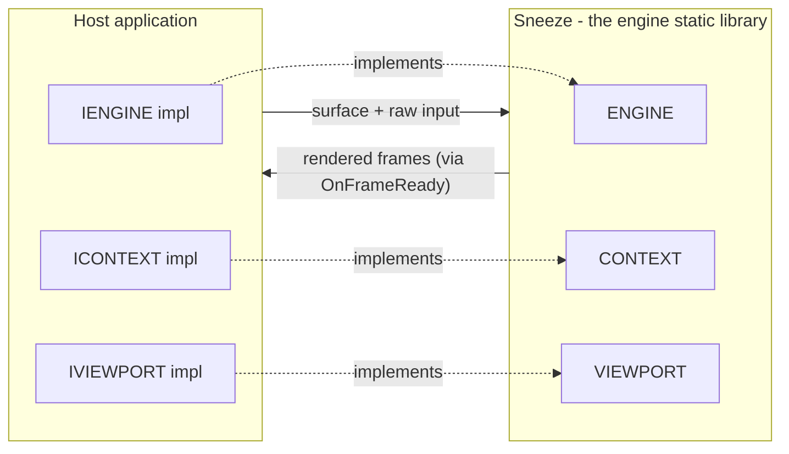
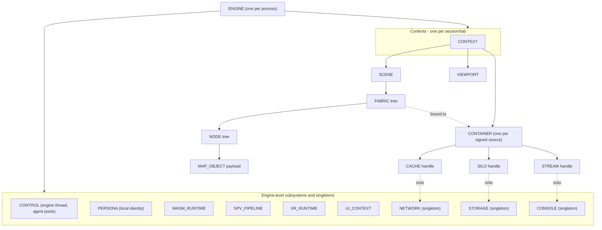

# Architecture Overview

This page is the map of the engine's interior. The [Overview](../overview/index.md) tier explained *what* a metaverse browser is and *why*; this tier explains *how Sneeze is put together*. We start here with the object graph — who owns whom — because almost every other architectural fact follows from ownership. Once you can see the ownership tree, the [lifecycle](lifecycle.md), [fabric loading](fabric-loading.md), [threading](threading.md), and [trust](trust-and-isolation.md) pages each zoom into one slice of it.

The guiding principle: **Sneeze is a tree of owned objects rooted at a single `ENGINE`, and the host talks to it through a thin set of interfaces.** Get the tree in your head and the rest is detail.

---

## The engine/application split

Sneeze builds as a **static library**. It is not a program. A **host application** links it in and supplies the two things the engine deliberately refuses to own: a **window** and **input devices**. The host hands the engine a surface to draw into and a stream of raw input deltas; the engine hands back rendered frames.

This split is enforced, not merely encouraged. The engine has no dependency on any windowing or input library. It never includes a window-system header. Everything that would tie it to one application — menus, tabs, an address bar, a particular OS — lives in the host. The seam between the two is three small **host interfaces** the application implements:

| Interface | The host implements it to… | The engine uses it to… |
|---|---|---|
| `IENGINE` | provide the data path and renderer name, and receive log output | read engine-level configuration and emit logs |
| `ICONTEXT` | receive inspector notifications for one session | report container / network / storage / console activity |
| `IVIEWPORT` | provide a window handle and surface size, and receive frames | obtain the draw surface and deliver finished frames |

All three are declared in `include/Sneeze.h`. The host creates concrete subclasses, passes them in, and the engine calls back through them. This is the entire surface between application and engine.

---

## The ownership tree

Everything in the engine hangs off one `ENGINE` instance. Ownership is strict: each object is owned by exactly one parent, constructed by it and destroyed by it, and reaches everything else by walking *up* to its owner and back down — never by caching pointers it could otherwise obtain. (That rule is a stated [coding convention](conventions.md): "one pointer of ownership, one path to everything else.")

### Engine level — shared across all sessions

The `ENGINE` directly owns the subsystems that are global to the process, created once at `Initialize()` and shared by every session:

- **`CONTROL`** — the engine thread, the agent pools, the metronome, and the job queues. All of the engine's worker threads live here. See [Threading](threading.md).
- **`PERSONA`** — the local identity proxy (the logged-in user).
- **`CONSOLE`**, **`NETWORK`**, and **`STORAGE`** — the three disk-backed subsystems, each an **engine-owned singleton** (one per process, shared by every context). `CONSOLE` is the developer console and log store; `NETWORK` is the resource loader and on-disk cache; `STORAGE` is persistent JSON document storage. They were per-context in an earlier design and are now singletons, so the disk cache and document store are engine-wide and deduplicated across contexts. See [Network](../systems/network.md), [Storage](../systems/storage.md), and [Console](../systems/console.md).
- The dependency-backed runtimes: **`WASM_RUNTIME`** (the sandbox), **`SPV_PIPELINE`** (shader validation), **`XR_RUNTIME`** (device access), and **`UI_CONTEXT`** (the UI toolkit). These are global because the libraries behind them initialize once per process.

The `ENGINE` also owns **path management** (the on-disk cache layout) and the **list of open contexts**.

### Context level — one independent session each

A **`CONTEXT`** is one browsing session — a tab. The engine can hold many at once, each fully isolated. A context does not own the disk-backed subsystems; those are engine singletons it reaches through the engine. A context owns two per-session subsystems, plus the containers for the sources it has connected to:

- **`SCENE`** — the scene object model (the world this session is showing).
- **`VIEWPORT`** — the camera and the framebuffer handoff to the host.
- **`CONTAINER`s** — one per signed source the session has connected to; each is that source's identity and sandbox.

`CONTEXT::Console()`, `Network()`, and `Storage()` are thin accessors that forward to the engine singletons, so the rest of the engine can keep asking a context for "its" console, network, or storage without knowing the objects are shared.

### Container level — per-source handles onto the singletons

Each **`CONTAINER`** opens, for the lifetime of its reference count, a small set of **handles** onto the engine singletons rather than owning any subsystem itself: a **`CACHE`** (the network file tier, reachable via `CONTAINER::Cache()`), a **`SILO`** (the storage handle, `CONTAINER::Silo()`), and a **`STREAM`** (the console handle, `CONTAINER::Stream()`), plus a per-identity WASM store. The singletons own the shared, deduplicated state (the on-disk cache, the document store, the entry log); a container's handles contribute only the per-source, per-request layer over it. This is what lets two contexts share one cached file while each still tracks its own view of it.

Because every per-session resource hangs off the context, closing a context tears down an entire world — scene, containers (and thus their cache, storage, and console handles), and viewport — without disturbing any other session or the engine singletons the handles were opened against.

### Scene level — the composed world

Within a context, the **`SCENE`** is the root of the SOM. It owns a tree of **`FABRIC`s** (one structural root fabric plus the sources attached into it); each fabric owns a tree of **`NODE`s**; each node points to a **`MAP_OBJECT`** payload. And every fabric is *bound to* a container, which is what gives that fabric's code an identity and a sandbox. The [Scene system](../systems/scene.md) is the deepest single subsystem in the engine.

---

## How a request becomes a frame

The ownership tree is static structure. The two flows that animate it are **loading** and **rendering**, and they run on different threads.

**Loading** turns an address into live content. The scene fetches a fabric's signed manifest over the network; the [MSF](../systems/msf.md) layer parses and verifies it; the context opens a container for the verified identity; a fabric is created, bound to that container, and asked to fetch its WASM modules; each module is instantiated in the sandbox and (in the full design) drives the SOM. This end-to-end path is the subject of [Fabric Loading](fabric-loading.md).

**Rendering** turns the current SOM into pixels. A compositor agent owned by `CONTROL` walks the scene each frame, submits it through ANARI, and delivers the result to the host via `IVIEWPORT::OnFrameReady` (or presents directly to a native surface). This is the subject of [Threading](threading.md) and the [Viewport system](../systems/viewport.md).

```mermaid
flowchart LR
  Url["address / URL"] --> Fetch["NETWORK fetch (MSF)"]
  Fetch --> Verify["MSF parse + verify"]
  Verify --> Container["CONTAINER opened for identity"]
  Container --> Fabric["FABRIC created + bound"]
  Fabric --> Modules["WASM modules fetched + instanced"]
  Modules --> SOM["SOM populated"]
  SOM --> Compositor["COMPOSITOR agent walks scene"]
  Compositor --> Anari["ANARI submit"]
  Anari --> Frame["frame to host (OnFrameReady)"]
```

---

## Two independent CMake trees

One architectural fact lives outside the C++ object graph but shapes the whole repository: **dependencies and the engine are two separate, independent CMake projects.** Third-party libraries (the renderer device, WASM runtime, SPIR-V tools, OpenXR, the UI toolkit, the crypto stack, and more) are built once into a dependency tree; Sneeze itself is a second tree that consumes the installed headers and libraries. There is no top-level build that spans both — build scripts are the only glue. This keeps the engine's own build fast and its dependency set explicit. The mechanics are summarized in [Building Sneeze](../guides/building.md).

---

## Reading order from here

- [Lifecycle](lifecycle.md) — how the tree is built up and torn down, and how sessions and cache paths work.
- [Fabric Loading](fabric-loading.md) — the full path from a URL to a live, verified scene.
- [Threading Model](threading.md) — the engine thread, agents, pools, and the compositor.
- [Trust & Isolation](trust-and-isolation.md) — signing, identity, sandboxing, access control.
- [Coding Conventions](conventions.md) — the rules the code holds itself to (and that this ownership discipline comes from).

---

## See also

- [Open Metaverse Browser Architecture](sneeze-architecture.md) — the full OMBI architectural specification (foundational concepts, MBE design, and enterprise use cases).
- [Core Concepts](../overview/core-concepts.md) — the same tree, defined as vocabulary.
- [Engine system](../systems/engine.md) and [Context system](../systems/context.md) — the two objects at the top of the tree, in depth.
- [API: ENGINE](../api/sneeze/index.md) — the exact entry-point surface.

---

[Home](../Home.md) · Prev: [The Standards Sneeze Builds On](../overview/standards.md) · Next: [Lifecycle](lifecycle.md)
