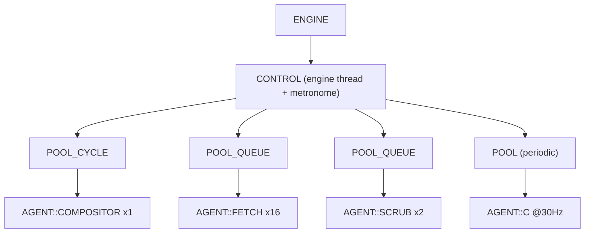

# Threading Model

A metaverse browser is inherently concurrent: it renders continuously while downloading dozens of resources, running sandboxed code, and cleaning up disk in the background. This page explains how Sneeze organizes that concurrency — the small set of building blocks (`THREAD`, `CONTROL`, `POOL`, `AGENT`) from which every worker thread is made, the **metronome** that paces periodic work, the **job queues** that distribute one-shot work, and two hard rules that keep shutdown from crashing. The class-by-class detail is in the [Control system](../systems/control.md); this is the model.

The shape to hold in mind: **one control thread runs a metronome and owns several pools; each pool owns a few agent threads; work reaches agents either by a periodic tick or by being posted to a queue.** Everything threaded in the engine is one of those pieces.

---

## Why a structured model instead of ad-hoc threads

Threads spawned ad hoc are where C++ engines go to crash: races on shutdown, threads outliving the objects they touch, and subtle deadlocks. Sneeze avoids this by funneling **all** worker threads through one base class and one owner. Every thread is a `THREAD` subclass with a uniform lifecycle; every worker is an `AGENT` owned by a `POOL` owned by `CONTROL`. Because there is exactly one creation path and one ownership chain, there is exactly one correct teardown order — and the code enforces it.

---

## THREAD — the uniform thread lifecycle

`THREAD` (declared in `sneeze/Engine.h`, implemented in `Thread.cpp`) is the base class for every managed thread. It encapsulates the raw primitives — the `std::thread`, a mutex, a condition variable, a shutdown flag, and a startup handshake — and exposes a small, strict interface:

- **`Initialize()`** spawns the thread (which runs the subclass's `Main()`), blocks until the thread signals `Ready()`, and returns the startup result.
- **`Wait(...)`** has two forms: a *predicate* form, `Wait(fn)`, that sleeps on the condition variable until the predicate returns true; and a *timed* form, `Wait(ms)`, that sleeps for a duration or until signalled.
- **`Signal(bool)`** wakes a waiting thread; the boolean optionally latches shutdown.
- **`Join()`** signals shutdown and joins the thread; it is idempotent.

There is a deliberate, documented contract here that future edits must respect: **`Wait` is not shutdown-aware.** Neither `Wait` form reads the shutdown flag — they are pure condition-variable primitives. Shutdown is observed by the *predicate* a subclass passes to `Wait`, or by the metronome loop, never baked into `Wait` itself. Concentrating shutdown logic in one place per thread (the predicate / the loop) rather than scattering it through the base class is intentional; the [Control system](../systems/control.md) page records this contract in full.

---

## CONTROL — the engine thread and pool owner

`CONTROL` is a `THREAD` subclass, owned directly by the `ENGINE`. Its `Main()` is the engine's heartbeat. On startup it builds the pools from a static factory table; then it runs the **metronome** until shutdown; then, on exit, it deletes the pools (which tears down their agents).

### The metronome

The metronome is a **drift-free, fixed-origin scheduler.** Each iteration:

1. If not shutting down, compute elapsed time from a fixed origin (never accumulated from per-tick deltas, which would drift), and `Tick` every pool — a pool with a non-zero rate decides, from the elapsed time, whether enough time has passed to signal its agents.
2. Otherwise, break the loop.
3. `Wait(1ms)` and repeat.

On Windows the metronome raises the system timer resolution to 1 ms for the duration so that the 1 ms waits are honored. The result, measured, is accurate periodic scheduling up to high rates.

---

## POOL, POOL_QUEUE, POOL_CYCLE — three ways to feed agents

A `POOL` owns a vector of agents and manages their lifecycle. There are three flavors, and the difference is *how work reaches the agents*:

- **`POOL`** (the base) — *rate-driven*. The metronome ticks it at a fixed rate; on each due tick it signals all its agents. Used for periodic work.
- **`POOL_QUEUE<JOB_PTR>`** — *queue-driven, consume-once*. Callers `Post()` a typed job; the pool appends it under a lock, claims the first idle agent, and signals it. An agent `Grab()`s a job, runs it, and the job is gone. Used for fetches and disk cleanup.
- **`POOL_CYCLE`** — *queue-driven, perpetual*. Jobs stay in the pool until explicitly removed. Used for the compositor, where each viewport's render job lives as long as the viewport is active.

---

## AGENT — the worker threads

`AGENT` is a `THREAD` subclass and the base for every worker. It holds a back-pointer to its `POOL` (and reaches the engine via `Pool()->...->Engine()`, never a cached pointer) and an index within the pool. Its `Main()` is pure virtual. The concrete agents:

| Agent | Pool kind | Count | Rate | Job |
|---|---|---|---|---|
| `AGENT::COMPOSITOR` | `POOL_CYCLE` | 1 | — | Render one viewport per `JOB_COMPOSITOR` |
| `AGENT::FETCH` | `POOL_QUEUE` | 16 | — | HTTP download a `JOB_FETCH` |
| `AGENT::SCRUB` | `POOL_QUEUE` | 2 | — | Delete a transitory folder (`JOB_SCRUB`) |
| `AGENT::C` | `POOL` | 1 | 30 Hz | Reserved/periodic placeholder |

Queue-driven agents loop on `Wait([this]{ return Job(); })`: wake, grab a job, process it, and return whether to stop. The single shutdown check lives in `Job()` — not duplicated in `Main()`.

---

## The compositor and Filament's single-thread rule

The rendering agent deserves special mention because it explains why its pool has exactly **one** agent. The renderer is backed by a graphics engine whose API is **not thread-safe**: every call for a given engine instance — create, destroy, and crucially `beginFrame` / `render` / `endFrame` — must come from **one** thread. Because all viewports share one renderer engine instance, all rendering across all viewports is serialized onto a single compositor agent. This was confirmed empirically: multiple compositor agents rendering concurrently crash inside the renderer; one agent is stable.

Each active viewport posts a perpetual `JOB_COMPOSITOR` to the `POOL_CYCLE`. The job is a small state machine — create → render → present → destroy — and the pool routes the create and destroy states to the designated agent (trivially, since there is only one). Activation posts the job; deactivation calls the job's `Cancel()`, which blocks the deactivating thread until the compositor thread has finished destroying the renderer. The [Viewport system](../systems/viewport.md) covers the state machine.

---

## Two rules that keep shutdown safe

These are the load-bearing invariants. Both come from hard-won crashes.

**1. Join before you destroy members.** C++ destroys a derived class's members *before* running the base-class destructor. If a thread's `Main()` touches derived members, the base `~THREAD()` joining the thread would be too late — `Main()` would race against already-destroyed members. Therefore **every `THREAD` subclass calls `Join()` as the first act of its own destructor**, before its members are torn down. `~THREAD()` also calls `Join()` as a safety net, but it is never the correct place for the real synchronization.

**2. Add before init, remove after shutdown.** A worker must be able to *see* the objects it services during both their startup and their teardown. The clearest case: the compositor must see a viewport while that viewport's renderer is being destroyed, to complete the thread-affinity handshake on the single render thread. So owned children are added to their lists before `Initialize` and removed only after teardown.

---

## Where locks live

Threading correctness is also a matter of which mutex guards which state. The engine uses fine-grained, per-subsystem locks rather than one global lock, and several are **recursive** because teardown legitimately re-enters the same locked methods on one thread (closing a fabric closes its nodes, which close child fabrics, …). Because `NETWORK`, `STORAGE`, and `CONSOLE` are now engine-wide singletons, their locks are held across work from *every* context, so the split into fine-grained locks matters more than ever. The notable ones:

- `SCENE` — one recursive mutex over the fabric and node registries (re-entrant teardown).
- `NETWORK` — **three independent recursive mutexes**, not one: one for the reset/staleness record and asset-index counter, one for the cache registry, one for the asset map. They guard unrelated state and are never needed together, so cache work and asset work no longer serialize against each other. A per-`CACHE` mutex guards one container's file list, a per-`ASSET` mutex guards one resource's shared state, and a per-`FILE` mutex plus a per-file **atomic guard flag** let file deletion be *deferred* out of a fetch-completion callback to avoid a deadlock. The cross-lock order is registry → cache → asset map → asset, with the reset lock taken last and never co-held with an asset lock. See [Network](../systems/network.md#threading-model).
- `STORAGE` / `UNIT` — recursive mutexes; a per-`SILO` handle is the per-container view, and one engine-wide `UNIT` per document path is shared and deduplicated across contexts.
- `CONSOLE` — a recursive mutex over all public methods, with a per-`STREAM` handle per container.
- `CONTEXT` — a recursive mutex over the container map.

Each subsystem page documents its own locking and pitfalls; the [API class pages](../api/index.md) carry a dedicated "Threading and pitfalls" section per class.

---

## Current limitations

- **Scene mutation versus rendering is unsynchronized.** The compositor traverses the SOM while fetch threads can mutate it; navigating or reloading mid-render is a known hazard (see [Fabric Loading](fabric-loading.md)).
- **Several placeholder agents are reserved but idle.** `AGENT::C` (and the broader factory table) exists for future periodic subsystems — an animator that walks the SOM at a fixed rate is the planned occupant — but is a no-op placeholder today.
- **The general-purpose `THREAD_POOL`** that the WASM runtime is meant to dispatch parallel work onto exists but is not yet wired up.

---

## See also

- [Control system](../systems/control.md) — the class-by-class detail and the full `Wait`/shutdown contract.
- [Viewport system](../systems/viewport.md) — the compositor state machine and framebuffer handoff.
- [Lifecycle](lifecycle.md) — startup/shutdown ordering and join-before-destroy in context.
- [Network system](../systems/network.md) — the fetch pool and the deferred-deletion guard.

---

[Home](../Home.md) · Prev: [Fabric Loading](fabric-loading.md) · Next: [Trust & Isolation](trust-and-isolation.md)
