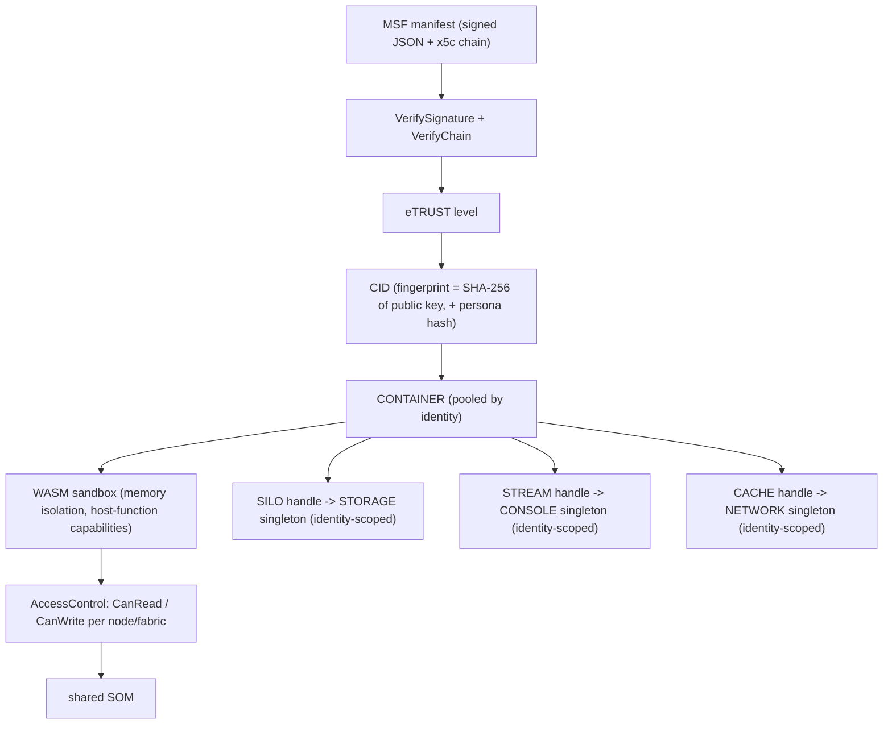

# Trust & Isolation

The defining hard problem of a metaverse browser is this: it runs **code from strangers**, from many strangers at once, composited into one shared space — and it must do so without letting any of them harm the user, the engine, or each other. A web browser solved the analogous problem for documents with two pillars: **trust without knowledge** (you can safely visit a site you have no relationship with) and **isolation** (one site cannot read or break another). Sneeze rebuilds both pillars for spatial content. This page explains how: how a source proves who it is, how much that proof is trusted, and how the engine keeps each source boxed in.

The two questions to keep separate: **"who is this?"** (identity and trust) and **"what may it touch?"** (isolation and access control). They are related but distinct, and the engine handles them in different layers.

---

## Why this is harder than the web

A web page is one origin in one sandbox; the browser keeps origins apart by putting each in its own box. The SOM inverts that: **many untrusted sources contribute objects to one shared 3D scene.** They are not in separate windows — they are interleaved in a single coordinate space the user stands inside. So isolation cannot simply be "one box per page." It has to be *per-source ownership of branches within a shared tree*, with access control enforced at the branch level. That is the architectural reason the engine has a dedicated identity object (the container) and a dedicated access-control layer, rather than relying on process or window isolation alone.

---

## Identity: who signed this?

Every fabric arrives as a signed manifest — an **MSF** file, which is JSON wrapped as a JWS (JSON Web Signature) with the publisher's full X.509 certificate chain embedded in the `x5c` header. The [MSF system](../systems/msf.md) covers the format; the trust-relevant points:

- **The publisher's identity is the hash of its public key.** Specifically, the engine computes `SHA-256` of the leaf certificate's `SubjectPublicKeyInfo` (SPKI) — the **fingerprint**. This is the durable identity of the organization behind the fabric.
- **Hashing the key, not the certificate, is deliberate.** Certificates expire and get re-issued; the key pair can stay the same across renewals. By identifying an organization by its key, the engine recognizes the same publisher before and after a certificate renewal. The fingerprint is also independently reproducible — the engine, the signing tool, and any third-party verifier compute the same value for the same key.

Verification is two explicit steps after parsing: `VerifySignature()` (the bytes were signed by the leaf certificate's key) and `VerifyChain()` (the certificate chain validates against the operating system's trust store, and has not expired). Parsing is separate from verifying so the engine can inspect a manifest before deciding to trust it.

---

## Trust: how much do we believe it?

Verification does not produce a yes/no — it produces a **trust level**. The `eTRUST` ladder (declared in `include/Container.h`) ranks a source from "actively distrusted" to "fully trusted":

| Level | Meaning |
|---|---|
| `kTRUST_NONE` | No trust established (initial / unset). |
| `kTRUST_UNTRUSTED` | Signature is invalid — the content was not signed by the key it claims. |
| `kTRUST_UNVERIFIED` | Signature valid, but the certificate chain does not validate against the trust store. |
| `kTRUST_EXPIRED` | Chain is otherwise trusted but a certificate has expired. |
| `kTRUST_VERIFIED` | Signature valid and chain trusted and current — a fully verified source. |
| `kTRUST_ROOT` | The engine's own structural root container (the scene's anchor), trusted implicitly. |

When the context opens a container for a verified manifest, it maps the verification results onto this ladder: a bad signature yields `UNTRUSTED`, an untrusted chain yields `UNVERIFIED`, an expired-but-otherwise-good chain yields `EXPIRED`, and full success yields `VERIFIED`. The structural root fabric the scene creates for itself uses a synthetic `ROOT` container.

The trust level is recorded on the container's identity and is available to the rest of the engine to gate behavior. Richer enforcement (e.g. refusing to run modules below a threshold, or visually marking untrusted content) builds on this primitive.

> **Current state.** The verification machinery is implemented and runs, but pending a real trusted signing certificate for test content, the container-open path currently pins the trust level (to `kTRUST_EXPIRED`) rather than acting on the computed result. This is a clearly-marked temporary stopgap; the ladder and the verification that feeds it are real.

---

## The container: one identity, one sandbox

The **container** is where identity becomes enforcement. It is the runtime envelope of one signed source: it carries the verified **CID** (fingerprint, organization, organization hash, container name, persona hash, trust level) and holds the per-source resources that must never leak between sources. It **owns** that source's **WASM store** (its module instances) directly, and it opens per-source **handles** onto the three engine-wide singletons — a **`CACHE`** onto the network, a **`SILO`** onto storage, and a **`STREAM`** onto the console. The singletons are shared across every context, but the handles, and the identity-keyed disk paths they resolve to, are the source's alone: one source can never read another's cached files, stored documents, or log stream, because each handle is scoped to a CID whose disk key is derived from the publisher's certificate fingerprint and the persona.

Two properties make the container the isolation boundary:

1. **Pooled by identity.** Containers are keyed by their CID, so all fabrics from the same organization share one container — one sandbox, one storage scope, one log stream — and fabrics from *different* organizations never do. "Same publisher = same box; different publisher = different box" is enforced structurally.
2. **Persona-scoped.** The CID includes a hash of the logged-in persona, so the same organization's data is partitioned per user on a shared machine. See [Persona](../systems/persona.md).

A fabric is *bound to* a container; the fabric is the source's branch of the scene, the container is the source's security identity. The [Container system](../systems/container.md) covers reference counting and lifecycle.

---

## Execution isolation: the WASM sandbox

A source's logic runs as **WebAssembly** inside its container's sandbox. WASM gives the engine the execution-isolation pillar:

- **Memory isolation** — each module instance has its own linear memory; it cannot read or write another source's memory, the engine's memory, or the file system.
- **Capability control** — a module can only affect the world through the engine's **host functions**, a deliberately small, controlled surface (create a node, read/write *its own* storage, log to *its own* console). It has no ambient authority.
- **Resource limits (planned)** — WASM's fuel metering (CPU budget) and memory caps are proven in the runtime's test suite but not yet wired into per-source store creation; they are the mechanism for bounding a misbehaving module's resource use.

The [WASM system](../systems/wasm.md) details the runtime, the per-identity stores, and the host-function surface (and what of it is wired today).

---

## Scene isolation: per-branch access control

Because all sources share one SOM, the engine needs rules for which source may read or modify which node. That is the job of the **access-control** layer (`AccessControl.h/.cpp` in the scene module). Its model:

- **Ownership by fabric.** Each node belongs to a fabric, which is bound to a container. A WASM module may freely modify nodes in *its own* fabric.
- **Private branches.** Nodes (and fabrics) can be marked **private**, which restricts their visibility across container boundaries — one source's private content is not exposed to another source's code.
- **Browser-internal bypass.** Operations originating from the engine itself (no owning container) bypass these checks — the engine is trusted; only content code is constrained.

The access-control functions (`CanRead` / `CanWrite` for nodes and fabrics) are the chokepoint the host functions consult before letting module code touch the scene. They are defined and ready; wiring every host function to call them is part of the in-progress host-function work.

---

## Putting it together

A source proves its identity by signing its manifest; the engine verifies that signature and chain and assigns a trust level; identity plus persona becomes a CID; the CID selects (or creates) a container that is the source's sole sandbox; the source's code runs inside that sandbox with no authority beyond a small host-function surface; and every touch that surface makes on the shared scene is gated by per-branch access control. **Trust without knowledge** comes from the signature-and-verification chain; **isolation** comes from the container-plus-sandbox-plus-access-control stack. Both pillars, rebuilt for a shared 3D world.

---

## Current limitations

- Trust level is temporarily pinned at container-open (above).
- WASM fuel/memory limits are proven but not yet applied per source.
- Host functions do not yet consistently call the access-control checks; the checks exist, the wiring is in progress.
- There is no UI surface yet for communicating trust level to the user — that is host/UI work built on the `eTRUST` primitive.

---

## See also

- [MSF system](../systems/msf.md) — signing, the `x5c` chain, and verification mechanics.
- [Container system](../systems/container.md) — the identity/sandbox object and its lifecycle.
- [WASM system](../systems/wasm.md) — execution isolation and host functions.
- [Fabric Loading](fabric-loading.md) — where verification and container-open sit in the flow.
- [API: MSF](../api/msf/MSF.md), [API: CONTAINER](../api/container/CONTAINER.md).

---

[Home](../Home.md) · Prev: [Threading Model](threading.md) · Next: [Coding Conventions](conventions.md)
