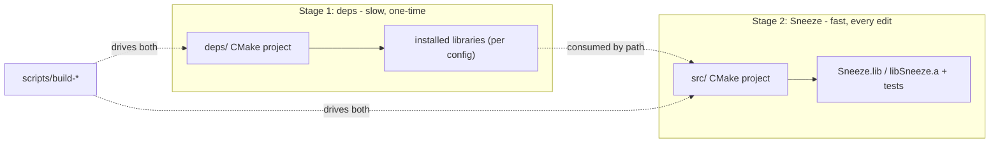

# Building Sneeze

This page is the short version of how Sneeze builds, oriented around the *mental model* so the commands make sense. The exhaustive, copy-pasteable instructions — every prerequisite, every platform, every flag, and a full troubleshooting table — live in the repository's [`README.md`](../../README.md). Read this to understand the shape of the build; go there to actually run it.

The one idea that explains everything: **Sneeze is built in two completely independent stages — dependencies, then the engine — and they never share a build tree.**

---

## Two trees, one wall between them

The repository has **two separate CMake projects** and, deliberately, no top-level project that spans them:

- **`deps/`** — builds every third-party library (the renderer device, the WASM runtime, SPIR-V tooling, OpenXR, the UI toolkit, the crypto stack, and more) from source into a per-configuration dependency tree. This is the slow stage: roughly one to two hours on a fresh machine, but it is a *one-time* cost — the results are stamp-cached and reused.
- **`src/`** — builds Sneeze itself: a single static library (`Sneeze.lib` / `libSneeze.a`) plus the test executables. This is the fast stage: seconds per edit. It consumes the installed dependency headers and libraries by path; it never reaches into `deps/`.

The build scripts in `scripts/` are the *only* glue between the two. Neither CMake project references the other. This separation is why your day-to-day rebuild is fast: it only ever touches the `src/` tree.



---

## One script per platform

A single script per platform drives both stages. By default it runs **only the fast stage** — compile and link Sneeze — which is what you want almost every time.

| You want to… | Windows (PowerShell) | Linux / macOS |
|---|---|---|
| Build Sneeze (the 99% command) | `.\scripts\build-windows.ps1` | `./scripts/build-linux.sh` |
| Build a Debug configuration | `.\scripts\build-windows.ps1 -Config Debug` | `./scripts/build-linux.sh --config Debug` |
| First-time setup (deps **and** Sneeze) | `.\scripts\build-windows.ps1 -All` | `./scripts/build-linux.sh --all` |
| Refresh dependencies only | `.\scripts\build-windows.ps1 -Deps` | `./scripts/build-linux.sh --deps` |
| Reconfigure Sneeze (after editing CMake) | `.\scripts\build-windows.ps1 -Fresh` | `./scripts/build-linux.sh --fresh` |
| Rebuild one dependency from scratch | `.\scripts\build-windows.ps1 -Only <dep> -Rebuild` | `./scripts/build-linux.sh --only <dep> --rebuild` |
| Move a dependency clone to its pinned tag | `.\scripts\build-windows.ps1 -Only <dep> -Sync` | `./scripts/build-linux.sh --only <dep> --sync` |
| List which dependencies are cached | `.\scripts\build-windows.ps1 -List` | `./scripts/build-linux.sh --list` |

`-Config` / `--config` selects Debug or Release (default Release). Debug and Release live in fully separate dependency trees, so you can keep both populated side by side. `-Rebuild` is a *modifier* that forces a from-scratch rebuild of whatever the other flags select; on its own it never touches `deps/`. `-Sync` is a second modifier for dependencies: a dependency's pinned `GIT_TAG` only governs its first clone, so after a tag bump an existing clone stays put — `-Sync` fetches and checks out the pinned tag before rebuilding (without it, a tag mismatch is a hard error rather than a silent stale build). `-Deps`, `-Fresh`, and `-All` are mutually exclusive; `-Rebuild` and `-Sync` compose with them.

> **First-time order on any platform: Release before Debug.** The Debug renderer build reuses a Release build-time tool; building Debug first will halt with an explanatory message. Running `-All` once (it defaults to Release) and then `-All -Config Debug` is the sequence that "just works."

---

## What you get

After a successful build:

- `builds/<platform>/install/<config>/lib/` — the static library (`Sneeze.lib` / `libSneeze.a`) you link against.
- `builds/<platform>/install/<config>/bin/` — the test executables and command-line tools.

`<platform>` is a slug like `windows-x64`, `linux-x64`, or `macos-arm64`; `<config>` is `debug` or `release`. On Windows the `src/` stage is a single multi-config Visual Studio solution — open `builds/windows-x64/build/Sneeze.sln` once and the Debug/Release dropdown flips configurations without reconfiguring. For daily editing, the IDE (or your editor with Ninja Multi-Config on Linux/macOS) is faster than re-invoking the script; the scripts exist for fresh checkouts, CMake changes, cross-platform builds, and CI.

---

## Running the tests

Every subsystem's tests are compiled into a **single executable, `SneezeTest`**, that lands in the `bin/` directory alongside the tools. Run it with no arguments to execute every suite, or pass one or more suite flags to run just those. `--help` (or `-h`) prints the list.

```powershell
# Windows (Release)
builds\windows-x64\install\release\bin\SneezeTest.exe            # all suites
builds\windows-x64\install\release\bin\SneezeTest.exe --network  # one suite
builds\windows-x64\install\release\bin\SneezeTest.exe --help     # list suites
```

```bash
# Linux / macOS (Release)
builds/linux-x64/install/release/bin/SneezeTest            # all suites
builds/linux-x64/install/release/bin/SneezeTest --storage  # one suite
builds/linux-x64/install/release/bin/SneezeTest --help     # list suites
```

The suite flags are `--wasm`, `--spv`, `--xr`, `--net`, `--ui`, `--compute`, `--vox`, `--jws`, `--network`, `--storage`, `--console`, and `--gltf` (the `--wasm` and `--xr` suites are present only when those optional features are built). `SneezeTest` prints a per-suite pass/fail line and returns a non-zero exit code if any selected suite fails. A few suites depend on the environment rather than the engine: `--net` makes live HTTP requests (expected to fail with no internet), `--xr` reports no active runtime on a machine without a headset, and `--compute` falls back to a CPU path when no supported GPU is present — all handled gracefully.

---

## Consuming Sneeze from an application

A host application links Sneeze as a static library. The expected integration is via CMake `add_subdirectory` on the `src/` project: when the application links the `Sneeze` target, all of Sneeze's dependencies are pulled in transitively (they are declared `PUBLIC`), so the application does not configure them itself. The application supplies its own windowing/input library (Sneeze owns none) and includes the engine's public headers from `include/`. See [Embedding Sneeze](embedding-sneeze.md) for the code side of that integration.

---

## When something breaks

The README carries the full troubleshooting table — missing tools, PATH issues, the Windows MSVC-environment requirement, the Release-before-Debug rule, and the configuration-mismatch link error. Start there. The most common first-time snags are a missing build prerequisite (the README lists each and how to install it) and running the Windows script outside a "Developer PowerShell for VS 2022" window.

---

## See also

- [`README.md`](../../README.md) — the complete, authoritative build instructions.
- [Embedding Sneeze](embedding-sneeze.md) — how to use the library once built.
- [Contributing](contributing.md) — repository layout and adding a subsystem or dependency.
- [Architecture Overview](../architecture/overview.md) — the two-tree model in context.

---

[Home](../Home.md) · Prev: [Embedding Sneeze](embedding-sneeze.md) · Next: [Contributing](contributing.md)
