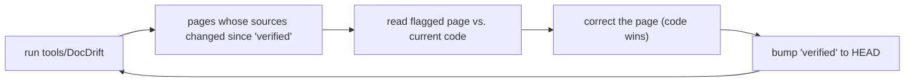

# Contributing

This page is for people changing Sneeze — its code or its documentation. It covers the repository layout you will navigate, the pattern for adding a subsystem, and — at length, because it is unusual and important — **how this wiki is kept synchronized with the code**. Read [Coding Conventions](../architecture/conventions.md) first; the style and design rules there are assumed throughout.

---

## Repository layout

The repository separates public interface, private implementation, dependencies, and the engine's own build, with no top-level CMake project spanning deps and source:

```text
Sneeze/
├── include/        Public API headers — the entire surface a host depends on
├── src/            Private implementation
│   ├── sneeze/         Engine core + engine-wide singletons
│   │   ├── control/        Engine thread, agent pools (CONTROL, AGENT, POOL)
│   │   ├── console/        CONSOLE, STREAM, BLOCK, ENTRY
│   │   ├── network/        NETWORK, CACHE, ASSET, FILE
│   │   └── storage/        STORAGE, SILO, UNIT
│   ├── context/        Per-context subsystems
│   │   ├── scene/          SCENE, FABRIC, NODE, MAP_OBJECT
│   │   ├── viewport/        VIEWPORT, the ANARI renderer
│   │   └── msf/            MSF signing/verification
│   ├── persona/        PERSONA (local identity)
│   └── deps/           Thin wrappers over third-party runtimes (wasm, spirv, compute, xr, ui, gltf, stb)
├── tests/          One test suite per subsystem, all built into a single SneezeTest executable
├── tools/          Standalone utilities (signing CLI, viewers, the docs drift detector)
├── deps/           The dependency CMake project (one ExternalProject per library)
├── scripts/        The build drivers — the only glue between deps and src
└── docs/           This wiki
```

Two rules of thumb: **public headers live in `include/`, everything else under `src/` is private**; and **`include/` declares, `.cpp` implements** — there is no executable code in headers. The larger subsystems use the pimpl idiom, so a public class is a thin handle over a private `Impl`. The layout also mirrors ownership: subsystems under `src/sneeze/` are engine-wide singletons owned by `ENGINE` (the developer console, the network stack, and storage), while those under `src/context/` are per-context and owned by a `CONTEXT`.

---

## Adding a subsystem

A subsystem is either **engine-wide** (one instance per engine, shared by every context — the templates are `NETWORK`, `STORAGE`, `CONSOLE`) or **per-context** (one instance per session — the templates are `SCENE` and `VIEWPORT`). The shape is the same; only the owner differs:

1. **Declare the public class** in a new `include/<Name>.h`, pimpl style — a public class holding a single `Impl*`, with `Initialize()` and accessors that follow the [naming conventions](../architecture/conventions.md). Add the include to `Sneeze.h` if it is part of the umbrella header.
2. **Implement it** under `src/sneeze/<name>/` for an engine-wide subsystem, or `src/context/<name>/` for a per-context one, with the `Impl` class carrying all state and the subsystem's own mutex. Respect symmetry: whatever `Initialize` brings up, the destructor tears down in reverse.
3. **Own it from the right parent.** An engine-wide subsystem is constructed with an `ENGINE*` and slotted into the nested-init order in `ENGINE::Impl::Initialize` (with `CONTEXT` forwarding to it — as `CONTEXT::Network()`/`Storage()`/`Console()` do); a per-context subsystem is constructed with a `CONTEXT*` and slotted into `CONTEXT::Impl::Initialize`. Put its destruction into the reverse-order teardown either way, and remember *add before init, remove after shutdown* for anything list-managed.
4. **Add a test suite** under `tests/`, register its entry point in `tests/TestRunner.cpp`, and add its `.cpp` to `tests/CMakeLists.txt` — every suite links into the one `SneezeTest` executable and gets a `--<name>` selection flag.
5. **Document it** — a [Systems](../systems/index.md) page and, if it has a public header, an [API](../api/index.md) folder. See the documentation workflow below.

Adding a *dependency* (a new third-party library) is a separate, build-system task; the [`README.md`](../../README.md) section "Adding a new dependency" is the authority.

---

## How the documentation is maintained

This wiki is large, and the code it documents moves. Keeping the two synchronized is a deliberate, repeatable process — and one worth being candid about: **these pages are written and kept current primarily by AI coding agents** working directly from the source tree, following [STYLE.md](../STYLE.md). The conventions below exist so that an agent (or a human) picking up the task months from now behaves the same way the last one did. The whole approach is ordinary "docs as code": the documentation lives in the repository beside the code, is reviewed like code, and is checked against the code mechanically.

### The source of truth is the code

The first and most important rule: **the code is the single source of truth.** Facts come from `include/*.h` and the current `src/` implementation. The terse `src/**/*.md` reference notes, any external architecture document, and any project knowledge base are *unverified hints* — they may be stale or misleading. When a hint and the code disagree, the code is right. Every page is written by reading the code, not by paraphrasing other docs.

### Every page declares what it documents

Each page begins with YAML front matter, and two fields make the doc-to-code dependency explicit and checkable:

```yaml
sources:
  - include/Scene.h
  - src/context/scene/Scene.cpp
verified: 92fdc1c
```

- **`sources`** — the repo-relative code files the page documents. List every file whose behavior the page describes.
- **`verified`** — the commit SHA the page was last checked against. When you write or re-verify a page, set this to the current `HEAD`.

These two fields are the durable link between a page and the code behind it. The full schema is in [STYLE.md](../STYLE.md).

### The drift loop

Documentation rots when code moves and nobody remembers which page depended on it. The `sources`/`verified` fields turn that into a mechanical check. The loop, run whenever you want to confirm the wiki is current:

1. **Run the drift detector** (`tools/DocDrift/`). For each page it asks, in effect, *"have any of this page's `sources` changed since its `verified` SHA?"* — it runs `git log <verified>..HEAD -- <sources>` per page and reports every page whose sources moved. It is read-only: it never edits docs, it only tells you where to look.
2. **Open each flagged page** and compare it against the current code. The code wins on every conflict.
3. **Fix the drift**, then **bump `verified`** on that page to the current `HEAD`.



The detector is intended to run in CI as a **warn-only** check — it surfaces drift on a pull request without blocking the merge, so documentation maintenance is a visible, low-friction follow-up rather than a gate.

### Known limitation

The `sources` list is hand-maintained, so the detector catches changes to files you *listed* but not coverage you *forgot* to list. When you add a new source file to a subsystem, add it to the relevant page's `sources`. This is the one piece of judgment the mechanism cannot automate.

### Is this a normal way to maintain docs?

Yes. "Docs as code" — documentation versioned beside the code, reviewed in the same pull requests, and validated by CI — is standard practice. The specific twist here is the explicit `sources`/`verified` front matter and a detector that keys off git history, which makes drift *detectable* rather than relying on someone remembering. That, plus stating plainly that agents are the primary maintainers, is what is tailored to this project.

### Writing a new page

When you add or substantially edit a page, follow [STYLE.md](../STYLE.md): the five tiers, the page template (orientation → why → concepts → detail → examples → see also → nav), the front matter schema, prose over bullet dumps, terms defined on first use, and the rule that the wiki never names a specific browser product or any application that embeds Sneeze. The existing [Scene system](../systems/scene.md) page and the [`api/scene/`](../api/scene/index.md) class pages are the worked exemplars to match.

---

## See also

- [Coding Conventions](../architecture/conventions.md) — the code style and design principles.
- [STYLE.md](../STYLE.md) — the documentation authoring contract.
- [Building Sneeze](building.md) — the two-tree build and how to add a dependency.
- [`README.md`](../../README.md) — full build and dependency-management detail.

---

[Home](../Home.md) · Prev: [Building Sneeze](building.md)
