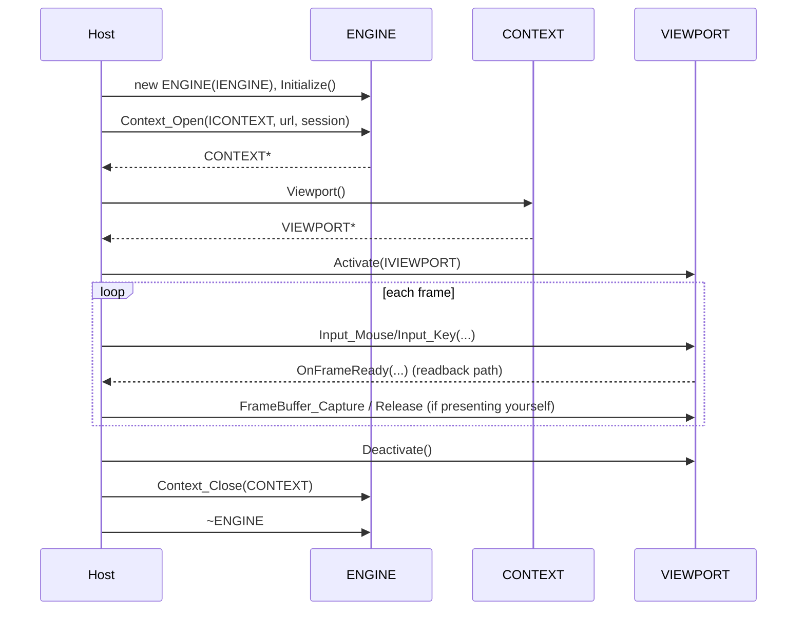

# Embedding Sneeze

This guide is for integrators: you have an application — a window, an event loop, a way to put pixels on screen — and you want it to render and run metaverse content. Sneeze is the engine that does that; your application is the **host**. This page walks through the minimum a host must do: implement three small interfaces, create the engine, open a session, drive frames, and present them. It assumes you have read [Architecture Overview](../architecture/overview.md) so the engine/host split is familiar.

The contract in one sentence: **you give the engine a data path, a window surface, and a stream of raw input; the engine gives you back rendered frames.** Everything below is the shape of that exchange. Exact signatures are in the [API tier](../api/index.md); this is the orchestration.

---

## The three interfaces you implement

Sneeze talks to your application through three abstract interfaces declared in `include/Sneeze.h`. You subclass each and pass instances to the engine.

### `IENGINE` — engine-level configuration and logging

The engine reads its configuration from this object and sends all log output to it. You must provide at least:

- `sAppDataPath()` — an absolute directory the engine may use for its on-disk cache (required; the engine creates `Sneeze/Cache/...` beneath it).
- `sRenderer()` — the name of the ANARI rendering device to load.
- `Log(level, module, message)` — receives the engine's log lines.

```cpp
class MyEngineHost : public SNEEZE::IENGINE
{
public:
   const std::string& sAppDataPath () const& override { return m_sAppData; }
   const std::string& sRenderer    () const& override { return m_sRenderer; }

   void Log (eLOGLEVEL level, const std::string& sModule, const std::string& sMessage) override
   {
      // route to your logging system
   }
private:
   std::string m_sAppData  = "/path/to/appdata";
   std::string m_sRenderer = "halogen";
};
```

### `ICONTEXT` — per-session inspector notifications

This is how the engine tells your application about activity inside one session: containers appearing and disappearing, network caches and files, storage silos and units, and console entries. The network, storage, and console subsystems are engine-wide singletons (see [What you do not have to do](#what-you-do-not-have-to-do)), but their notifications are still delivered per-context through the `ICONTEXT` you passed to `Context_Open`, so an inspector only sees the activity belonging to its own session. **Every method has a default no-op**, so you only override the ones you care about — a minimal host can pass an instance that overrides nothing. These callbacks are what a developer-tools/inspector UI would consume.

```cpp
class MyContextHost : public SNEEZE::ICONTEXT
{
public:
   void OnContainerCreated    (SNEEZE::CONTAINER* p) override { /* update inspector */ }
   void OnNetworkCacheCreated (SNEEZE::CACHE* p) override { /* a container opened its cache */ }
   bool OnNetworkFileCreated  (SNEEZE::FILE* p) override { return true; }   // return true to track it
   void OnConsoleEntryCreated (std::shared_ptr<const SNEEZE::ENTRY> e) override { /* show log line */ }
   // ...override only what you need
};
```

### `IVIEWPORT` — the rendering surface

This is the seam where pixels happen. The engine calls it to learn about your window and to deliver frames. All three methods are required:

- `FrameWindow()` — returns your native window handle (the engine may render directly to a native surface).
- `FrameSize(w, h)` — reports the current surface dimensions.
- `OnFrameReady(pixels, w, h)` — called when a frame has been rendered into a CPU framebuffer for you to present (used on the readback path; skipped when the engine renders straight to your native surface).

```cpp
class MyViewportHost : public SNEEZE::IVIEWPORT
{
public:
   void* FrameWindow () override { return m_hWnd; }
   bool  FrameSize (int& w, int& h) override { w = m_w; h = m_h; return true; }
   void  OnFrameReady (const uint32_t* pFB, int w, int h) override
   {
      // blit pFB (w x h RGBA) to your window
   }
private:
   void* m_hWnd; int m_w, m_h;
};
```

---

## The lifecycle, end to end



### 1. Create and initialize the engine

```cpp
MyEngineHost host;
SNEEZE::ENGINE engine (&host);
if (!engine.Initialize ())
   return; // initialization failed — check the log
```

`Initialize()` brings up every engine-level subsystem and the worker threads (see [Lifecycle](../architecture/lifecycle.md)). Always check its return value.

### 2. (Optional) log in a persona

```cpp
engine.Login ("Ada", "Lovelace");   // scopes storage/sandbox to this user
```

A persona scopes the session's storage and sandbox state to a user. It is a local stub today (see [Persona](../systems/persona.md)); for a single-user host you can skip it.

### 3. Open a context (a session)

```cpp
MyContextHost ctxHost;
SNEEZE::CONTEXT* pContext =
   engine.Context_Open (&ctxHost, "https://example/space.msf",
                        SNEEZE::CONTEXT::kSESSION_PERSISTENT);
```

This creates the session and begins loading the fabric at the given address. Choose `kSESSION_TRANSITORY` for a private/ephemeral session whose data is deleted when it closes.

### 4. Activate the viewport

The context owns a viewport. Hand it your `IVIEWPORT` to start rendering:

```cpp
MyViewportHost vpHost;
SNEEZE::VIEWPORT* pViewport = pContext->Viewport ();
pViewport->Resize (width, height);
pViewport->Activate (&vpHost);
```

`Activate` posts a render job to the compositor; from here the engine renders on its own thread and calls your `IVIEWPORT` back. A context whose viewport is never activated is a valid **headless** session (e.g. a background tab).

### 5. Feed input every frame

Your event loop forwards raw input to the viewport. The engine accumulates it and the compositor consumes it:

```cpp
pViewport->Input_Mouse (dx, dy, scrollY, bLeftDown, bRightDown);
pViewport->Input_Key   (bSpace, bPlus, bMinus);
```

The engine drives rendering itself — you do **not** call a "render" function. You only supply input and present frames.

### 6. Present frames

Two paths, depending on how the renderer is configured:

- **Native surface** — the engine presents directly to the window handle you returned from `FrameWindow()`. You do nothing per frame.
- **Readback** — the engine calls `OnFrameReady(pixels, w, h)`; or you pull the latest frame yourself with `FrameBuffer_Capture(w, h)` (which locks), present it, then `FrameBuffer_Release()`.

### 7. Clear the cache and reload (optional)

A context binds to its address when it is created; there is no in-place "navigate" call on `CONTEXT`. To send a session somewhere new, close it and open a fresh one at the new address (step 8, then step 3). Two operations *are* exposed on the live context:

```cpp
pContext->Reset ();   // clear this context's cache, so it refetches as it runs
```

`Reset()` records a durable cache-clear keyed to the context's primary fabric — every cached file the context relies on becomes stale and refetches on next access (see [Network](../systems/network.md) for why the clear is scoped this way). To open a context that starts from a clean cache, pass `bReset = true` as the fourth argument to `Context_Open`.

### 8. Tear down — in reverse

```cpp
pViewport->Deactivate ();          // blocks until the renderer is torn down safely
engine.Context_Close (pContext);   // closes the session and frees its world
// ~ENGINE on scope exit closes anything still open and joins all threads
```

Teardown mirrors setup exactly (see [Lifecycle](../architecture/lifecycle.md)). Deleting the engine is safe even if you forgot to close a context — it drains them — but closing explicitly is the intended path.

---

## What you do not have to do

Worth stating, because it is the point of the engine/host split:

- You do not implement rendering, scene management, networking, sandboxing, or storage — the engine owns all of it. Networking, storage, and the developer console are engine-wide singletons shared across every context, and content is fetched internally: a container opens a [`CACHE`](../api/network/CACHE.md) and files are loaded through it, so you never issue a fetch yourself.
- You do not manage worker threads — the engine owns its own.
- You do not parse, verify, or trust content — the engine does, and reports identity and trust to you through `ICONTEXT` / the [Container API](../api/container/index.md).
- You do not depend on any of the engine's third-party libraries directly — you link the Sneeze static library and include its `include/` headers.

---

## See also

- [API: ENGINE](../api/sneeze/ENGINE.md), [IENGINE](../api/sneeze/IENGINE.md), [ICONTEXT](../api/sneeze/ICONTEXT.md), [IVIEWPORT](../api/sneeze/IVIEWPORT.md).
- [API: CONTEXT](../api/context/CONTEXT.md), [VIEWPORT](../api/viewport/VIEWPORT.md).
- [Lifecycle](../architecture/lifecycle.md) — the ordering you are participating in.
- [Building Sneeze](building.md) — how to compile the library you are linking.

---

[Home](../Home.md) · Prev: [Guides](index.md) · Next: [Building Sneeze](building.md)
