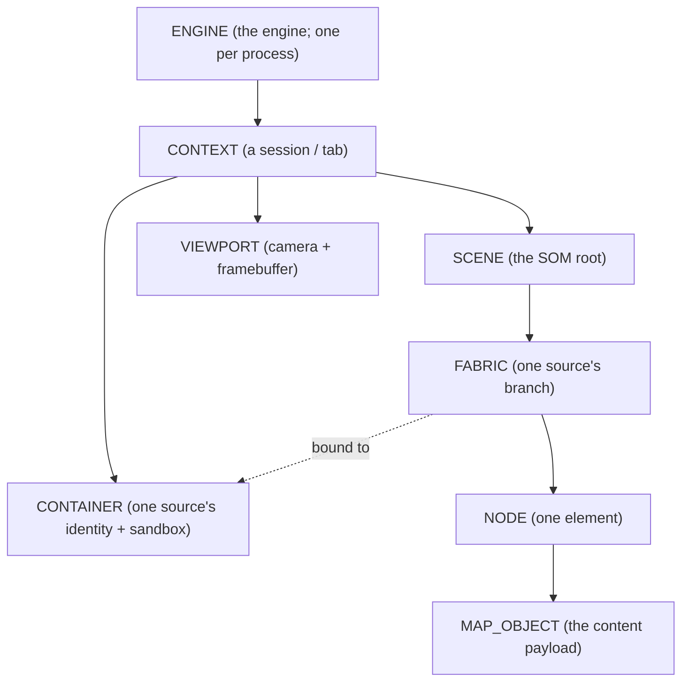

# Core Concepts

This page defines the vocabulary the rest of the wiki uses. [What is the Open Metaverse Browser?](what-is-omb.md) introduced these terms informally to sketch the shape of the system; here each one is defined properly, in the order that builds on the previous. Read it once, top to bottom, and the Architecture and Systems tiers will read smoothly. None of this requires reading code — these are the ideas the code implements.

The single sentence to keep in mind: **a metaverse browser fetches signed descriptions of spaces, runs their untrusted code in sandboxes, and composites the results of many independent sources into one 3D world that the user stands inside.** Every term below is part of that sentence.

---

## The engine and the host

**Sneeze** is the engine — the reusable core that does the work: fetching, verifying, sandboxing, scene-building, and rendering. It is a static library, not a program you run on its own.

A **host application** (also "the host" or "the embedder") is whatever program links Sneeze into itself. The host owns the operating-system window and the input devices, hands Sneeze a drawing surface and a stream of raw input, and presents the frames Sneeze produces. Throughout this wiki the host is always generic — Sneeze is designed so that a desktop browser, a headset shell, a kiosk, or an embedded device could each be the host without the engine knowing the difference.

The relationship is exactly that of a web-browser engine (Blink, Gecko) to the browser application around it. The engine is neutral; the application supplies the chrome.

---

## Spatial fabric

A **spatial fabric** (often just "fabric") is one source's contribution to a space — the spatial equivalent of a website. It is the unit you connect to. A fabric is not a finished 3D model; it is described by a small **signed manifest file** that the engine fetches first. That manifest names the services the fabric is composed of and points to the code modules that implement them.

Several fabrics are live at once. The engine maintains connections to many independent fabrics simultaneously and blends their content into a single coordinate space, so the user perceives one coherent world while the engine is really juggling dozens of untrusted, unrelated sources. Inside the engine, fabrics form a tree: a structural **root fabric** anchors the scene, and other fabrics attach to nodes within it (and to each other), mirroring how they are spatially nested.

The manifest file is an **MSF** — a *Metaversal Spatial Fabric* file. It is signed JSON (see [Trust](#trust-and-identity) below). The [MSF system](../systems/msf.md) covers its exact format and verification.

---

## Service

A **service** is one discrete unit of functionality within a fabric — a region of terrain, a presence system that shows where other people are, an inventory tracker, a safety-zone alert, an AI assistant. A fabric is typically composed of several services, each independent.

Crucially, a service is not a static asset. It is **logic** — code that runs. Each service is implemented by one or more code modules listed in the fabric's manifest. Those modules are **WebAssembly** (WASM): portable, sandboxed bytecode. The engine downloads each module, verifies it against the fabric's signature, and runs it in an isolated sandbox where it cannot read other fabrics' data, touch the file system, or crash the engine. See the [WASM system](../systems/wasm.md).

The running code never draws anything directly. Instead it builds and updates the scene object model.

---

## Scene Object Model (SOM)

The **Scene Object Model** is the engine's internal tree of everything in the world — the 3D analog of the **DOM** (Document Object Model) that a web page builds inside a web browser. Just as page code manipulates the DOM and the browser paints it, a fabric's code manipulates the SOM and the engine renders it.

The SOM is built from a few kinds of object:

- A **node** is a single structural element of the tree — the equivalent of a DOM element. Each node belongs to one fabric, has a parent and children, and points to a content payload.
- A **map object** is that content payload: the thing a node actually represents in space — its transform, geometry, texture, and type (a celestial body, a piece of terrain, a physical object, an attachment point for another fabric).
- A **fabric** (above) owns a sub-tree of nodes. Fabrics nest, so the SOM is really a tree of fabrics, each contributing its own tree of nodes, seamed together at attachment nodes.

The renderer walks the SOM each frame and produces pixels. The full design is the [Scene system](../systems/scene.md) — the most central subsystem in the engine.

---

## Container

A **container** is the runtime identity and sandbox of one signed content source. Where a *fabric* is the branch of the scene tree a source contributes, the *container* is the security and identity envelope that source runs inside. Every fabric is bound to exactly one container.

A container carries the source's verified **identity** (who signed the manifest, and how much that signature can be trusted), and it owns the per-source resources that must be isolated from every other source: that source's WASM module instances, its slice of persistent storage, and its developer-console log stream. Two fabrics signed by the same organization share a container; content from different organizations never does.

The container's identity record is the **CID** (container identity). The [Container system](../systems/container.md) describes how containers are created, reference-counted, and torn down.

---

## Proximity

On the web you navigate by *addresses*: you type a URL or click a link, one origin at a time. In a spatial world that does not scale — you cannot type an address for every object you walk past. The defining navigation mechanism of a metaverse browser is therefore **proximity**: moving near something is what triggers connecting to it. A fabric is discovered, connected, streamed, and later disconnected as the user moves through space, the way following a link loads a page — except continuous and driven by position rather than clicks.

This is why fabrics are *connected and disconnected* rather than *loaded and unloaded*. There is no "page load complete" moment; the scene is always in motion, always being recomposed from whichever fabrics are currently relevant.

> Proximity-based discovery is the long-term model. In the engine today, a fabric is > reached by an explicit address (a URL handed to the scene), and the proximity layer > that will trigger those connections automatically is future work. The architecture is > built to support it; the discovery driver is not yet implemented.

---

## Presence

On the web you view a page from the outside, like looking at a poster. In a spatial world you are *inside* it: you have a **position**, an orientation, and a vantage point. This is **presence**. It changes everything downstream — what the engine renders, which services it activates, and (eventually) who else can see you all follow from where you are. Presence is what makes proximity meaningful: there has to be a "you" somewhere in the space for "near" to mean anything.

---

## Trust and identity

Because a fabric arrives as **code from a stranger**, the engine cannot simply run it. Every MSF manifest is **cryptographically signed**, and the engine verifies that signature and the certificate chain behind it before trusting the content. This establishes a stable, verifiable **identity** for whoever published the fabric.

That identity is computed as a hash of the signer's **public key** (specifically, the SHA-256 of the certificate's `SubjectPublicKeyInfo`). Hashing the key rather than the certificate means the identity survives certificate renewal: an organization can re-issue its certificate with a new expiry date and keep the same identity, as long as it keeps the same key pair. The engine, the signing tool, and any independent verifier all compute the same value for the same key.

Verification produces a **trust level** for the source, ranging from untrusted (bad signature) through unverified and expired up to verified and root. The container records this level, and the rest of the engine can make access decisions based on it. The mechanics live in [Trust & Isolation](../architecture/trust-and-isolation.md) and the [MSF system](../systems/msf.md).

---

## Persona

A **persona** is the local stand-in for a user's identity. A user "logs in" with a name, which the engine hashes into a persona key used to scope that user's storage and sandbox state on disk, so two users on the same machine never see each other's data.

In the engine today the persona is deliberately a **testing stub** — there is no real authentication, credential, or account behind it; logging in is just supplying a name to hash. Real browser-managed identity is a future component. See the [Persona system](../systems/persona.md).

---

## Context (a session, a "tab")

A **context** is a single browsing session — the engine-side equivalent of a browser tab. Each context is an independent world: it owns its own scene, its own network cache, its own storage, its own console, and its own rendering viewport, all scoped to one session and isolated from every other context. The host opens a context to start browsing and closes it to end the session. A context can be **persistent** (its cached and stored data survives across runs) or **transitory** (everything it touches lives in a session-scoped folder that is deleted when the session ends — the basis of a private or "ephemeral" browsing mode).

The [Context system](../systems/context.md) details what a context owns and how it sequences its subsystems.

---

## Viewport (the rendered surface)

A **viewport** is a rendering surface onto a scene — a camera plus a framebuffer. The host gives the engine a surface and raw input (mouse deltas, scroll, keys); the viewport turns the current scene into rendered frames from a particular camera position and hands them back. The camera, the per-frame input, the framebuffer handoff, and the rendering loop all belong to the viewport. See the [Viewport system](../systems/viewport.md).

---

## How the pieces relate

The vocabulary forms a clean ownership chain. Reading it top to bottom is reading the engine from its entry point down to a single object in the world:

The engine owns contexts. A context owns its containers, its scene, and its viewport. The scene owns a tree of fabrics; each fabric owns a tree of nodes; each node points to a map object. And every fabric is bound to a container, which gives its code an identity and a sandbox. That single picture is the backbone of the whole [Architecture](../architecture/overview.md) tier.

---

## See also

- [What is the Open Metaverse Browser?](what-is-omb.md) — why these concepts exist.
- [The Standards Sneeze Builds On](standards.md) — the open standards behind WASM, rendering, GPU, and XR.
- [Architecture Overview](../architecture/overview.md) — the same ownership chain, in code terms.

---

[Home](../Home.md) · Prev: [What is the Open Metaverse Browser?](what-is-omb.md) · Next: [The Standards Sneeze Builds On](standards.md)
