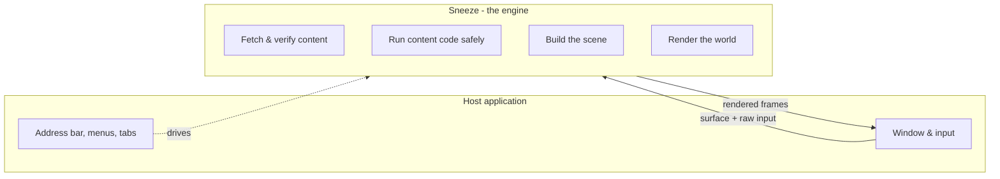

# What is the Open Metaverse Browser?

This page explains the problem Sneeze exists to solve, the idea of an *open metaverse browser*, why it is one of the more consequential pieces of software the industry is attempting right now, and where Sneeze itself sits in that picture. It assumes no prior knowledge. By the end you should understand what kind of software this is, what becomes possible because of it, and why it is built the way it is. The vocabulary introduced here (fabrics, services, the scene object model, proximity, presence) is defined properly in [Core Concepts](core-concepts.md); here we only need enough to see the shape of the thing.

---

## The short version

The web browser is arguably the most consequential application category ever built. It turned the internet from a network for specialists into a universal medium — and it did so because of one decision: the browser is a *neutral client*. The website does not ship you its program. It ships standardized content and code that **any** conforming browser can fetch, sandbox, and render. No single company owns the front door, anyone can publish, and anyone can build a browser. That neutrality is the entire reason the web became an open platform instead of a collection of walled gardens.

Spatial computing — the 3D, real-time, location-aware content that AR glasses and VR headsets render, and that phones already show through their cameras — has no such client yet. Today, every immersive experience is its own installed application, with its own code, its own account, its own trust assumptions, and its own silo. There is no neutral client, no shared address, no shared identity, no shared security model.

The **Open Metaverse Browser (OMB)** is the proposal that spatial content should work the way the web does: one neutral, standards-based client that can connect to *any* conforming space, fetch its content and code, run that code safely, composite it with content from dozens of other independent sources, and present a single coherent world — on any device, with a shared model for identity, trust, and navigation. **Sneeze is the engine of that browser** — the reusable core that does the fetching, sandboxing, scene-building, and rendering. It is to a metaverse browser what Blink is to Chromium.

This is an open initiative — the **Open Metaverse Browser Initiative (OMBI)**, an open project under the **Metaverse Standards Forum** — so that, like the web, no single vendor owns the client and anyone can build a conforming one.

---

## The problem, in concrete terms

### The 10-step rule

Picture moving through an increasingly augmented world — holding up a phone, wearing AR glasses, immersed in a passthrough headset. You will encounter new spatial content every few steps: a building's information overlay, a transit schedule, a safety alert near machinery, a product display on a shelf, a review badge above a restaurant.

No one will download a new application, create a new account, and accept a new terms-of-service agreement *every ten steps.* That friction is fatal at the pace of ambient discovery. The web browser eliminated exactly this friction for documents — you follow a link and the content simply runs, then it is gone when you leave. The metaverse browser must eliminate it for spatial content at the same cadence. This is the fundamental justification for the whole endeavor.

### The walled-garden trap

The XR industry today looks like online services in the early 1990s: a handful of incompatible, proprietary platforms, each a closed world. A service built for one does not run on another. Developers pay multiplied costs to ship everywhere, reach is capped by each platform's install base, and everyone — developer and user alike — is locked in.

We have seen this movie. AOL, CompuServe, and Prodigy were thriving walled gardens until the web browser arrived and let anyone reach any site without permission. Within a few years the open ecosystem won so completely that AOL itself became a web portal. **When open standards deliver equivalent functionality, the open ecosystem wins.** The XR industry is sitting at precisely that inflection point.

### Proof-of-concept purgatory

The closed model has a body count, and it is the reason enterprises hesitate:

- **Microsoft HoloLens** — enterprise AR headset, discontinued in 2024, stranding the companies that built on it.
- **AltspaceVR** — a thriving social-VR community, bought by Microsoft (2017) and shut down (2023).
- **Mozilla Hubs** — ended production support (2024).
- **8th Wall** — web-based AR platform, acquired and deprecated.
- **Ready Player Me** — avatar platform, absorbed and turned internal, shutting out a large creator community.
- **Meta Horizon** — Workrooms and Managed Services discontinued; Horizon Worlds restructured away from VR.

Operational infrastructure has a lifespan measured in decades. A hospital, an airport, or a factory cannot bet its core operations on a platform that a single vendor can discontinue. So enterprises remain in *proof-of-concept purgatory*: they understand what spatial computing could do, but the only use case they can currently justify is isolated training, because a training system can be ripped out and replaced without disrupting the business. They are waiting for infrastructure they can own and control the same way they own and control their web infrastructure — self-hosted or commercially hosted, standards-based, portable, with no proprietary dependency. That infrastructure is what the open metaverse browser, and the open spatial fabrics it connects to, exist to provide.

---

## What makes something a "browser"

It is worth being precise about what a browser *is*, because the metaverse browser must preserve every one of these properties — in three dimensions, in real time, with untrusted code from hundreds of sources at once. These four are not features; remove any one and the model collapses.

1. **Trust without knowledge.** You visit an unknown site without fear. You have no relationship with its operator and no idea what its code does, yet the browser protects you anyway — through sandboxing, isolation, and strict capability control. This is what made mass participation possible.
2. **No application installation.** Content streams and runs without a setup wizard or a permanent footprint. You arrive, it runs, you leave, it is gone.
3. **Device independence.** The same content works on any device. The author cannot design for specific hardware; the browser abstracts the device away. Content written once reaches every platform.
4. **Content / display separation.** The creator describes *what* to present; the browser decides *how* to render it. This is what turns content creation from a software-engineering problem into a publishing task.

A metaverse browser is a native, cross-platform application that keeps all four properties in 3D space, at interactive frame rates, while compositing dozens of independent, sandboxed sources into one scene that the user is *inside* of.

---

## How the metaverse browser differs from the web browser

The analogy to the web browser is direct, not superficial:

| Web browser | Metaverse browser |
|---|---|
| HTML / CSS / JS content | 3D spatial content + WASM service logic |
| DOM (Document Object Model) | SOM (Scene Object Model) |
| One origin at a time | Dozens of spatial fabrics simultaneously |
| URL-based navigation | Proximity-based discovery |
| JavaScript engine | WASM runtime |
| Web browser engine (Blink, Gecko) | Metaverse browser engine (**Sneeze**) |

But four differences force a genuinely different architecture:

1. **Many sources, one scene.** A web browser renders one website at a time. A metaverse browser maintains live connections to dozens — sometimes hundreds — of independent spatial fabrics and blends their content into a single coordinate space. You see one coherent world; the engine sees dozens of untrusted data streams.
2. **Service-dominated, not document-dominated.** A web page is a self-contained document. A spatial fabric is a living environment populated by many independent *services*, each running its own logic, each sandboxed.
3. **Proximity, not URLs.** On the web you navigate by typing addresses and clicking links. In the metaverse you navigate by *moving* — content appears and disappears based on where you are.
4. **You are present in the space.** On the web you view a page from the outside. In the metaverse you have a position, an orientation, and a vantage point. What the browser renders, which services it activates, and who can see you all follow from where you are.

This is also why you cannot simply bolt these onto an existing web browser. The web's security model is per-origin isolation: each page in its own box. The SOM requires the opposite — many untrusted sources contributing objects to *one shared* 3D scene, with ownership and access control enforced per-branch rather than per-window. That is not a new API; it is a different architecture. (Sneeze is nonetheless designed to be embedded: a web browser can host it the way Chromium hosts Blink, switching to the spatial engine when it encounters a spatial fabric, much as it switches to a PDF viewer for a PDF.)

---

## Engine versus application

A web browser is really two layers. There is the *engine* — the part that fetches, parses, sandboxes, lays out, and renders — and the *application* around it: the window, the tabs, the address bar, the menus, the settings. The same engine can power very different browser applications, and the application can be replaced without rewriting the engine.

Sneeze is the **engine** (the Metaverse Browser Engine, MBE), not the application. Concretely, it builds as a static library that a host application links into itself. The host owns the window and the input devices (keyboard, mouse, controllers, headset). It hands Sneeze a surface to draw into and a stream of raw input; Sneeze hands back a rendered world. Sneeze deliberately knows nothing about windowing systems, application menus, or chrome.

This split is the whole point. By keeping the engine free of any one application's assumptions, the same engine can sit inside a desktop browser, a headset's shell, a kiosk, or an embedded device. The neutrality that made web engines reusable is built into Sneeze from the first line.

Throughout this wiki, "the host" or "the host application" means whatever program embeds Sneeze. We never assume a particular one.

---

## What a space is made of

When you visit a space, what is actually delivered to the engine? Not a finished 3D model, and not a video stream, but something closer to how a web page is delivered: a manifest plus code.

A space is called a **spatial fabric**. It is described by a small signed file that the engine fetches first. That file names the **services** the fabric is composed of (a service is one unit of functionality within the space — a region of terrain, a presence system, an inventory tracker, a safety-zone alert, an AI assistant) and points to the **code modules** that implement them. Those modules are WebAssembly — portable, sandboxed bytecode — so the space's logic runs inside the engine without being trusted to behave. The engine downloads each module, verifies it against the fabric's signature, and runs it in an isolated sandbox where it cannot read other spaces' data, touch the file system, or crash the browser.

The running code does not draw anything directly. Instead it builds and updates the **scene object model** (SOM) — the engine's internal tree of everything in the world, analogous to the DOM that a web page builds in a browser. The engine's renderer walks that tree and produces pixels. Just as web page code manipulates the DOM rather than painting to the screen, a space's code manipulates the SOM and the engine handles the drawing. The [Scene system](../systems/scene.md) is the implementation of this model and is one of the most important parts of the engine.

Finally, fabrics are not "loaded" and "unloaded" like pages. They are *connected, streamed, and disconnected* as you move. There is no "page load complete" moment — the scene is always in motion, always being composed from whichever fabrics are currently relevant. The defining discovery mechanism is **proximity**: moving near something is what triggers connecting to it — the spatial analog of following a link.

---

## What becomes possible

This is not speculative. Major enterprises actively want to deploy spatial computing and cannot, because the open infrastructure does not yet exist. A few of the use cases that the open metaverse browser unlocks:

- **Manufacturing & logistics.** Inventory overlays on the warehouse floor, assembly instructions anchored to the part in your hands, real-time safety alerts, picking routes, remote-expert maintenance.
- **Healthcare.** Spatially accessible scheduling and records, patient monitoring, drug-interaction lookups, surgical guidance, room finders for visitors, remote visitation — composed from many providers but isolated for privacy.
- **Transportation.** An airport where staff get training, ticketing, and baggage tools, travelers get check-in, wayfinding, and gate finders, and tarmac operations coordinate fueling, ground traffic, and maintenance — all in the same shared space.
- **Retail.** Product information and try-on overlays, wayfinding, proximity-triggered specials, spatial checkout — delivered by each business through its own fabric, with the retailer keeping the customer relationship and the revenue.
- **Education & smart cities.** Campus digital twins, virtual labs, spatial classrooms; transit info, evacuation routing, and municipal services accessible on any device.

The unifying idea is **syndication over destination.** Today every business must build a destination — a website or app — and drive traffic to it. Services invert this: a service is *distributed to the places where people already are* (a factory floor, a hospital corridor, a store aisle), the way a syndicated cartoon appears in every newspaper that already has readers. That is a fundamentally different distribution model for information, operations, and commerce — and it only works if the client is neutral and the standards are open.

---

## Why it is built on open standards

A neutral client only stays neutral if the things it depends on are themselves open. Sneeze is therefore built on a small set of widely adopted, vendor-neutral standards rather than any one company's proprietary technology:

- an **open rendering abstraction** (so the engine describes a scene and any conforming renderer can draw it),
- the **open GPU shader and compute bytecode formats** (portable visual effects and parallel compute),
- the **open standard for VR/AR device access** (one API across headsets and trackers), and
- **WebAssembly** for sandboxed service code (portable, isolated, no JavaScript runtime required).

Each is the "open by default" choice in its domain, and each lets the engine run across hardware without being locked to a GPU vendor, headset maker, or operating system. The reasoning behind each choice is in [The Standards Sneeze Builds On](standards.md).

The same principle drives the trust model. Because content arrives as code from strangers, the engine cannot simply run it. Every spatial fabric is cryptographically signed; the engine verifies that signature and the certificate chain behind it before trusting the content, establishing a stable, verifiable identity for whoever published the space. This is covered in [Trust & Isolation](../architecture/trust-and-isolation.md).

These open requirements are sometimes summarized as the *five non-negotiables* of an open metaverse, articulated directly by the enterprises that need it: **interoperability** (build to the standard, run in any conforming browser), **device independence** (the same services on glasses, headset, desktop, and phone), **ownership** (users own their data and identity; providers own their customers and revenue, with no platform toll), **frictionless access** (browse-to-enter, no installs), and **open tooling** (anyone can create and deploy without permission).

---

## Why this matters

The browser is the most consequential application category ever built precisely because it was an open, neutral client that no one owned. Interactive 3D has no such client yet, and the stakes are rising fast: the first pervasive wave of users will experience spatial content through the cameras on the phones they already carry, with AR and VR following — initially driven by enterprises folding them into daily operations. Industry consensus holds that this class of device is on a path to become as significant as the phone.

Whoever's client becomes the default front door to spatial computing inherits enormous influence over it. The web's openness was not inevitable — it was a deliberate choice to value openness over control, and proprietary platforms with vast resources did not adopt open standards voluntarily. They were outcompeted by an open ecosystem that produced more innovation and a larger market. The open metaverse faces the same choice now.

That is why this work is being done in the open, coordinated through the **Metaverse Standards Forum** and aligned with the standards bodies whose specifications it builds on — the **Khronos Group** (rendering, GPU, and XR standards), the **W3C** (identity and the web's own spatial efforts), and the **OGC** (real-world spatial positioning). An *open* engine — one anyone can inspect, build on, and ship — is how the front door to spatial computing stays open rather than becoming a single company's gate.

That is what Sneeze is for. The rest of this wiki explains how it works, starting with the vocabulary in [Core Concepts](core-concepts.md).

---

## See also

- [Core Concepts](core-concepts.md) — the terms used here, defined properly.
- [The Standards Sneeze Builds On](standards.md) — the open standards and the rationale for each.
- [Architecture Overview](../architecture/overview.md) — how the engine is structured internally.

---

[Home](../Home.md) · Next: [Core Concepts](core-concepts.md)
