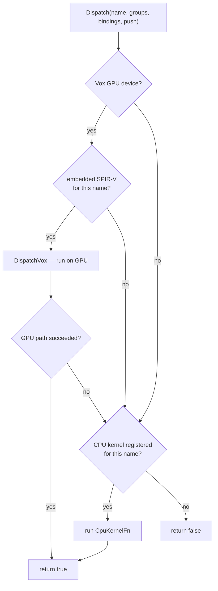

# Compute System

The compute system runs the engine's own number-crunching on the GPU. Some of the work a metaverse browser does — most notably proximity queries, the mechanism by which the open metaverse discovers and connects nearby things — is massively parallel and a poor fit for the CPU. This page explains why the engine carries its own compute path, how `COMPUTE_DISPATCH` chooses between a real GPU backend and a CPU fallback, where its shader kernels come from, and what is and is not wired up today.

It builds on the [SPIR-V](spirv.md) system (kernels are SPIR-V) and complements the [Viewport](viewport.md) (which owns *rendering*, a separate GPU concern). The system is built on **Vox**, the engine's GPU-compute backend, and its classes live in namespace `DEP`.

---

## Why it exists

Rendering is not the only thing a browser wants a GPU for. The engine has *internal* compute work — calculations it performs on the user's behalf rather than on a graphics surface — and the headline example is **proximity**: deciding which spatial fabrics and objects are near enough to matter. Done naïvely over thousands of objects every frame, that is exactly the embarrassingly parallel workload GPUs exist to chew through.

But a browser cannot assume the GPU it wants is the GPU it has. One user runs Vulkan on Linux, another DirectX 12 on Windows, a third Metal on a Mac, and a fourth has no usable compute device at all. The compute system answers this with two commitments. First, it abstracts the backend: through Vox it dispatches the *same* SPIR-V kernel on Vulkan, DX12, or Metal without the engine caring which. Second, it guarantees an answer everywhere: when no GPU backend is available, it falls back to a CPU implementation of the same kernel, so correctness never depends on hardware luck — only speed does.

---

## What COMPUTE_DISPATCH is

`COMPUTE_DISPATCH` is the single front door. Its constructor takes an `ANARIDevice` parameter, but that argument is vestigial — retained only for source compatibility because ANARI never shipped a compute extension. The real work at construction is to **probe for a GPU**: it calls `vox::DEVICE::Create(vox::Backend::Auto)`, which tries Vulkan, then DX12, then Metal in priority order and returns null if none is usable. A null result is not an error; it simply means the dispatcher will run on the CPU. The constructor then registers the built-in CPU fallback kernel, `TEST_PROXIMITY`.

`SupportsNativeCompute()` reports whether a GPU backend was acquired — useful for callers that want to know whether they are about to run on hardware or in software. `RegisterCpuKernel(name, fn)` adds (or replaces) a CPU implementation in an internal name → function map, letting a caller supply a software mirror for any kernel it intends to dispatch.

A **`BUFFER_BINDING`** describes one buffer the kernel reads or writes: a binding slot number, a host memory pointer, a size in bytes, and a read-only flag. A **`CpuKernelFn`** is a plain function pointer whose signature mirrors the GPU kernel's interface exactly — the same bindings, push constants, and workgroup counts — so a kernel can be expressed once on each side with matching semantics.

---

## How dispatch chooses a path

`Dispatch` takes a kernel name, the three workgroup counts, the buffer bindings, and an optional push-constant blob, and routes the work. The routing is a deliberate GPU-first, CPU-safety-net policy:

The important nuance is the fall-through: if a GPU device exists and an embedded kernel is found but the GPU path *fails* (shader translation, kernel creation, or buffer allocation goes wrong), `Dispatch` does not give up — it falls through to the CPU registry so a caller with a CPU mirror still gets a valid result. The call only returns `false` when neither path can serve the named kernel.

### The GPU path, in detail

`DispatchVox` is where the abstraction earns its keep. It compiles the SPIR-V into a Vox kernel (`CreateKernel(bytes, size, "main")`), then mirrors each `BUFFER_BINDING` into a host-visible Vox buffer and uploads the caller's bytes. It binds the kernel, attaches each buffer to its slot (honoring the read-only flag), sets push constants if any, dispatches with the requested workgroup counts, and waits for completion (`Finish`). After the kernel runs it reads back every non-read-only buffer into the caller's original memory, then destroys all the Vox buffers and the kernel before returning. The contract is clean: Vox objects are transient, and the caller's host memory is the single source of truth before and after.

---

## Where kernels come from

The GPU kernels are not loaded from disk at runtime — they are **embedded in the binary**. GLSL compute shaders are compiled to SPIR-V at build time via glslang and baked into the executable, and `GetEmbeddedKernel(name)` retrieves one by name as a `{ pBytes, nSize }` pair.

How they are embedded is platform-specific, and `EmbeddedKernels.cpp` handles both forms behind one function:

- **On Windows**, kernels are stored as Win32 resources of type `SPV_KERNEL`. The lookup grabs the current module handle, calls `FindResourceA` / `LoadResource` / `LockResource`, and reports the size via `SizeofResource`.
- **On other platforms**, a generated `kernels_embedded.c` defines an array of `{ name, data, size }` entries; the lookup walks the array and matches the name.

Either way the kernel name passed to `Dispatch` is the same key used to find the embedded SPIR-V and the same key used for the CPU registry, which is what lets a single name resolve to whichever path is available.

### The built-in proximity kernel

The one kernel registered out of the box is `TEST_PROXIMITY`, and its CPU implementation shows the intended shape of compute work. It reads a push-constant block carrying a reference point and a count, takes positions from binding 0 (read-only) and distances from binding 1 (writable), and computes the Euclidean distance from each position to the reference point. It is both a working example and the seed of the proximity machinery the discovery model depends on.

---

## Threading

`COMPUTE_DISPATCH` performs each dispatch synchronously and blocks on `Finish` for the GPU path, so a call returns only when results are back in the caller's buffers. The class itself adds no internal locking; a single dispatcher instance is meant to be driven by one owner at a time. It is non-copyable, reflecting that it owns a GPU device handle that must not be duplicated.

---

## Current limitations

Drawn directly from the current code.

- **Not yet wired into the engine.** Unlike the WASM runtime or SPIR-V pipeline, `COMPUTE_DISPATCH` is not constructed by the engine during startup. It is a standalone facility exercised today through its test suite (`tests/ComputeTest.cpp`), not yet connected to a live proximity or render path.

- **One built-in kernel.** Only `TEST_PROXIMITY` ships with a CPU fallback registered. Any other kernel must be supplied by the caller (and have an embedded SPIR-V counterpart to run on the GPU).

- **No runtime validation gate here.** Embedded kernels are trusted because they are validated at build time; this system does not itself call the [SPIR-V](spirv.md) validator before handing bytecode to Vox, so a runtime- loaded kernel would need to be validated by the caller first.

- **Host-visible buffers only.** The GPU path allocates every mirrored buffer as host-visible and reads results straight back, which is simple and correct but not the fastest possible layout for large or device-local workloads.

- **Namespace inconsistency.** The compute classes sit in a bare `DEP` namespace rather than `SNEEZE::DEP` like the other dependency wrappers — a wrinkle worth knowing when referencing them from engine code.

---

## See also

- [SPIR-V](spirv.md) — the validation gate for shader bytecode; compute kernels are SPIR-V.
- [Viewport](viewport.md) — the GPU's other job, rendering, kept separate from internal compute.
- [Core Concepts](../overview/what-is-omb.md) — proximity as the metaverse's discovery mechanism, the workload this system targets.

---

[Systems index](index.md) · Previous: [SPIR-V](spirv.md) · Next: [XR](xr.md)
