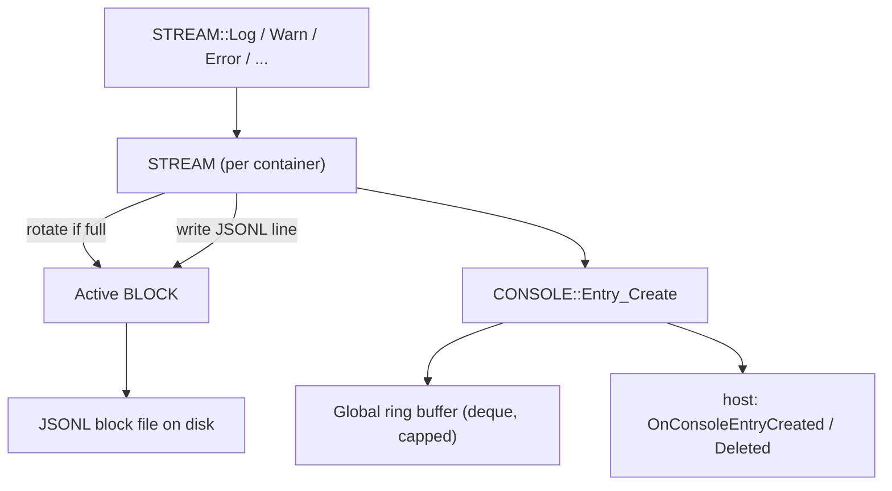

# Console System

The console system is the engine's developer console — the direct equivalent of the `console` object a web page calls in a browser. Content loaded into the engine is sandboxed code, and like web content it needs a way to emit diagnostic output: log lines, warnings, errors, grouped sections, counters, and timers. The console system collects that output, keeps it addressable for an inspector UI, and persists it to disk so a developer can review what a source logged even across sessions. This page explains why the console is shaped the way it is, the two tiers of storage it maintains, and how an entry travels from a logging call to both memory and disk.

It assumes you have read [Core Concepts](../overview/core-concepts.md). For the exact class and method signatures, see the [Console API reference](../api/console/index.md); this page is about how and why the system works.

---

## Why it exists

Several independent, sandboxed sources can be live in one browsing session at once. Each is a separate trust domain — a [container](container.md) — and each wants to log. A useful console for the open metaverse therefore has to satisfy several pulls at the same time:

- **Per-source isolation.** Each source's output must be attributable to *that* source and storable separately, so an inspector can show "this fabric's log" without untangling it from everyone else's.
- **A single chronological feed.** An inspector also wants the unified, in-order stream of everything that happened, across all sources, the way a browser's console shows all frames interleaved.
- **Bounded memory.** A long session can produce millions of log lines. The console cannot grow without limit in RAM.
- **Persistence and review.** Output should survive beyond the moment it was printed, so it can be inspected after the fact — which means writing to disk.
- **Browser-grade ergonomics.** Content authors expect `log`/`warn`/`error`, `group`, `count`, and `time` to behave the way they do on the web.

The console resolves these with **two tiers of storage** and a per-source **stream** abstraction, described next.

---

## Concepts and vocabulary

The system is four cooperating classes. Three are public (`CONSOLE`, `STREAM`, `ENTRY`); one is private (`BLOCK`). A small internal interface, `ICONSOLE_IMPL`, ties them together without exposing the console's private implementation.

### ENTRY — one immutable log record

An `ENTRY` is a single line of console output: a severity level, a message, a timestamp, the originating container, a monotonic index, and grouping metadata (group depth, a collapsed flag, a system flag). An entry is **immutable** — once constructed it is never modified — and it is always handled through a `std::shared_ptr<const ENTRY>`. Immutability plus shared ownership is what lets the *same* entry object live simultaneously in the in-memory feed, in a disk-block cache, and inside an inspector callback without any copying or locking of its contents. The entry stamps itself with the wall-clock time at the moment of construction.

### STREAM — one container's log channel

A `STREAM` is the per-container logging channel. Every container that logs gets exactly one stream, and the stream owns all of the browser-style operations for that container: the severity methods (`Log`, `Debug`, `Info`, `Warn`, `Error`, `Assert`), grouping (`Group`, `GroupCollapsed`, `GroupEnd`), counters (`Count`, `CountReset`), and timers (`Time`, `TimeEnd`, `TimeLog`). The stream is also the owner of that container's on-disk representation: a rolling set of block files.

### BLOCK — one disk file

A `BLOCK` is one log file on disk, holding up to a fixed number of entries in **JSONL** format (one JSON object per line). A stream writes into its newest block; when that block fills, the stream rotates to a fresh one. Each block can load its file back into an in-memory cache on demand and evict it again, so an inspector can drill into an old block without the engine keeping every block resident.

### CONSOLE — the engine-owned owner

A `CONSOLE` is an engine-owned singleton: there is exactly one per [`ENGINE`](../api/sneeze/ENGINE.md), reached through `ENGINE::Console()` (a [context](context.md) forwards `CONTEXT::Console()` to it). It owns the global in-memory feed, the table of open streams, and the configuration knobs (cache size, entries per block, block-window length). Because it is engine-wide, its feed and stream table span *every* context, not one browsing session. It is the object an inspector talks to, and the object that mints and ring-buffers every entry.

---

## The two tiers of storage

The defining design choice is that every entry is recorded **twice**, in two structures that serve two different readers.

**Tier 1 — the global ring buffer.** `CONSOLE` keeps a single `std::deque<std::shared_ptr<const ENTRY>>` holding the most recent entries from *every* container across *every* context, in creation order. It is capped (default 16384 entries); when it overflows, the oldest entry is dropped from the front and the host is notified of the deletion. This is the unified, bounded, chronological feed an inspector reads through `Entry_Enum`. Because the buffer and the stream table are engine-wide, a per-context inspector filters — walking a context's containers and reading each container's one stream — rather than assuming the global enumeration belongs to a single context.

**Tier 2 — per-container disk-backed streams.** Each container's `STREAM` appends its entries to JSONL block files on disk. A stream keeps a **rolling window** of at most `m_nBlocks` block files (default 4), each holding at most `m_nEntries_Block` entries (default 4096). When a write fills the active block, the stream rotates: it opens a new block, and if the window now exceeds its limit it detaches, deletes, and removes the on-disk file of the oldest block. This tier is durable, per-source, and effectively unbounded over time (old blocks are recycled), and it is what an inspector drills into through `Stream_Open` / `Stream_Enum`.

The two tiers share the actual `ENTRY` objects by `shared_ptr` while the entries are still recent enough to live in both — so a freshly logged line that the inspector reads from the global feed is the very same object the block file cached. When a block is later reloaded from disk, it first asks the console whether each entry's index is still in the ring buffer (`Entry_Find`) and reuses that object if so, only reconstructing from JSON when the original has aged out.



---

## How an entry is created

Every logging method on a stream funnels into one private write path, and that path is where the two tiers are populated in a fixed order:

1. **Rotate if needed.** If the stream has no active block yet, or the active block is full, the stream rotates to a new block first.
2. **Mint the entry.** The stream calls back into the console (`ICONSOLE_IMPL::Entry_Create`). The console constructs the immutable `ENTRY` — which stamps the current time — assigns it the next monotonic index, pushes it onto the global ring buffer, evicts the oldest entries if the buffer is over its cap (notifying the host of each deletion), notifies the host of the new entry, and returns the `shared_ptr`.
3. **Write to disk.** The stream hands that same entry to its active block, which appends one JSONL line to the block file and increments the block's count.

Disk writes are **synchronous** on the caller's thread, but go through an OS-buffered `std::ofstream` opened in append mode — there is no explicit flush per line, so the cost is a buffered write rather than a disk round-trip. Old block-file deletion during rotation is also synchronous, via `std::filesystem::remove`.

### Grouping, counting, and timing

These are conveniences layered on top of the write path:

- **Grouping** emits a normal log entry for the label, then increments the stream's group depth so that subsequent entries record a deeper nesting level; `GroupEnd` decrements it. `GroupCollapsed` is identical but marks its label entry collapsed so an inspector can fold it by default.
- **Counting** keeps a per-label integer map; each `Count(label)` increments and logs `label: N`. `CountReset` drops the label.
- **Timing** keeps a per-label `steady_clock` timestamp map. `Time` records the start; `TimeEnd` logs the elapsed milliseconds and removes the label; `TimeLog` logs the elapsed time but leaves the timer running.

---

## Attaching, detaching, and the on-disk layout

A stream's block files exist on disk whether or not their contents are resident in memory. Loading them is **reference-counted and on demand**:

- `STREAM::Attach` marks the stream attached and attaches each block in its window; `STREAM::Detach` reverses it and writes the stream's metadata sidecar.
- A `BLOCK` counts its attach calls. The first attach loads the JSONL file into an in-memory entry cache; the last detach evicts that cache and closes the file. This lets multiple readers share one loaded block, and lets the engine keep most blocks unloaded.

A stream remembers where it left off across sessions through a small `.meta` JSON sidecar (the current block index and the active block's entry count, plus the container's identity fields for human readability). It is read when the stream initializes and rewritten on detach, so a relaunched session continues appending to the right block rather than starting over.

Block files are laid out under the context's temporary path, partitioned by the container's cryptographic identity so that different sources never collide:

```text
<TemporaryPath>/<personaHash>/<fingerprint[0:2]>/<fingerprint[2:22]>/<container>/Console/
    console.meta
    0000.log
    0001.log
    ...
```

The four-digit name is the block index; `.log` files are JSONL. The identity prefix and container segment are owned by `CONTAINER`; `STREAM` appends only its `Console` segment. All of a stream's blocks live in that one directory (the path is derived from the container's identity, not from the block number), which `STREAM` creates once at initialization.

---

## Consumers

The console is read and written by three distinct kinds of caller, and the design keeps them cleanly separated.

- **Sandboxed content (WASM modules).** A source's code logs through the stream opened for *its own* container. Because a stream is keyed by `CONTAINER*`, a module can only write to its own channel — it has no way to address another source's stream. This is the console half of the engine's per-source isolation.
- **The engine itself.** Engine-internal subsystems log through the engine's own logging facility; the console's streams are per-container and keyed by a non-null `CONTAINER*`. An `ENTRY` additionally carries a *system* flag (`IsSystem`) that marks browser-injected entries so an inspector can render them differently from content-authored ones.
- **The inspector / host UI.** A host inspector is omniscient: it reads the unified feed via `CONSOLE::Entry_Enum`, walks the live streams via `Stream_Enum`, and drills into a specific source's history via `Stream_Open` (then `Attach` to page blocks in from disk). It is also pushed live updates through the host callbacks `OnConsoleEntryCreated` and `OnConsoleEntryDeleted` (declared on the host's context interface), which fire as the ring buffer gains and sheds entries. Because one console serves every context, it caches no host pointer: each callback self-resolves the host through the entry's container (`pEntry->Container()->Context()->Host()`), and an engine-internal entry with no container fires no callback.

---

## Threading model

The console is touched from multiple threads: content runs on worker agents, fetch-completion paths log failures, and an inspector reads on the host's UI thread. Each layer protects itself with its own recursive mutex.

- **`CONSOLE`** guards everything with `m_mxConsole` (a `std::recursive_mutex`). Every public method — stream open/close/enumerate, clear, entry enumerate, and the internal `Entry_Create` / `Entry_Find` — takes it. It is recursive because the write path re-enters the console while a stream already holds its own lock. Being an engine singleton, this one lock is shared by every context that logs.
- **`STREAM`** guards its state with `m_mxStream` (a `std::recursive_mutex`) covering attach/detach, the write path, rotation, grouping, counting, and timing.
- **`BLOCK`** guards its in-memory cache and file handle with its own recursive mutex.

Disk writes happen synchronously on whatever thread called the logging method; there is no background writer thread. The cost is therefore paid inline by the caller, mitigated only by OS buffering.

---

## Current limitations

These come straight from the code and shape how the system behaves today.

- **No engine-internal stream.** `CONSOLE::Stream_Open` returns null for a null container, so there is no per-context "engine channel" stream; engine subsystems use the engine log instead. Entries can carry a null container and a *system* flag, but in normal operation every stream is bound to a real container.
- **Configuration is captured at stream creation.** `Entries_Block` and `Blocks` are passed to a stream when it is opened. Changing them on the console afterward does not reshape streams that are already open — only the global ring-buffer cap (`Entries_Cache`) takes effect live.
- **Synchronous disk I/O on the logging thread.** Writes and old-block deletion happen inline. A burst of logging, or a slow filesystem, is paid for by the thread that logged — there is no asynchronous flush queue yet.
- **`Clear` clears only memory.** It empties the global ring buffer (notifying the host) but does not delete the per-container block files on disk.

---

## See also

- [Console API reference](../api/console/index.md) — exact `CONSOLE`, `STREAM`, and `ENTRY` signatures.
- [Container](container.md) — the identity each stream is keyed by, and the source of the on-disk path partitioning.
- [Storage](storage.md) — the other per-container persistence subsystem, for structured documents rather than log lines.
- [Context](context.md) — forwards `CONTEXT::Console()` to the engine's single console and carries the host callback surface.

---

[Systems index](index.md) · Next: [Viewport](viewport.md)
