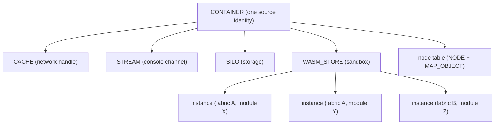

# Container System

A `CONTAINER` is the engine's runtime manifestation of **one signed content source**: its identity, its sandbox, and the per-source resources that source is allowed to use. Where a [fabric](scene.md) is a branch of the scene tree, the container is *who that branch belongs to* — the cryptographic identity behind the content, the WebAssembly sandbox its code runs in, the network cache its fetches are filed under, the console stream its messages land in, and the storage silo its documents live in. Every fabric is bound to exactly one container; many fabrics can share a container if they come from the same source.

This page explains why containers exist, what a container's identity (`CID`) is and how it is computed, what `Open` and `Close` actually stand up and tear down, how the container keys its disk storage, how it holds a fabric's scene nodes, and how trust is assigned. The exact signatures are in the [Container API reference](../api/container/index.md).

---

## Why it exists

Content in the open metaverse is code from many independent, mutually distrustful sources, all loading into one shared world. The engine needs a single object that answers, for any piece of content: *who signed this, how much do we trust them, and what private resources are they confined to?* That object is the container.

It exists to provide three things at once:

- **Identity.** A stable, verifiable name for a source, derived from its signing certificate and the manifest it published — not from the URL it happened to load from. Two fabrics from the same signer are the same identity even at different addresses.
- **Isolation.** A sandbox — a WebAssembly execution store — that source's code runs inside, unable to touch the host or other sources directly.
- **Per-source resources.** A network cache, a console stream, and a storage silo scoped to that source, so its fetched files, its logging, and its persisted data never mix with another source's.

By bundling these together and pooling containers by identity, the engine guarantees that "the same source" means one identity, one sandbox, one cache, one stream, one silo — no matter how many fabrics that source contributes to the scene.

---

## Identity: the CID

A container's identity is a [`CONTAINER::CID`](../api/container/CID.md) — a small record the [context](context.md) builds from a source's verified [MSF](msf.md). Its fields are:

- **`sFingerprint`** — the signing certificate's fingerprint.
- **`sOrganization`** — the human-readable organization name from the certificate.
- **`sOrganizationHash`** — a hash standing in for the organization when its name is not trusted enough to display.
- **`sContainer`** — the container name the source declared in its manifest.
- **`sPersonaHash`** — the hash of the local [persona](persona.md) under which the content is being loaded.
- **`eTrust`** — the trust level assigned to the source (see [Trust levels](#trust-levels)).

The persona hash is part of identity on purpose: the same source loaded under two different local identities is two different containers, so one persona's data never leaks into another's.

Three derived strings matter, all computed from those fields:

- **`Key_Org()`** joins the persona hash (first 12 characters), the fingerprint's first 2 characters, and the fingerprint's next 22 characters into `persona/fp2/fp22`. This is the **organization tier** — the prefix shared by every container from the same signer under the same persona.
- **`Key_All()`** appends the container name to that: `persona/fp2/fp22/container`. This is the **pooling key** — the context's container map is keyed by it. Identical key means identical identity means one shared container. `CONTAINER::Key()` returns this string.
- **`DisplayName()`** is what a host shows the user: `organization/container` when the source is trusted enough (`eTrust >= kTRUST_EXPIRED`), and `organizationHash/container` otherwise — so an untrusted source cannot spoof a recognizable name.

`eTrust` is deliberately **not** part of either key: the same source at different trust levels still pools to one container.

---

## Trust levels

Trust is the `eTRUST` enum, ordered from least to most trusted:

| Level | Meaning |
|---|---|
| `kTRUST_NONE` | No trust evaluated (the default on a freshly constructed `CID`). |
| `kTRUST_UNTRUSTED` | The MSF's signature did not validate. |
| `kTRUST_UNVERIFIED` | Signature valid, but the certificate chain is not trusted. |
| `kTRUST_EXPIRED` | Chain trusted, but expired. |
| `kTRUST_VERIFIED` | Signature valid and chain trusted and current. |
| `kTRUST_ROOT` | The engine's own root container (the source-less root fabric). |

The context assigns the level when it builds the CID, walking the checks in order: invalid signature gives `kTRUST_UNTRUSTED`; untrusted chain gives `kTRUST_UNVERIFIED`; expired chain gives `kTRUST_EXPIRED`; otherwise `kTRUST_VERIFIED`. The root fabric, which has no MSF, is given `kTRUST_ROOT` directly along with a synthetic identity (an all-zero fingerprint, the organization name `"Sneeze"`, and the container name `"Root"`).

> **Current behavior.** The trust computation is immediately followed by an unconditional override that forces every MSF-derived container to `kTRUST_EXPIRED`, regardless of what the checks decided. This is an in-progress development override, not the intended policy. The verification ladder above is the design; treat the forced value as a temporary state of the code.

---

## What Open and Close manage

A container is reference-counted. `Open(bReset)` increments the count; `Close()` decrements it and returns the new count. The container's *resources* are tied to the transitions in and out of zero, not to every call.

**On the first open** (count goes 0 → 1), `Open()` first creates the container's permanent and temporary identity folders on disk, then stands up, in order:

1. A network [`CACHE`](../api/network/index.md) via `NETWORK::Cache_Open` — the container's handle onto the engine-wide disk cache, under which all of this source's fetched files are filed.
2. A console [`STREAM`](../api/console/index.md) via `CONSOLE::Stream_Open` — the source's dedicated log channel.
3. A storage [`SILO`](../api/storage/index.md) via `STORAGE::Silo_Open`, then `Attach()`-es it — the source's persistent document store.
4. A **WASM store** (`WASM_STORE`) via the engine's `WASM_RUNTIME` — the sandbox. The store is given the container as its host data and its linker is initialized, wiring up the host functions content code may call.

It then notifies the host (`ICONTEXT::OnContainerCreated`). Subsequent opens simply bump the count and succeed without rebuilding anything. If any step of the first open fails, `Open()` calls `Close()` to unwind the partial construction and reports failure.

**On the last close** (count goes 1 → 0), `Close()` tears the same resources down in the exact reverse order: notify the host (`OnContainerDeleted`), close the WASM store, detach and close the silo, close the stream, close the cache. Closes that do not reach zero just decrement.

This open-once/close-once-at-zero discipline is what makes pooling safe: many fabrics can `Open` and `Close` the same container as they load and unload, and the expensive sandbox and per-source stores are built exactly once and destroyed exactly once.

### Cache reset and the root container

The `bReset` flag on `Open` is how "clear the cache and reload" reaches a container. Its effect depends on identity. On the **root container** (`kTRUST_ROOT`, the source-less root fabric), a reset stamps an in-memory stale floor — the current wall-clock time — that `Reset_Stale()` then reports so the root fabric's own fetches refetch. For every other container the flag is inert here; the durable, per-primary clear is recorded by the [context](context.md) against the primary fabric's key and applied through the [network](network.md)'s reset record. `CONTAINER::Reset_Stale()` is the container's contribution to that resolution: the root container returns its stamped floor (or the network's start time as a baseline when nothing has been stamped), and any non-root container returns an empty string, meaning "no container-level clear — defer to the network's per-key record." The cache consults the container first and falls back to the network, so the two mechanisms compose. See [Network → Clearing the cache](network.md#clearing-the-cache) for the whole model.

---

## The scene node handle table

A container does more than hold identity and a sandbox: it also owns the **scene nodes** that belong to the fabrics bound to it. A fabric's scene graph is not built inside the fabric object — it is built as a table of nodes on the container, so that several fabrics from the same source share one indexed namespace of node handles.

Content running in the sandbox constructs its scene graph by calling the container's `Node_Root` and `Node_Open` (reached through the WASM host-function bridge, one `RMCOBJECT` per node). `Node_Root` creates the root node of a fabric; `Node_Open` creates a child under an existing parent, inheriting that parent's fabric. Each call allocates a per-container object index (or accepts a content-supplied one, if it is free), builds the concrete `MAP_OBJECT` subclass for the node's class — root, celestial, terrestrial, physical, panel, or light — wraps it in a `NODE`, and records both in the container's tables. `Node_Close` removes and deletes a node and its map object; `Node_Find` looks one up by index. The container owns every `MAP_OBJECT` it creates and deletes any that survive to its own destruction.

The same table also serves the host-driven "map-managed" path, in which the browser reads a fabric's node tree from its MSF and injects nodes via the same `Node_Open` calls rather than the sandbox doing so. Because object indices are unique per container, a single container can host the nodes of several fabrics at once, each fabric's nodes namespaced within the shared index space.

---

## WASM instances

A container holds the source's sandbox; the individual WebAssembly modules a fabric loads are **instances** inside that sandbox. A [fabric](scene.md), as it loads each `.wasm` module its MSF declares, calls `CONTAINER::Instance_Open` to compile and instantiate the module bytes into the container's WASM store, and `Instance_Close` to unload it.

Instances are keyed by the triple `(fabric index, module URL, module hash)`. The fabric index in the key is what lets one container host modules from several fabrics — each fabric's instances are namespaced by its index, even though they share the container's store and host-function linker. The container delegates both calls straight through to its `WASM_STORE`; it owns the store, the store owns the instances.

---

## Disk paths and identity keying

A container hands the disk-backed subsystems the identity scaffold they file under. At construction it derives four folder paths from its context's permanent and temporary roots and its own key. The **all-tier** paths join the root with `Key_All()` (`persona/fp2/fp22/container`) and are the per-container home that the cache, console, and per-container storage build beneath. The **org-tier** paths join the root with `Key_Org()` (`persona/fp2/fp22`, no container segment) and are where organization-scoped storage is filed — shared across every container of the same signer and persona. `Path_Permanent_All()`, `Path_Temporary_All()`, `Path_Permanent_Org()`, and `Path_Temporary_Org()` expose the four; the all-tier folders are created on disk at the first `Open`. A subsystem appends only its own segment (for example the [cache](network.md) appends `Network`), so the identity prefix lives in exactly one place and is never re-derived downstream.

---

## Relationship to fabrics

The container is the identity side of the loading flow; the [fabric](scene.md) is the structural side. When the scene loads a source:

1. The scene asks the context to `Container_Open` for the verified MSF; the context pools and returns a `CONTAINER` (see [Context → Container pooling](context.md#container-pooling)).
2. The scene constructs a `FABRIC` **bound to** that container and initializes it.
3. As the fabric fetches its WASM modules, it opens each as an instance in the container (`Instance_Open`), and its nodes are built into the container's node table.
4. When the fabric is destroyed, it closes its instances (`Instance_Close`) and then closes its container reference (`Container_Close` → `CONTAINER::Close`), releasing the identity.

So the lifetimes nest cleanly: a container outlives every fabric bound to it, because each fabric holds one reference for its lifetime and the container only tears down when the last reference is released. A fabric never owns the container — the context does.

---

## Threading model

A container is reference-counted from multiple threads — fabric loads complete on network fetch threads, and teardown runs on the thread driving the scene cascade. The container guards its own state with a **recursive mutex** (`m_mxContainer`), held by `Open`, `Close`, and the node-table methods. It is recursive because a failed `Open` calls `Close` while still holding the lock. The reference count, the construction and teardown of the cache, stream, silo, and store, and every mutation of the node table all happen under this lock, so concurrent opens, closes, and node operations on the same container are serialized and the "first open" / "last close" transitions are atomic.

`Instance_Open` and `Instance_Close` are **not** guarded by the container's mutex; they forward directly to the WASM store, which owns the synchronization appropriate to module instantiation. The accessors (`Context()`, `Identity()`, `Key()`, the path accessors) read fields that are stable for the container's lifetime, while `Cache()`, `Stream()`, and `Silo()` are null while the container is closed (count at zero) — they exist only between the first open and the last close.

---

## Current limitations

- **Trust is forced to expired.** As noted under [Trust levels](#trust-levels), the computed trust level is currently overridden to `kTRUST_EXPIRED` for all MSF-derived containers. Trust-dependent behavior (such as `DisplayName`) therefore reflects the forced value, not the real verification result, until the override is removed.

- **A non-zero refcount at destruction is logged, not prevented.** If a container is deleted while it still has open references, its destructor logs an error naming the count and the source, but does not force the resources down. Containers are expected to reach zero references through the scene teardown cascade before the context frees the pool.

- **Pooled containers are not freed mid-session.** Because the context never prunes its container pool during navigation (see [Context → Current limitations](context.md#current-limitations)), a closed container lingers in the pool, ready to be re-opened, until the whole context is destroyed.

---

## See also

- [Container API reference](../api/container/index.md) — exact `CONTAINER` and `CID` signatures.
- [Context](context.md) — pools containers and assigns their identity and trust.
- [Scene](scene.md) — fabrics bind to containers and open WASM instances and nodes in them.
- [Network](network.md) — the cache a container opens and the reset record its clears feed.
- [MSF](msf.md) — the signed manifest a container's identity and trust are derived from.
- [WASM](wasm.md) — the sandbox store and instances a container hosts.

---

[Systems index](index.md) · Prev: [Context](context.md) · Next: [Scene](scene.md)
