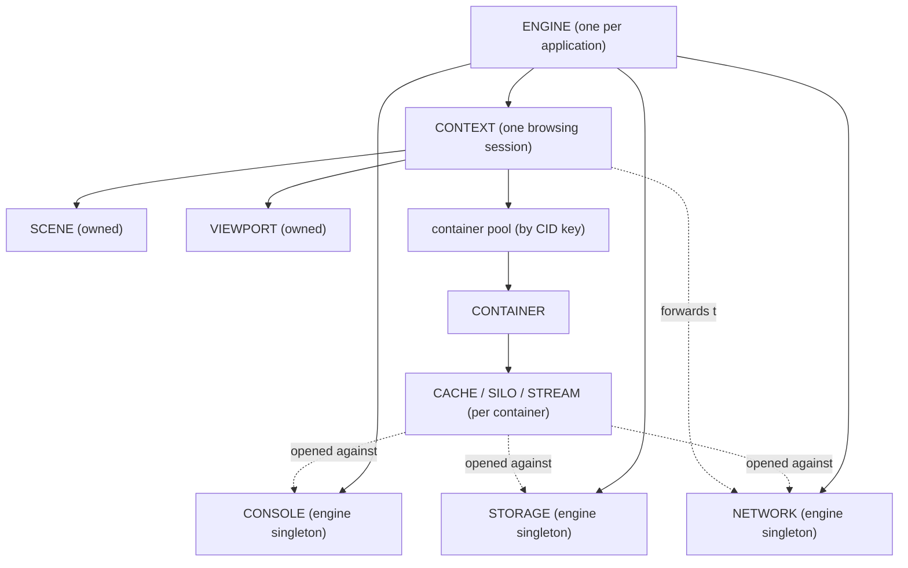
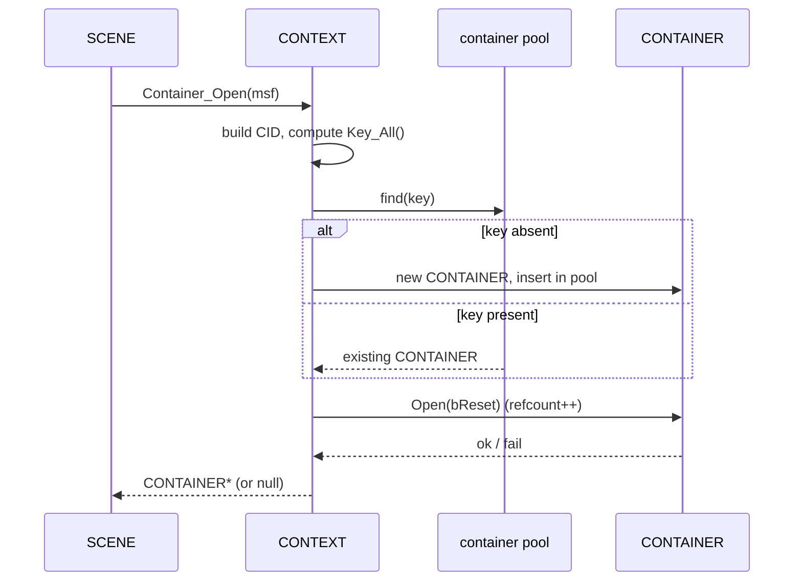

# Context System

A `CONTEXT` is one browsing session — the engine's equivalent of a browser tab. It is the boundary inside which an address is loaded, a world is built, and frames are drawn. If the [engine](engine.md) is the application-wide singleton, a context is the unit a host application opens and closes as the user moves between independent sessions. This page explains what a context actually owns after the engine-singleton migration, how it reaches the shared subsystems it no longer owns, the strict order in which it stands its own objects up and tears them down, and how it pools the [containers](container.md) that give content its runtime identity.

The exact class and method signatures are in the [Context API reference](../api/context/index.md); this page is about how and why the system works.

---

## Why it exists

The engine has to support more than one independent session at a time, and each session has to be self-contained: its own scene, its own rendering surface, its own view of the world. Two tabs pointed at two different worlds must not share scene state.

But not everything is per-session. Fetching, caching, persistent storage, and console output are all backed by a single on-disk tree and are far cheaper to run — and to deduplicate across tabs — as one engine-wide service each. So the ownership split is deliberate: the *scene and the surface that draws it* belong to the session, while *network, storage, and console* belong to the [engine](engine.md) as singletons. A context owns the former and forwards to the latter.

A context is therefore both a *scope* (the scene and viewport of one session, plus the containers that session has loaded) and a *hub* (the single object through which per-session code reaches the engine-wide services). Every subsystem that needs to fetch, log, or persist asks its context, and the context either serves it from what it owns or forwards to the engine.

The host application never constructs a context directly. It calls [`ENGINE::Context_Open`](../api/sneeze/index.md), passing an `ICONTEXT` host interface, an optional start URL, a session kind, and a reset flag; the engine constructs the `CONTEXT`, initializes it, and hands it back. Closing is the mirror: `ENGINE::Context_Close` destroys it.

---

## What a context owns

After the engine-singleton migration, a context owns exactly two per-session subsystems, plus a pool of containers:

- **[`SCENE`](../api/scene/index.md)** — the scene object model: the tree of fabrics, nodes, and map objects that represents the loaded world.
- **[`VIEWPORT`](../api/viewport/index.md)** — the rendering surface and camera that turns the scene into frames.
- a pool of **[`CONTAINER`](container.md)** objects — the runtime identities and sandboxes of the signed sources loaded into the scene. Containers are not created up front; they come and go as fabrics load, and the context pools them so the same source loaded twice shares one container (see [Container pooling](#container-pooling)).

It does **not** own the console, network, or storage subsystems. Those are engine-wide singletons ([`CONSOLE`](../api/console/index.md), [`NETWORK`](../api/network/index.md), [`STORAGE`](../api/storage/index.md)), constructed once by the [engine](engine.md) and shared by every context. The context's `Console()`, `Network()`, and `Storage()` accessors simply forward to the engine, as does `Wasm_Runtime()`. A context caches no copy of any of them.

The per-session *view* of those shared subsystems is not the singleton itself but a **per-container handle** opened against it: a [`CONTAINER`](container.md) opens one [`CACHE`](../api/network/CACHE.md) from the network, one [`SILO`](../api/storage/index.md) from storage, and one [`STREAM`](../api/console/index.md) from the console, each scoped to that container's identity. A context reaches those handles through its containers (`Container → Cache()/Silo()/Stream()`), never by holding them directly. This is how a single engine-wide network cache still keys each cached file to the identity of the container that fetched it.

---

## Session kinds

A context is opened as one of two session kinds, declared by `CONTEXT::eSESSION`:

- **`kSESSION_PERSISTENT`** — a session whose cache and storage are meant to survive across runs.
- **`kSESSION_TRANSITORY`** — a session whose data is meant to be discarded.

The kind is recorded on the context and informs where its files live and whether they persist. The two on-disk locations are passed in at construction as `Path_Permanent` (durable per-session data) and `Path_Temporary` (scratch and cache), derived by the engine from its own persistent and session paths. The per-container handles that write to disk — the container's `CACHE` and `SILO` — anchor themselves under these paths, prefixed by container identity.

The reset flag `bReset` is also fixed at construction (not per-call). It asks the session to start from a cleared cache; the context threads it into each `CONTAINER::Open` and, when the primary fabric's container opens, records the durable clear (see [The cache-reset key](#the-cache-reset-key)).

---

## Initialization and reverse teardown

The defining discipline of a context is **symmetry**: what it builds in order, it destroys in the exact reverse. Because the shared subsystems are engine-owned, a context's own build is short.

`CONTEXT::Initialize(sUrl)` builds the two owned subsystems in dependency order, proceeding to the next only if the previous succeeded:

1. **`SCENE`** — created and immediately told to `Initialize(sUrl)`, which begins the asynchronous load of the world at the start address.
2. **`VIEWPORT`** — created and initialized second, so there is a scene to render the moment it activates.

If either step fails, the context logs the failure and returns `false`; the half-built context is then destroyed, unwinding whatever was created. (The console, network, and storage singletons are already up — the engine initialized them before any context exists — so `Initialize` never touches them.)

Teardown, in the destructor, is the mirror image:

1. Delete the **`VIEWPORT`** (stop rendering first).
2. Delete the **`SCENE`**. This triggers a cascade: the root fabric's nodes are recursively deleted, every attachment-point node deletes the fabric attached to it, and each fabric, on destruction, closes its container — decrementing that container's reference count. By the time the scene is gone, every container the scene was using has been released.
3. Delete any **`CONTAINER`** objects still held in the pool. After the scene cascade these should all be at zero references; deleting them frees the pooled identities (and, through each container's own teardown, closes its cache, silo, and stream against the engine singletons).

The engine-owned singletons are never touched here — they outlive every context and are torn down by the engine itself.

---

## Session operations

A live context exposes three simple operations. None of them rebuilds the scene — the context has no in-session navigation; a new address means a new context.

- **`Reset()`** — the durable half of "clear the cache and reload." It records, against the context's [cache-reset key](#the-cache-reset-key), that the cache was cleared now, by calling [`NETWORK::Reset`](../api/network/NETWORK.md#cache-reset-durable-clear-the-cache) with that key. Every cached file the context relies on whose `createdAt` predates the stamp becomes stale and refetches on next access. If the context has no primary yet (empty key), `Reset` does nothing.
- **`Logout()`** — a **no-op**. It exists as a session hook, but because the network is now an engine-wide singleton a blanket cache clear here would wipe every other context's data, so it deliberately does nothing.
- **`Clear()`** — a reserved hook, not yet implemented.

### The cache-reset key

A metaverse browser is multi-origin: a context loads a **primary fabric**, whose container can load other containers indefinitely, so "the cache of this context" has no single origin to point at. The design resolves the ambiguity by separating *what a clear affects* from *where the fact is recorded*: a clear affects the whole context, but it is recorded under the stable key of the context's **primary fabric's container**.

The context tracks that key in `m_sKey_Reset`. It is set once, in `Container_Open`, on the **first MSF-bearing container** the context opens — that container is, by definition, the primary. The key is the container's [`CID::Key_All()`](../api/container/CID.md). `Key_Reset()` returns it. When the context is constructed with `bReset` set, the primary's open immediately calls `Reset()` so the clear is stamped as the session begins.

Because the record is keyed to the primary's container, two contexts on the same primary share the clear, while a context whose primary differs is untouched. The full rationale — and the durable `network_reset.json` that stores it — lives in [Network system → Clearing the cache](network.md#clearing-the-cache).

---

## Container pooling

When the scene loads a signed source, it asks the context to open a container for that source's verified [MSF](msf.md): `CONTEXT::Container_Open(pMsf)`. The context does not blindly create a new container each time — it **pools** them, so two fabrics from the same source under the same identity share one container.

The pooling key is the source's identity. The context builds a [`CONTAINER::CID`](../api/container/CID.md) — the identity record — from the MSF's fingerprint, organization, organization hash, container name, and the current persona's hash, and assigns a trust level from the MSF's signature and certificate-chain checks. `CID::Key_All()` collapses those fields into a single string. The context keeps an `unordered_map` from that key string to the owning `CONTAINER*`; this map is the authoritative owner of every container in the session.

`Container_Open` then:

1. Builds the `CID` and computes its `Key_All()`.
2. Looks the key up in the pool. If absent, it constructs a new `CONTAINER` and inserts it; if present, it reuses the existing one.
3. Calls `CONTAINER::Open(bReset)`, which reference-counts the container and, on the first open, brings up its per-container handles (cache, silo, stream) against the engine singletons.
4. On success, if this is the first MSF-bearing container, records it as the primary (sets the [cache-reset key](#the-cache-reset-key)).
5. If `Open` fails, removes the entry and deletes the container, returning null.

The root fabric is a special case: it has no MSF, so the context builds a synthetic "Root" CID — a fingerprint and organization-hash of all zeros, organization "Sneeze", container "Root" — at trust level `kTRUST_ROOT`. Because it carries no MSF it never becomes the primary, so it never sets the reset key.

`Container_Close(pContainer)` is the inverse for a single reference — it calls `CONTAINER::Close()`, decrementing the refcount and tearing down the container's resources when the count reaches zero. The pool entry itself remains until the context is destroyed; a closed-but-pooled container is simply re-opened if its source loads again.

For what a container *is* and what `Open`/`Close` actually stand up and tear down, see the [Container system](container.md).

---

## The host interface

The host application hands the engine an `ICONTEXT` implementation when it opens a context (declared in `include/Sneeze.h`). It is purely an **inspector callback interface** — the way a host's developer tools observe what the session is doing. The context stores the pointer and exposes it via `Host()`; the shared subsystems reach it, when they need to notify, through the container that owns their handle (`Container → Context → Host`).

The callbacks fan out across four subsystems:

- **Containers** — `OnContainerCreated` / `OnContainerDeleted`.
- **Network** — `OnNetworkCacheCreated` / `OnNetworkCacheDeleted` (per-container caches), and `OnNetworkFileCreated` / `OnNetworkFileChanged` / `OnNetworkFileDeleted` (individual files).
- **Storage** — `OnStorageSiloCreated` / `OnStorageSiloDeleted` (per-container silos), and `OnStorageUnitCreated` / `OnStorageUnitChanged` / `OnStorageUnitDeleted` (the scoped documents behind them).
- **Console** — `OnConsoleEntryCreated` / `OnConsoleEntryDeleted`.

Because the network and storage singletons are engine-wide and deduplicate by pathname, a change to a shared file or unit fans out to *every* context holding a handle on it — each context hears the notification on its own `ICONTEXT`.

---

## Threading model

A context is touched from multiple threads: the engine control thread that opens and closes it, network fetch threads that deliver data into its scene, and the render thread driving its viewport.

The context's own synchronization is narrow. The **container pool is guarded by a recursive mutex** (`m_mxContainer`), held by `Container_Open` and `Container_Close`. It is recursive because closing a container can, through the scene teardown cascade, re-enter the pool's locked paths on the same thread. The map lookup, insertion, and erase all happen under this lock, so concurrent `Container_Open` calls from different fetch completions are serialized.

The two owned subsystems carry their own internal locking appropriate to their job (the scene's recursive registry lock, the viewport's render synchronization); the context does not lock around calls into them. The accessor methods (`Scene()`, `Viewport()`, and the forwarding `Console()`/`Network()`/`Storage()`) return their pointers without locking. Because the context has no in-session navigation, `Scene()` and `Viewport()` are stable for the whole life of the context, from the end of `Initialize` to the start of destruction.

---

## Current limitations

These come straight from the code and shape how the system behaves today.

- **`Clear()` is unimplemented.** The method exists on the class but its body is a stub; it does nothing yet.
- **The container pool is never pruned during a session.** Containers are only freed when the context is destroyed, so a long-lived session that visits many sources accumulates their containers until it closes.
- **Trust level is currently forced.** After computing a container's trust from the MSF's signature and chain checks, `Container_Open` unconditionally overrides the result to `kTRUST_EXPIRED`. This is an in-progress override, not the intended trust policy; the verification logic that precedes it is the design, and the override is expected to be removed. See [Container → Trust levels](container.md#trust-levels).

---

## See also

- [Context API reference](../api/context/index.md) — exact `CONTEXT` signatures.
- [Container](container.md) — what `Container_Open` pools, the `CID` identity, and the per-container cache/silo/stream handles.
- [Engine](engine.md) — opens and closes contexts (`Context_Open` / `Context_Close`) and owns the network/storage/console singletons.
- [Scene](scene.md) — the world a context builds during initialization.
- [Network](network.md) — the engine-wide cache a context forwards to, and the cache-reset design behind `Reset()`.

---

[Systems index](index.md) · Prev: [Control](control.md) · Next: [Container](container.md)
