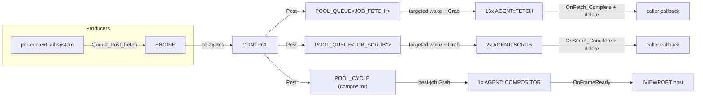

# Control System

The control system is the engine's scheduler — the threads, the work pools, the metronome that paces time-driven work, and the queues that carry units of work to the threads that run them. Where [`ENGINE`](engine.md) is the embedding boundary, `CONTROL` is the beating heart behind it: one owning thread that creates and supervises every other thread the engine runs, and the place where the engine's concurrency actually lives.

This page covers the whole stack: the `THREAD` base class and its precise wait/shutdown contract; `CONTROL` and its metronome loop; the three pool flavors (`POOL`, `POOL_QUEUE`, `POOL_CYCLE`); the agent types (`COMPOSITOR`, `SCRUB`, `FETCH`, and the placeholder `C`); the job hierarchy (`IJOB`, `JOB_FETCH`, `JOB_SCRUB`, `JOB_COMPOSITOR`); and the single hard constraint that shapes the rendering path — Filament's thread affinity. None of these classes are public (none live in `include/`), so this system page is their complete reference; there are no separate API-tier pages for them.

---

## Why it exists

An engine that fetches over the network, decodes assets, runs sandboxed code, and renders continuously cannot do all of that on one thread. But uncontrolled threading is worse than none: threads that outlive the objects they touch, shutdowns that race teardown, and work that piles up with nowhere to run are the classic failure modes. The engine needs a *disciplined* concurrency model — a fixed, known set of worker threads, created and destroyed in a strict order, fed by explicit queues, with one authoritative answer to "how does a thread know when to stop?"

`CONTROL` provides exactly that. It owns a single engine thread that, in turn, creates a fixed roster of agent pools. Every thread in the system — `CONTROL` itself and every agent — derives from one base class, `THREAD`, with one shutdown protocol. Work reaches agents only through typed queues. And a small set of design rules (documented below as the *threading contract*) exists precisely so that future edits do not reintroduce the shutdown and lifetime hazards that a managed thread layer is meant to prevent.

---

## The `THREAD` base class

Every managed thread in the engine derives from `THREAD` (declared in `Engine.h`, implemented in `Thread.cpp`). It wraps a `std::thread` together with one mutex, one condition variable, and three booleans (`m_bReady`, `m_bResult_Initialize`, `m_bShutdown`). A derived class implements one method, `Main()`, the thread's entry point.

The lifecycle:

- **`Initialize()`** spawns the OS thread running `Main()`, then blocks until the thread calls `Ready()`. It returns whatever result the thread passed to `Ready()`. This makes thread startup synchronous from the caller's point of view: when `Initialize` returns, the thread is up and has reported success or failure.
- **`Ready(bResult)`** is called from inside `Main()` once the thread has finished its own setup. It records the result, sets `m_bReady`, and wakes `Initialize`.
- **`Signal(bShutdown = false)`** wakes the thread. If `bShutdown` is true it latches `m_bShutdown` (it is OR-ed in, never cleared) before notifying. This is how both a plain "wake up, there's work" and a "wake up and stop" are delivered.
- **`Wait(predicate)`** and **`Wait(duration)`** are the two ways a thread sleeps. The predicate form is `m_cvThread.wait(lock, fnWork)`; the duration form is `m_cvThread.wait_for(lock, duration)`.
- **`IsShutdown()`** reads the shutdown flag.
- **`Join()`** signals shutdown and joins the OS thread if it is joinable.
- **`~THREAD()`** calls `Join()` as a safety net, then deletes the thread object.

### The wait/shutdown contract

This is the single most important rule in the control system, and it exists so that future edits do not duplicate shutdown checks in the wrong layer:

- **`Wait` is not shutdown-aware.** Neither overload reads `m_bShutdown` or calls `IsShutdown()`. The predicate overload is *exactly* `m_cvThread.wait(lock, fnWork)`.
- **The predicate owns the meaning of "done."** Signal-driven agents wait on `[this] { return Tick(); }`; queue-driven agents wait on `[this] { return Job(); }`. `Tick()` and `Job()` decide what runs on each wake and which boolean ends the wait. `Main()` must never wrap those lambdas with an extra `IsShutdown()` test.
- **The work happens inside the predicate.** Because `Job()`/`Tick()` are the wait predicate, the condition variable evaluates them on every wake — so grabbing and running jobs *is* the predicate evaluation. A queue agent's `Job()` drains its queue and then returns `IsShutdown()`: returning `false` keeps the thread waiting; returning `true` (shutdown latched) satisfies the predicate, `Main()` returns, and the thread exits.
- **Every derived destructor must call `Join()` first.** C++ destroys derived members before the base destructor runs. If `Main()` touches derived-class state, the base `~THREAD()` join would come too late and the still-running thread would read freed members. So `CONTROL`, `AGENT`, and every concrete agent call `Join()` as the first action in their own destructor; the `~THREAD()` join is only a backstop.

---

## `CONTROL`: the engine thread and metronome

`CONTROL` derives from `THREAD` and is the one thread the engine creates directly (in `ENGINE::Initialize`). Its `Main()` does three things in order.

First, it **creates the pools.** A static factory table, `aAgent_Init`, describes the fixed roster: for each pool it gives a tick rate in hertz, an agent count, a function to build the pool, and a function to build one agent. `Main()` walks the table, constructs each pool, pushes it onto `m_apPool`, and initializes it (which spawns that pool's agent threads). If any pool fails to initialize, it logs and stops. It then calls `Ready()` with the overall result — unblocking the engine's `Initialize`.

Second, it **runs the metronome loop.** This is a drift-free, fixed-origin clock. It records a steady-clock origin once, then on each iteration computes the elapsed seconds since that origin and calls `Tick(dElapsed)` on every pool, followed by a diagnostics pass. It then `Wait`s for one millisecond and repeats. Because every tick is computed against the *same origin* rather than accumulated per-iteration, scheduling does not drift over time. On Windows, `Main()` brackets the loop with `timeBeginPeriod(1)` / `timeEndPeriod(1)` so the 1 ms wait actually has 1 ms resolution (this links `winmm`).

Third, on shutdown it **destroys the pools** in order and clears the list. Destroying a pool signals and joins its agents, so by the time `CONTROL::Main` returns, every agent thread has stopped.

The roster as configured today:

| Pool index | Pool type | Agent | Count | Hz | Driven by |
|---|---|---|---|---|---|
| 0 | `POOL_CYCLE` | `COMPOSITOR` | 1 | 0 | queue (perpetual jobs) |
| 1 | `POOL_QUEUE<JOB_SCRUB*>` | `SCRUB` | 2 | 0 | queue |
| 2 | `POOL_QUEUE<JOB_FETCH*>` | `FETCH` | 16 | 0 | queue |
| 3 | `POOL` | `C` | 1 | 30 | metronome (placeholder) |

Only pool 3 has a non-zero hertz, so it is the only pool the metronome actually ticks; the other three are woken on demand when work is posted. The compositor is configured with a single agent — a direct consequence of the Filament constraint described below.

`CONTROL`'s public surface is intentionally thin: `Queue_Post_Fetch`, `Queue_Post_Scrub`, and `Queue_Post_Compositor` each forward to the matching pool's `Post`, and `Engine()` returns the owning engine. It does not manage agents, queues, or busy flags directly — that is the pools' job.

---

## Pools

A **`POOL`** owns a vector of agents and the metronome state for one tick rate. Its `Initialize(nHertz, nAgents, fnCreate)` constructs `nAgents` agents through the factory and initializes each. Its `Tick(dElapsed)` is the metronome hook: if the pool has a non-zero hertz and a new tick boundary has been crossed since the last call, it signals every agent. Its destructor signals all agents to shut down, then deletes them. `POOL` deliberately knows nothing about queues or jobs — it is pure agent-lifecycle and tick plumbing.

Two specializations add the actual work-delivery:

**`POOL_QUEUE<JOB_PTR>`** is a template that adds a typed job queue (instantiated only for `JOB_FETCH*` and `JOB_SCRUB*`). `Post(pJob)` locks the queue, appends the job, and then performs a **targeted wake**: it walks the agents and signals the first *idle* one. (The agent's `Busy()` call is an atomic claim — it returns true and marks the agent busy if the agent was previously idle, so "the first agent whose `Busy()` returns true" is "the first idle agent.") `Grab(pJob)` pops the front job under the lock. This is a simple FIFO with one-agent-per-post wakeups.

**`POOL_CYCLE`** is the compositor's pool and behaves differently: jobs are *perpetual*. They stay in the pool until explicitly `Remove`d, because a viewport renders frame after frame from the same job. Its `Grab(pJob, nAgentIz)` does not pop; it *selects the best available job* for the calling agent: a job in the `CREATE` or `DESTROY` state is handed out only to agent 0 (Filament affinity — see below), while jobs ready to render are chosen round-robin by longest-ago-rendered (smallest `m_nLastFrame`). Selection uses each job's own lock (`Busy`/`Idle`/`Unlock`) so two agents never grab the same job.

---

## Jobs

All work units derive from **`IJOB`**, which owns a mutex and a cancelled flag and provides `IsCancelled()`, `Cancel()`, and `Complete()`. The base `Complete()` is the self-cleaning contract: under the lock it delivers the completion callback (`Complete_Deliver()`, a pure virtual the concrete job implements) **only if the job was not cancelled**, and then `delete this`. A heap-allocated job therefore disposes of itself once an agent finishes with it.

**`JOB_FETCH`** carries everything a network download needs — URL, temporary and final paths, an optional Subresource-Integrity hash, and request headers — plus a `FETCH_RESULT` it fills in on completion. A flag (`IsFetch()`) distinguishes a real HTTP fetch from a *notify-only* job used to deliver an asynchronous result for a file that was already cached or already known failed. Its `Complete_Deliver()` calls the virtual `OnFetch_Complete(result)`.

**`JOB_SCRUB`** carries a single path to delete and delivers `OnScrub_Complete()`.

**`JOB_COMPOSITOR`** is the exception to the self-cleaning rule. It is a *perpetual* job holding a viewport pointer and a four-state machine (`CREATE → RENDER → PRESENT → DESTROY`), and it **overrides `Cancel()` and `Complete()`** with its own condition-variable handshake instead of `delete this`. Its lifetime is owned by the viewport, not by the agent: `Cancel()` forces the job into the `DESTROY` state and then *blocks the caller* until the compositor agent has actually finished destruction and called `Complete()`. This is how a viewport shutdown on an application thread waits for the render thread to release Filament resources before proceeding.

---

## Agents

An **`AGENT`** derives from `THREAD`, holds a back-pointer to its pool and an index within that pool (`m_nAgentIz`), and an atomic busy flag. `Engine()` reaches the engine through `m_pPool->Engine()`. There are four concrete agents.

**`AGENT::C`** is a placeholder. Its `Main()` calls `Ready()` then `Wait([this] { return Tick(); })`, and `Tick()` simply returns `IsShutdown()`. It is the only metronome-driven pool (30 Hz) and currently does no work — it exists to exercise and demonstrate the signal-driven pattern.

**`AGENT::SCRUB`** drains the scrub queue. Its `Job()` loops grabbing `JOB_SCRUB`s; for each, if not cancelled, it verifies the path contains the `/Transitory/` marker (a second safety check on top of the engine's path validation) and `remove_all`s the directory tree, logging the outcome, then calls the job's `Complete()`. When the queue empties it returns `IsShutdown()`.

**`AGENT::FETCH`** performs HTTP downloads (16 agents). Its `Job()` drains the fetch queue; for each non-cancelled job it runs `Execute()`, then calls `Complete()`. `Execute()` does a blocking `curl` download into the temporary path, captures response headers and the remote address, verifies the SRI hash if one was supplied, and on success renames the temporary file to its final path. A curl progress callback polls `IsCancelled()` and aborts an in-flight transfer if the job was cancelled. Notify-only jobs (`IsFetch()` false) skip the network entirely and just carry their result through to completion.

**`AGENT::COMPOSITOR`** drives rendering and is the most involved. Its `Job()` repeatedly asks `POOL_CYCLE::Grab` for the best job for this agent and dispatches on the job's state. The state handlers:

- **`Execute_Create`** — agent 0 only: read the host's frame size, resize the viewport, initialize the renderer, and advance the job to `RENDER`. Other agents leave the job in `CREATE` (so it returns to agent 0).
- **`Execute_Render`** — any agent: consume input, update the camera, traverse the scene object model into draw lists (textured spheres, orbit-trail curves, oriented boxes, UI panels, and lights), apply the per-scene render scale, push any background-colour change, and submit a frame to the renderer. Advances to `PRESENT`.
- **`Execute_Present`** — any agent: read back the framebuffer (when not rendering to a native surface), hand it to the host via `OnFrameReady`, run per-frame diagnostics, stamp the job's `m_nLastFrame`, and return to `RENDER`.
- **`Execute_Destroy`** — agent 0 only: shut the renderer down, remove the job from the pool, and call `Complete()` (releasing the thread blocked in `Cancel()`). Other agents leave the job in `DESTROY`.

---

## How work flows through the system

The metronome (pool 3) sits to the side: it is ticked by `CONTROL`'s loop rather than fed by `Post`, and today drives only the placeholder agent.

---

## Filament single-thread affinity

The compositor is configured with exactly one agent for a hard reason, documented in the code itself. Filament — the renderer behind the engine's ANARI device — requires that its engine object be **created and destroyed on the same OS thread**, and the ANARI layer over it does not expose any thread-transfer API. Creating the renderer on one thread and destroying it on another triggers a hard precondition failure ("shutdown() called from the wrong thread").

The mitigation is the agent-0 routing in `POOL_CYCLE::Grab`: every `JOB_COMPOSITOR` in the `CREATE` or `DESTROY` state is handed out *only* to compositor agent 0, guaranteeing renderer creation and destruction land on the same OS thread. With a single compositor agent today the constraint is automatically satisfied, but the routing logic is written to hold even if more compositor agents were added for rendering (the render/present states can run on any agent; only lifecycle is pinned). The preferred long-term fix is a thread-transfer API on the ANARI device so ownership can be handed back before destruction.

A practical consequence noted elsewhere in the engine: because Filament's present mode is vsync-locked and all viewports share the one compositor thread, N viewports render sequentially and total frame time scales with N.

---

## Current limitations

- **Compositor scaling is capped by one thread.** The single compositor agent serializes all viewport rendering. Adding agents is possible in principle (the render/present states are agent-agnostic) but blocked in practice by the Filament affinity constraint on create/destroy.
- **`IsShutdown()` reads `m_bShutdown` without locking.** The flag is written under the thread mutex in `Signal` but read unlocked in `IsShutdown`. It is only ever set (never cleared) and read as a loop-exit hint, so this is benign in practice, but it is a technically unsynchronized read.
- **Queue agents busy-drain inside the wait predicate.** Because the queue is drained within `Job()` (the wait predicate), a burst of posts is handled by whichever single agent was woken until the queue empties, rather than fanning out one job per agent. For the scrub and fetch workloads this is acceptable, but it is not a work-stealing scheduler.
- **The metronome pool is a placeholder.** Pool 3 (`AGENT::C`, 30 Hz) currently performs no work; it exists to validate the time-driven path. Time-driven engine work (simulation ticks) would attach here.
- **No global backpressure.** Queues grow unbounded; there is no limit on how many `JOB_FETCH`es can be posted ahead of the 16 fetch agents. Flow control, if needed, lives with the producers.

---

## See also

- [Engine](engine.md) — creates `CONTROL` during bring-up and posts jobs through it.
- [Viewport](viewport.md) — owns `JOB_COMPOSITOR`s and consumes `OnFrameReady`.
- [Network](network.md) — the producer and consumer of `JOB_FETCH`.
- [Scene](scene.md) — the tree the compositor traverses each frame.
- [Engine API reference](../api/sneeze/index.md) — the public `ENGINE` surface that fronts `CONTROL`.

---

[Systems index](index.md) · Prev: [Engine](engine.md) · Next: [Context](context.md)
