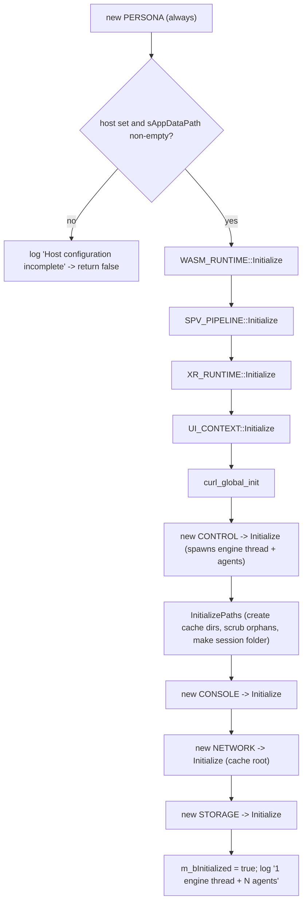

# Engine System

`ENGINE` is the single object a host application creates to use the engine. Everything the engine does — loading content, running sandboxed code, rendering, persisting data — happens inside an `ENGINE` instance and the per-session contexts it owns. If you think of the engine as the rendering core of a metaverse browser (the way Blink is the core of a web browser), `ENGINE` is the top of that core: the embedding boundary, the owner of every shared subsystem, and the place where the strict initialize/shutdown symmetry that runs through the whole codebase begins.

This page explains why a single entry point exists, what it owns, how it brings the engine up and tears it down in mirror order, how it manages browsing sessions (*contexts*), and how it lays out the on-disk cache for persistent and throwaway data. The exact method signatures are in the [Engine API reference](../api/sneeze/index.md); this page is about how and why the system works. The thread and agent machinery that `ENGINE` delegates to is covered separately in [Control](control.md).

---

## Why it exists

A reusable engine has to be embeddable. A host application — a browser, a tool, a test harness — needs exactly one well-defined object to instantiate, configure, and destroy, with no hidden global state and no assumptions about the surrounding program. It also needs the engine to be honest about failure: bringing up a renderer, a WASM runtime, a network stack, and a cache directory can each fail, and a half-initialized engine must never be left running.

`ENGINE` answers both needs. It is the one public object in the engine that a host constructs directly. It takes a host-supplied interface ([`IENGINE`](../api/sneeze/IENGINE.md)) for the few things only the host can provide — where to put files, which renderer to use, where log lines go — and from there owns everything else. Its construction and destruction are a strict mirror: subsystems come up in a fixed order, and if any step fails the engine reports it and stays down; on shutdown the same subsystems are torn down in exactly the reverse order. This symmetry is the single most important property of the engine, and `ENGINE` is where it is established.

---

## Concepts

**Host application.** Whatever embeds the engine. The engine never names or assumes a particular host; it talks to the host only through the interfaces the host implements.

**`IENGINE`.** The engine-level host interface. The host implements it to supply the application data path, the renderer name, and a log sink. The engine reads configuration from it during initialization and writes log lines to it throughout its life. See [IENGINE](../api/sneeze/IENGINE.md).

**Context.** A `CONTEXT` is one browsing session — the engine's equivalent of a browser tab. It owns its per-session subsystems (scene, viewport) and its containers, and reaches the engine-wide services (network, storage, console) through per-container handles rather than owning them. One engine holds many contexts. The host implements [`ICONTEXT`](../api/sneeze/ICONTEXT.md) to receive inspector callbacks for a context, and [`IVIEWPORT`](../api/sneeze/IVIEWPORT.md) to drive its rendering.

**Persona.** A local identity proxy. The engine owns one `PERSONA` shared across all contexts; logging in or out flows from the engine down to every open context.

**Persistent vs. transitory.** Data the engine caches is either *persistent* (kept across runs) or *transitory* (scoped to a session and scrubbed when it ends). This split is realized as two folders under the cache root, and it drives both path management and the orphan-cleanup behavior on startup.

---

## What the engine owns

`ENGINE` uses the pimpl idiom: the public class is a thin handle and all state lives in a private `ENGINE::Impl`. The implementation owns, in the order it creates them:

- the **`PERSONA`** — the local identity proxy, created first and destroyed last;
- the **WASM runtime** (`WASM_RUNTIME`) — the sandbox host for all third-party code;
- the **SPIR-V pipeline** (`SPV_PIPELINE`) — shader validation;
- the **XR runtime** (`XR_RUNTIME`) — the OpenXR device abstraction;
- the **UI context** (`UI_CONTEXT`) — the HTML/CSS UI toolkit;
- the global **curl** initialization — the process-wide HTTP stack setup;
- the **`CONTROL`** object — the engine thread, agent pools, metronome, and job queues (see [Control](control.md));
- the **cache paths** — the persistent and transitory directories on disk; and, built on top of those,
- the three **service singletons** — the **`CONSOLE`** (developer log), the **`NETWORK`** (resource loader + disk cache), and the **`STORAGE`** (persistent JSON document store), created in that order.

It also owns the list of open **contexts** (`m_apContext`), guarded by its own mutex. The console, network, and storage moved *up* to the engine so that one deduplicated log, cache, and document store serve every context; a context reaches them through per-container handles — a [`STREAM`](../api/console/index.md), a [`CACHE`](../api/network/index.md), and a [`SILO`](../api/storage/index.md) — rather than owning the subsystems. The renderer and scene remain per-context. The engine owns the engine-wide singletons and the contexts; each context owns its scene, viewport, and containers.

A second structural fact worth stating early: objects deeper in the engine never cache a pointer to the engine's services. They reach the engine through their owner chain (`NODE → FABRIC → SCENE → CONTEXT → ENGINE`) and ask for what they need. `ENGINE` is the root of that chain.

---

## Bring-up: nested initialization

`ENGINE::Initialize()` takes no arguments — it reads everything it needs from the `IENGINE` host. It performs a **nested success cascade**: each subsystem is created and initialized only if the previous one succeeded, so a failure at any depth stops the chain, logs a specific error, and leaves `m_bInitialized` false.



Two details matter. First, the `PERSONA` is constructed *before* the configuration check, so it always exists once `Initialize` has been entered — which is why it is the last thing destroyed. Second, the host's `sAppDataPath()` must be non-empty: without a place to put files the engine refuses to start, because the cache directory layout is foundational to everything downstream.

`CONTROL` is created midway through the cascade. Constructing and initializing it spawns the engine thread and all agent pools (the compositor, scrub, fetch, and metronome agents); the count reported in the success log line comes back from `CONTROL`. Path initialization happens next so that the scrub agents — already running inside `CONTROL` — are available to clean up orphaned transitory folders found on disk. The three service singletons come up last, on top of the ready cache paths: the `CONSOLE`, then the `NETWORK` (pointed at the engine cache root, where `network_reset.json` lives), then the `STORAGE`.

---

## Teardown: the exact mirror

Destroying the `ENGINE` runs `~Impl`, which reverses bring-up precisely:

1. If the engine initialized, **close every open context** (`while (Context_Close(nullptr))` pops the most recently opened context until none remain), then **scrub the session's transitory folder**. The scrub is queued *before* `CONTROL` is destroyed, because the scrub agents live inside `CONTROL`.
2. **Delete the `STORAGE`, `NETWORK`, and `CONSOLE`** singletons, in that order. The network is torn down here — *before* `CONTROL` — deliberately: its fetch agents must still be alive so `~NETWORK` can drain any in-flight assets.
3. **Delete `CONTROL`** — which joins the engine thread and every agent.
4. **`curl_global_cleanup`** (only if `curl_global_init` succeeded).
5. **Delete the UI context, XR runtime, SPIR-V pipeline, and WASM runtime**, in that order — the reverse of how they were created.
6. **Delete the `PERSONA`** — created first, destroyed last.
7. Log `"Shutdown complete"`.

The symmetry is deliberate and load-bearing: every subsystem is destroyed in the exact reverse of its creation. Two orderings carry weight: the scrub is queued before `CONTROL` dies so the cleanup work has a live worker to run on, and the `NETWORK` is deleted before `CONTROL` so its fetch agents can still drain in-flight downloads.

---

## Contexts: opening and closing a session

A host opens a browsing session with `Context_Open(pHost, sUrl, kSession)`:

1. The engine creates a fresh **transitory viewport folder** (`v` + 8 hex digits) under the transitory root, for this context's throwaway data.
2. It selects the context's **permanent path**: the shared persistent folder for a `kSESSION_PERSISTENT` context, or the per-run session folder for a `kSESSION_TRANSITORY` one.
3. It constructs the `CONTEXT`, **adds it to the context list before initializing it** (so the context is visible to other threads during its own startup — the engine-wide "add before init" rule), then calls `CONTEXT::Initialize(sUrl)`.
4. If initialization fails, the engine removes the context from the list, deletes it, and scrubs the temporary folder it just created — leaving no trace of the failed attempt.

`Context_Open` takes a fourth argument, `bReset` (default `false`). When set, the context stamps a durable cache-clear against its primary fabric's container key as it comes up, so the session refetches everything from origin — this is the engine's "clear cache and reload" entry point, backed by [`NETWORK::Reset`](../api/network/NETWORK.md).

`Context_Close(pContext)` is the mirror: it captures the context's temporary path, deletes the context, removes it from the list, and queues the temporary folder for scrubbing. Passing `nullptr` to the internal close path closes the most recently opened context — the idiom the destructor uses to drain them all. (The public `ENGINE::Context_Close` rejects a null argument; the null-means-most-recent behavior is internal.)

---

## Path management and the cache layout

All cached data lives under `<sAppDataPath>/Sneeze/Cache`, split into two trees:

```text
<sAppDataPath>/Sneeze/Cache/
├── Persistent/            kept across runs (kSESSION_PERSISTENT contexts)
└── Transitory/            scrubbed; scoped to a single run
    ├── s<8 hex>/          this run's session folder (kTRANSITORY_SESSION)
    └── v<8 hex>/          one per context/viewport (kTRANSITORY_VIEWPORT)
```

`InitializePaths()` creates the persistent and transitory roots, then **scans the transitory root for orphans** — leftover `s…` or `v…` folders from a previous run that crashed or exited uncleanly — and queues each for scrubbing. Finally it creates this run's session folder.

Because scrubbing deletes directory trees, the engine never scrubs a path it has not validated. `IsValidTransitoryPath` enforces a strict shape: the leaf name must be exactly nine characters, begin with `s` or `v`, and be followed by eight hexadecimal digits; the folder must sit exactly one level under a directory literally named `Transitory`. Any path that fails this check is rejected and logged rather than deleted. This is a safety guard against a corrupted or malicious path ever triggering a destructive `remove_all`.

The persistent path and the session path are exposed to the rest of the engine through `Path_Persistent()` and `Path_Session()`.

---

## Shared services on the engine

A handful of operations live directly on `ENGINE` because they are engine-wide rather than per-context:

- **Logging.** `Log(level, module, message)` forwards to the host's `IENGINE::Log`. Every subsystem in the engine logs through here, so the host sees one unified stream.
- **Persona.** `Login`, `Logout`, and `ChangePersona` operate the shared identity proxy. `Logout` walks every open context, logging out each in turn, then logs the persona out; `ChangePersona` is a logout followed by a login.
- **Job submission.** `Queue_Post_Fetch` and `Queue_Post_Compositor` hand jobs to `CONTROL`'s pools. These exist on the engine so that per-context subsystems can submit work through the owner chain without holding a `CONTROL` pointer. The details of what those jobs do live in [Control](control.md).

---

## Threading model

`ENGINE` itself is mostly a thin coordinator; the real concurrency lives in `CONTROL` and its agents. Three things about the engine layer are worth knowing:

- **The context list is guarded by `m_mxContext`.** `Context_Open` and `Context_Close` take it around list mutation. Note that `Context_Close` deletes the context *while holding* this mutex — a context teardown therefore runs under the engine's context lock.
- **Initialization is single-threaded but spawns threads.** `Initialize` runs on the caller's thread, but constructing `CONTROL` starts the engine thread and the agent threads, which run for the engine's lifetime. From that point on the engine is multi-threaded.
- **`THREAD` is the shared thread primitive.** Both `CONTROL` and every `AGENT` derive from `THREAD` (declared in `Engine.h`, implemented in `Thread.cpp`). Its wait/shutdown contract — and the rule that every derived destructor must `Join()` first — is detailed in [Control](control.md), which is where threads actually run.

---

## Current limitations

These come straight from the code and shape how the engine behaves today.

- **Context teardown holds the context lock.** `Context_Close` deletes the context inside the `m_mxContext` critical section. Context destruction can be heavy (it cascades through scene, network, and container teardown), so the lock is held for the full duration; any other thread needing the context list waits behind it.
- **`Initialize` is not re-entrant or restartable.** It is meant to be called once on a freshly constructed engine. There is no partial-retry path: a failure logs and returns `false`, and the only correct response is to destroy the engine and start over.
- **`sRenderer()` is consulted lazily, not at bring-up.** The engine does not validate the host's renderer name during `Initialize`; it is read later when a viewport activates its renderer. A bad renderer name therefore surfaces as a viewport-time failure, not an engine-init failure.
- **The transitory scrub depends on a live `CONTROL`.** Cleanup of session folders is queued to scrub agents. The destructor orders the queueing before `CONTROL` is deleted, but any path that tears `CONTROL` down first would silently drop pending cleanups.

---

## See also

- [Engine API reference](../api/sneeze/index.md) — exact `ENGINE` / `IENGINE` / `ICONTEXT` / `IVIEWPORT` signatures.
- [Control](control.md) — the engine thread, agent pools, metronome, and job queues `ENGINE` delegates to.
- [Context](context.md) — the per-session object `ENGINE` opens and closes.
- [Persona](persona.md) — the identity proxy the engine owns and drives.

---

[Systems index](index.md) · Next: [Control](control.md)
