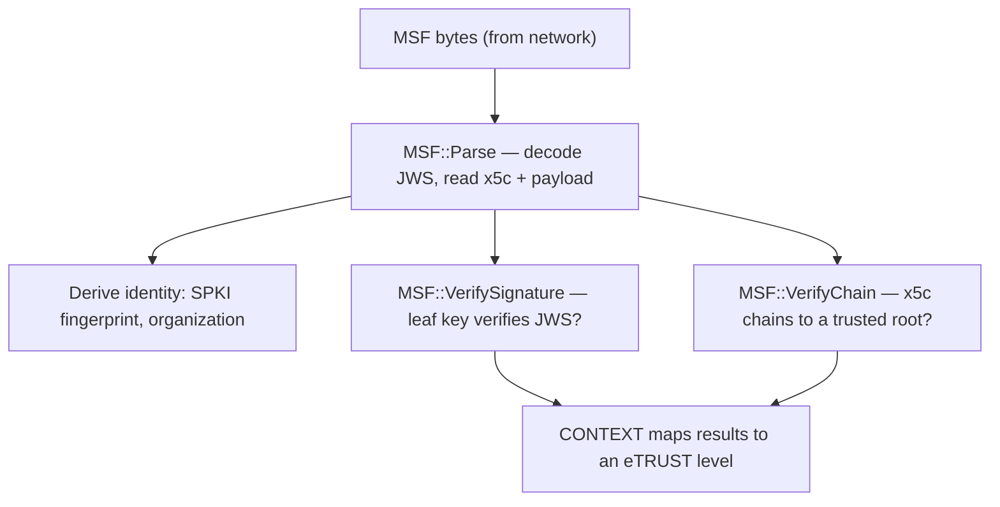

# MSF System

An open metaverse has no single publisher. Content arrives from many independent sources, and — unlike a web page that mostly renders passive markup — a spatial fabric ships **executable code** (WebAssembly modules) that the engine will run. The MSF system is the engine's answer to the obvious danger in that: *how do you know who wrote the thing you are about to execute, and that it has not been tampered with in transit?* This page explains what a Metaversal Spatial Fabric (MSF) file is, how the engine parses and verifies one, how cryptographic facts become a trust level the rest of the engine can act on, and where the sharp edges are today.

The exact class surface is in the [MSF API reference](../api/msf/index.md). This page is about how and why the system works.

---

## Why it exists

A metaverse browser is, at heart, a program that downloads other people's code and runs it on the user's machine. That is the same risk model a web browser faces, but amplified: the payload is not sandboxed-by-default HTML, it is compiled modules that build and mutate the shared 3D world. Three questions must be answerable *before* any of that code runs:

- **Integrity** — did the bytes arrive exactly as the author produced them, or did something modify them on the way?
- **Provenance** — who is the author? Can their identity be tied back to an authority the user already trusts?
- **Stable identity** — if the same author publishes content twice, or renews their credentials, can the engine recognize it as the *same* author and keep their data and permissions consistent?

The MSF system answers all three by wrapping a fabric's manifest in a **signed envelope** and giving the engine an explicit, inspectable verification path. An MSF that fails verification is not silently trusted; it is loaded with a trust level that says, in effect, "we could not vouch for this," and the rest of the engine — the [container](container.md) model, the [console](console.md), the chrome — colors its behavior accordingly.

---

## What an MSF file is

An MSF file is a fabric's **manifest**: a JSON document describing the fabric's container name, the WebAssembly modules it loads, the network services it talks to, and an optional successor reference. That JSON is the *payload*. The system supports the payload in two envelopes:

- **Signed** — the payload is wrapped as an [RFC 7515](https://www.rfc-editor.org/rfc/rfc7515) **JWS compact serialization**: three base64url segments (`header.payload.signature`) joined by dots. The signer's full X.509 certificate chain travels inside the JWS protected header's `x5c` array. This is the real, verifiable form.
- **Unsigned** — a bare JSON document with no envelope. The engine still parses it so that local development and experimentation work, but it carries no cryptographic identity at all. It is treated as completely untrustworthy (see [trust levels](#trust-levels)).

The single `MSF` class handles the entire lifecycle of both forms: parsing, signing, verification, certificate management, and typed access to the payload fields. A nested `MSF::CHAIN` class performs the X.509 chain validation. Both live in the `SNEEZE` namespace.

### The payload fields

The payload is plain JSON, but the engine reads a fixed set of typed fields out of it:

- a **container** name — the logical identity of the runtime sandbox the fabric runs in (see [Container](container.md));
- a list of **modules**, each a `{ url, hash }` pair naming a WebAssembly module to fetch and its expected integrity hash;
- a list of **services**, each a `{ name, type, endpoint, modules }` record describing an external service (for example a websocket game server) the fabric connects to;
- an optional **successor** reference, used to point at a newer version of the fabric.

These are exposed as the `MSF::SERVICE` and `MSF::MODULE` structs and the typed accessors documented on the [MSF API page](../api/msf/MSF.md).

---

## Parse, then verify — two explicit steps

The most important design decision in this system is that **parsing and verifying are separate, explicit operations**. `Parse` never verifies, and the parsed data is always available afterward whether or not verification succeeds or is even attempted.

```cpp
SNEEZE::MSF msf (pEngine);
msf.Parse (sJwsOrJson, sUrl);   // populates payload, certs, fingerprint
msf.VerifySignature ();          // checks the JWS signature against the leaf key
msf.VerifyChain ();              // checks the cert chain against the trust store
```

This separation exists because the two checks answer different questions and can fail independently. `VerifySignature` answers *"were these exact bytes signed by the holder of the leaf certificate's private key?"* — that is the **integrity** question. `VerifyChain` answers *"does that leaf certificate chain up to a certificate authority the user trusts, and is it currently valid?"* — that is the **provenance** question. A document can have a perfectly valid signature from a key whose certificate chains to no trusted root (self-signed, say), and the engine wants to distinguish that case from a forged signature. Keeping the steps apart is what lets it.

### Parsing

`Parse(sJws, sUrl)` first resets every field, then decides the envelope by looking at the first meaningful character. After skipping an optional UTF-8 byte-order mark and leading whitespace, an input whose first character is `{` or `[` is treated as **plain JSON**; otherwise, an input that contains a `.` is treated as **JWS compact serialization**. Testing for JSON first is deliberate — it stops the dots inside a plain-JSON payload (in float literals or embedded URLs) from being mistaken for JWS segment separators.

For a **JWS**, it decodes the compact form, reads the signing algorithm from the header, and walks the `x5c` certificate array. For each certificate it decodes the metadata into an `MSF::CERT` record (subject, issuer, organization, serial, validity window, key type and size, CA flag). From the **leaf** (first `x5c` entry) it derives three identity values up front, independent of any later verification:

- the **fingerprint** — the SHA-256 of the leaf's *Subject Public Key Info* (SPKI);
- the **organization** — the `O` field of the leaf's subject;
- the **organization hash** — the SHA-256 (full 64-hex) of the leaf's subject string, used as a display stand-in when the organization is not yet trusted.

Finally it reads the JSON payload out of the JWS `data` claim. For a **plain JSON** document there are no certificates; the engine parses the JSON directly and synthesizes a fingerprint from the SHA-256 of the URL plus the content — unique per file, but deliberately worthless as an identity.

### The identity fingerprint and why it survives cert renewal

The fingerprint that identifies a source is the SHA-256 of the leaf certificate's **public key (SPKI)** — not of the whole certificate. This is deliberate. A certificate carries a validity window and a serial number that change every time it is renewed, but an organization that renews a certificate while keeping the *same key pair* keeps the *same SPKI*, and therefore the same fingerprint. Binding identity to the key rather than to the certificate means a source's persistent data and trust relationships survive certificate renewal. The same SPKI-fingerprint logic is exposed on `CHAIN` as `GetLeafFingerprint` (computed over the *validated* leaf) and via the static `CHAIN::ComputeFingerprint` (computed over any base64-DER certificate).

---

## Verifying the signature

`VerifySignature` extracts the public key from the leaf certificate (`x5c[0]`) as PEM, then asks the JWS library to verify the compact serialization against that key using the algorithm named in the header. Six algorithms are supported, matching what the signer may use: **RS256, RS384, RS512** (RSA with SHA-256/384/512) and **ES256, ES384, ES512** (ECDSA over the corresponding curves). If the document was not parsed, has no certificates, names an unsupported algorithm, or the signature does not match, the method records a human-readable reason in `SignatureError` and reports failure. The crypto is provided by **BoringSSL**, driven through the header-only **jwt-cpp** library.

A subtle but important point: a valid signature here proves only that whoever held the leaf's private key signed these bytes. It says *nothing* about whether that leaf is legitimate. That judgment is the chain's job.

---

## Verifying the chain

`VerifyChain` hands the `x5c` certificates to the `MSF::CHAIN` validator, which is a thin, careful wrapper over BoringSSL's `X509_STORE` machinery.

The validator maintains a **trust store** — a set of certificate authorities the engine considers roots of trust. On first use it lazily loads the platform's system root store (on Windows, the `ROOT` system certificate store; elsewhere, OpenSSL's default certificate paths). Callers can add extra trusted roots with `AddTrustedCert` (used, for example, to trust a development or organization-specific CA). Validation then:

1. decodes each base64-DER `x5c` entry into an X.509 object (failing fast if any entry is malformed);
2. extracts an `MSF::CERT` info record for each, marking entry 0 as the leaf and the rest as CAs;
3. treats entry 0 as the leaf, entries 1..n as untrusted intermediates, and runs `X509_verify_cert` against the trust store;
4. on success, remembers a copy of the validated leaf so its SPKI fingerprint can be read back.

On failure it returns the BoringSSL error string. The MSF layer inspects that string for the word `expired` to distinguish an **expired-but-otherwise-valid** chain from a chain that does not validate at all — a distinction that matters downstream, because an expired certificate from a known organization is treated very differently from an unverifiable one.



---

## Trust levels

Verification produces booleans — `IsSignatureValid`, `IsChainTrusted`, `IsChainExpired` — but the rest of the engine reasons in terms of a single ordered **trust level**, the `eTRUST` enum declared in `include/Container.h`:

| Level | Meaning |
|---|---|
| `kTRUST_NONE` | No judgment made yet (initial state). |
| `kTRUST_UNTRUSTED` | Signature did not verify — integrity failed. Treat as hostile. |
| `kTRUST_UNVERIFIED` | Signature valid, but the chain does not reach a trusted root. |
| `kTRUST_EXPIRED` | Signature valid and chain otherwise sound, but a certificate has expired. |
| `kTRUST_VERIFIED` | Signature valid and chain trusted and current — fully vouched for. |
| `kTRUST_ROOT` | The engine's own synthetic root fabric; maximal trust by construction. |

The mapping happens in [`CONTEXT`](context.md) when it opens a container for a verified MSF: if the signature is invalid it is `kTRUST_UNTRUSTED`; otherwise if the chain is not trusted, `kTRUST_UNVERIFIED`; otherwise if the chain is expired, `kTRUST_EXPIRED`; otherwise `kTRUST_VERIFIED`. The engine's own structural root fabric — which has no MSF — is assigned `kTRUST_ROOT` directly.

The level drives user-facing behavior: the container's display name shows the real organization name only once trust reaches `kTRUST_EXPIRED` or better, and shows the opaque organization *hash* below that — so an unverified source cannot impersonate a known one by simply putting a famous name in its certificate subject.

> **Current behavior worth knowing.** The trust-mapping path in `CONTEXT` currently has a hard-coded override that forces the level to `kTRUST_EXPIRED` after computing it. This is a temporary measure standing in for a real trusted-CA configuration (the engine does not yet ship a metaverse root authority), and it means freshly verified content presents as *expired* today regardless of its certificate. It is expected to be removed once a real trust anchor is wired in.

---

## How the scene consumes a verified MSF

The MSF system's caller is the [scene](scene.md). When a node references a fabric URL, the scene fetches the file through the container's [cache](network.md), constructs an `MSF` on the engine, and runs the full sequence in one place: `Parse`, then `VerifySignature`, then `VerifyChain`. It hands the parsed MSF to the [context](context.md), which reads the three verification booleans and maps them to the container's `eTRUST` level (above), and opens a [`FABRIC`](../api/scene/FABRIC.md) that takes ownership of the MSF for its lifetime. Verification never blocks the load — a document that fails to verify still opens, just at a lower trust level.

The verified payload then drives two distinct things:

- **Modules become fetched, hash-checked WebAssembly.** The fabric reads `MSF::Modules()` and, for each `{ url, hash }`, opens a file on the container's cache with the declared hash supplied. This is the **SRI (subresource-integrity) path**: the MSF only *carries* the expected hash, but because the scene passes it to `File_Open`, the [network](network.md) layer verifies the fetched bytes against it before the module is instantiated. A module whose bytes do not match its declared hash is rejected before any code runs.
- **The primary fabric drives page-wide presentation.** For the primary fabric *only*, the scene reads an optional `primary` block out of the payload (via `MSF::Payload()`, not a typed accessor) and applies it: an initial **camera pose** — `primary.camera.position` (an absolute world position in metres) and `primary.camera.rotation` (an orientation quaternion) — and a **backdrop** — `primary.background`, an `"RRGGBB"` hex string applied as the scene's background color. Subsidiary fabrics loaded deeper in the world do not affect the camera or backdrop.

The scene-graph **nodes** and objects the fabric contributes are decoded by the [Scene](scene.md) subsystem from the same payload; the MSF system's own responsibility ends at delivering a parsed, verified, typed payload and a trust level for it.

---

## Composing and signing

The same class composes and signs an MSF, which is how the project's tooling produces test fabrics. A caller builds the payload through the typed setters (`SetContainer`, `AddService`, `AddModule`, `SetSuccessor`), supplies the certificate chain leaf-first through `AddCert`, and calls `Sign(privateKeyPem, algorithm)`. `Sign` converts each PEM certificate to base64-DER for the `x5c` header, serializes the payload into the `data` claim, and signs the compact form with the chosen algorithm (default `RS256`). The result is a JWS string ready to publish.

---

## Threading

The `MSF` class holds no locks and is not internally synchronized; an instance is owned and driven by a single fabric-loading flow at a time. In practice an MSF is constructed, parsed, and verified on the network fetch thread that delivered its bytes (see the [Scene system](scene.md)'s loading flow), then handed to the context to open a container, and finally owned and deleted by the [`FABRIC`](../api/scene/FABRIC.md) it described. The `CHAIN`'s lazy trust-store load is likewise a one-time, single-threaded step on first validation. Because each MSF instance belongs to one load at a time, no per-instance locking is required; sharing one `MSF` across threads is not supported.

---

## Current limitations

These come straight from the code and shape the system's behavior today.

- **No real metaverse trust anchor yet.** The engine relies on the platform root store plus any explicitly added CAs. There is no shipped metaverse-wide root authority, and the `kTRUST_EXPIRED` override above stands in for one. Until a real anchor exists, `kTRUST_VERIFIED` is effectively unreachable in normal loading.

- **The MSF system carries module hashes; the network layer enforces them.** Each `MSF::MODULE` names an integrity `hash`, but the `MSF` class itself only records it. Enforcement is delegated: when the [scene](scene.md) fetches a module it passes the hash to the container cache's `File_Open`, and the [network](network.md) layer verifies the fetched bytes against it before the module is accepted. So module integrity *is* gated at fetch — just not by the MSF class.

- **Unsigned MSFs are accepted.** Plain-JSON fabrics parse successfully to support local development. They carry a synthetic, worthless fingerprint and map to the lowest trust, but the format is permitted rather than rejected outright.

- **Expiry is detected by string match.** Whether a chain failed because it *expired* versus some other reason is decided by searching the BoringSSL error string for `expired`. This is pragmatic but brittle against error-string changes.

---

## See also

- [MSF API reference](../api/msf/index.md) — exact `MSF` and `MSF::CHAIN` signatures.
- [Container](container.md) — the runtime identity an MSF's verification produces.
- [Scene](scene.md) — where an MSF is fetched, parsed, and verified during fabric loading.
- [WASM](wasm.md) — the sandboxed modules an MSF declares.
- [Network](network.md) — how the MSF and its modules are fetched and cached.

---

[Systems index](index.md) · Prev: [Viewport](viewport.md) · Next: [WASM](wasm.md)
