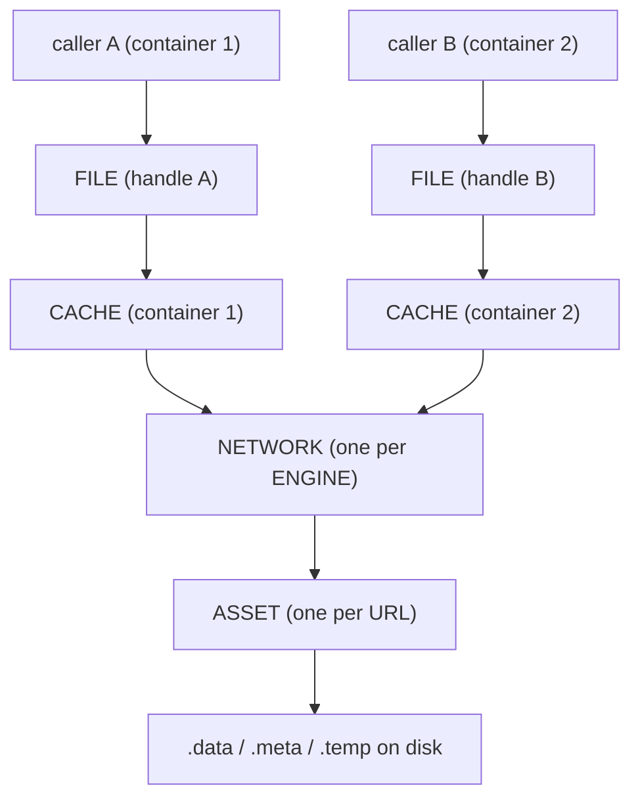
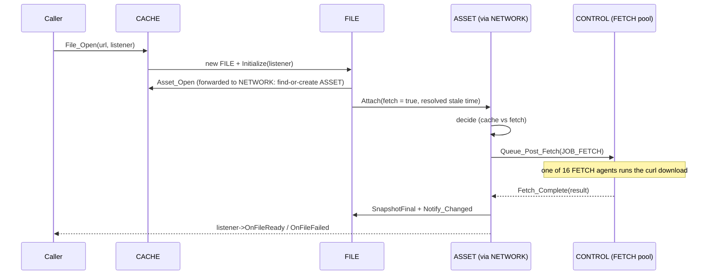

# Network System

The network system is the engine's resource loader and on-disk cache. Every byte that arrives from outside the engine — the signed file that describes a fabric, the WebAssembly modules a source ships, the textures a node paints itself with — comes through here. This page explains why the system is shaped the way it is, the three cooperating object types at its core, how a fetch travels from request to callback, how "clear the cache" is resolved in a browser that has no single origin, and the concurrency hazards that dominate its design.

It assumes you have read [Core Concepts](../overview/core-concepts.md). The exact class and method signatures are in the [Network API reference](../api/network/index.md); this page is about how and why the system works.

---

## Why it exists

Content in the open metaverse is fetched from many independent sources, and the same resource is often wanted by several parts of the engine — and several contexts — at once. A naive "download this URL" call would re-fetch the same bytes repeatedly, block whoever asked, lose everything on restart, and trust whatever came back. The network system exists to turn raw fetching into something the rest of the engine can lean on. It must:

- **fetch without blocking** — requests are issued on background threads and the caller is notified when the result is ready,
- **cache to disk and survive restarts** — a resource fetched once is served from disk next time, even after the process exits,
- **deduplicate** — many callers asking for one URL share a single download and a single cached copy, even across different contexts,
- **verify integrity** — a caller can demand that the bytes match a cryptographic hash before they are accepted,
- **stay inspectable** — a host's developer tools can watch every request, including ones that have already completed.

These requirements pull in different directions. Sharing demands one object per URL, while per-caller notification and inspection demand one object per request; and because one engine serves many contexts, the shared object must be engine-wide while the per-request objects are naturally grouped by the container that opened them. The system resolves the tension with three cooperating types plus a private one.

---

## The three tiers: NETWORK, CACHE, and FILE

### NETWORK — the engine-owned core

There is exactly **one `NETWORK` per [`ENGINE`](../api/sneeze/ENGINE.md)**, constructed with a back-pointer to it. It owns the deduplicated asset store (one private `ASSET` per cached URL, shared across every context), the background fetch machinery, the monotonic asset-index counter, and the durable record of when caches were cleared. It does not open files itself; it hands out a per-container cache.

### CACHE — the per-container handle

A `CACHE` is opened from `NETWORK::Cache_Open` for one [`CONTAINER`](container.md) and held for that container's lifetime (reachable via `CONTAINER::Cache()`). It is the object callers actually open files against. It owns the container's `FILE` handles — the file tier — and forwards every asset operation and the permanent cache path back to its `NETWORK`. The disk cache itself is engine-wide; a cache contributes only the file-handle layer. Because one engine-wide network now serves many contexts, the cache resolves the host itself, through `m_pContainer->Context()->Host()`, rather than caching a host pointer.

### FILE — the per-caller handle

A `FILE` is what a caller gets back when it asks for a resource. It is a handle: one per `File_Open` call, owned by the cache but handed out as a raw pointer. Each caller that wants a URL opens its own `FILE`, registers an optional listener on it, reads the bytes through it when they arrive, and closes it when done. A `FILE` reaches everything through its cache's private `ICACHE_IMPL` — file-lifecycle operations are implemented by the cache, while asset operations and the permanent path are forwarded by the cache to the network.

Crucially, a `FILE` carries a **snapshot** of the resource's display-level fields — state, URL, hash, size, HTTP status, timing, content type. The snapshot is copied from the shared asset at well-defined moments, so the handle can still report what happened *after* it has detached from the underlying data. This is what lets a developer inspector keep showing a completed request long after the bytes were consumed.

### ASSET — the private, shared, one-per-URL state

An `ASSET` is the network system's private internal class — never exposed to callers, declared only in the module's private header. There is exactly **one ASSET per cached resource**, keyed by the resource's on-disk pathname (which is derived from the URL), and owned by the engine-wide `NETWORK`. All the `FILE` handles for the same URL — across every cache and every context — point at the same `ASSET`. The asset owns the real shared state: the current fetch state, the in-flight fetch job, the cached bytes on disk, the response headers, and the `.meta` sidecar bookkeeping.

The split is the whole design. **FILE is per-request and per-caller; CACHE groups files by container; ASSET is per-resource and engine-wide.** Deduplication, caching, and the actual fetch live on the asset; the file-handle registry and the container-scoped path live on the cache; notification, inspection, and lifetime-from-the-caller's-view live on the file. Keying assets by disk pathname in a single engine-wide store is also what stops two contexts from writing the same cache file concurrently.



---

## The two-counter ASSET lifecycle

An asset's life is governed by **two independent reference counts**, and understanding them is the key to understanding the system.

- **`m_nCount_Open`** counts how many `FILE` handles *reference* the asset structurally. It rises in `Open` (called from `File_Open` via the cache's forwarded `Asset_Open`) and falls in `Close`. When it reaches zero the asset is removed from the live asset map and deleted. This counter answers "does anyone still hold this asset?"

- **`m_nCount_Attach`** counts how many handles are *actively engaged* with the asset's data — the ones that want it fetched and loaded. It rises in `Attach` and falls in `Detach`. The first attach (`0 → 1`) loads the `.meta` sidecar from disk; the last detach (`1 → 0`) flushes the sidecar back to disk and evicts the asset's in-memory fields. This counter answers "does anyone still want this data live?"

The separation matters because a handle can exist without engaging — a **passive open** (no listener) creates the asset and bumps `m_nCount_Open` but does not attach, so it neither triggers a fetch nor loads the sidecar. An inspector enumerating history holds files this way.

### Lazy loading

Nothing happens until it is needed. The asset is created on the first `File_Open` for its URL, not before. The `.meta` sidecar — the small JSON file recording what is cached and whether it is still valid — is read from disk only on the first *attach*, not at construction. An asset that is opened passively and never attached never touches the sidecar.

### The attach decision

The heart of the cache logic is `ASSET::Attach`. When a handle attaches with a fetch allowed, the asset inspects its current state, the caller's requested hash, whether caching is enabled, and the resolved stale timestamp, and decides among: serve the cached bytes, re-fetch because the cache is stale or the hash changed, verify a now-required hash against cached bytes, propagate a prior failure, or start a first fetch. The notable cases:

- **Cached and valid** — served straight from disk; no network traffic.
- **Cached but stale** (its `createdAt` predates the resolved stale timestamp) — the cached files are discarded and a fresh fetch starts.
- **Cached without a hash, but the caller now supplies one** — the cached bytes are hashed in place; if they match, the hash is adopted and they are served; if not, they are treated as corrupt and re-fetched.
- **Caller's hash differs from the asset's recorded hash** — the content has been revised; re-fetch.
- **Caching disabled for this caller** — a fresh fetch is forced even if cached.
- **Previously failed** — the failure is propagated to this caller too.

The stale timestamp used in that decision is resolved *before* the asset lock is taken: `FILE::Attach` asks the cache (`ICACHE_IMPL::Reset_Stale`), which resolves the container's own reset time or, failing that, the network's record for the context's reset key, and passes the resulting string into `ASSET::Attach`. This ordering is what keeps the reset lock and the asset lock from ever nesting (see [Threading model](#threading-model)).

---

## Disk layout and the cache key

Every asset maps to three files on disk that share a base pathname:

```text
<base>.data    the cached payload bytes
<base>.temp    the in-flight download (renamed to .data on success)
<base>.meta    a JSON sidecar describing the asset
```

The base pathname fans out by identity and a per-URL key:

```text
<PermanentPath>/<personaHash>/<fp[0:2]>/<fp[2:24]>/<container>/Network/<dk[0:2]>/<dk[2:]>
```

The identity prefix `<personaHash>/<fp[0:2]>/<fp[2:24]>/<container>` is owned by `CONTAINER` (`CONTAINER::Path_Permanent_All()`); the `Network` segment is the cache's own (`CACHE::Path()`), and `FILE` builds the leaf on top of it rather than re-deriving identity. The `<fp...>` segments come from the owning [container](container.md)'s certificate fingerprint, and `<dk>` is the **disk key**: a SHA-1 of the URL, truncated to 12 bytes (24 hex characters), with its first two characters peeled off as a fan-out directory so no single directory accumulates too many entries. Keying the path by container means the same URL fetched under two different identities is cached separately — the metaverse browser identifies origins by certificate, not domain. The `Network` directory is created once at `CACHE::Initialize`; each asset creates its own `<dk[0:2]>` leaf at open.

The `.temp`-then-rename pattern is used everywhere a file is written (payloads, sidecars, the reset record): write to a temporary name, then atomically rename over the target, so a crash mid-write never leaves a half-written file in place.

### The `.meta` sidecar

The sidecar records the URL, the accepted hash, the asset index, the byte size, the creation time, the HTTP status, and the request/response headers. On the first attach it is read back to reconstruct a cached asset's state without re-fetching; on the last detach it is rewritten if the asset is `READY` (or removed if the asset `FAILED`). The recorded URL is checked against the requested URL and the `.data` file's existence is confirmed before a sidecar is trusted — a sidecar without its payload is ignored.

---

## Clearing the cache

"Clear the cache and reload" is one of the most familiar commands in a browser, and in the single-origin web it is conceptually simple: a tab shows one site, that site is the origin, and clearing means discarding that one origin's files. There is never any ambiguity about *what* is cleared, because there is only ever one thing it could be.

A metaverse browser is **multi-origin** by nature. When a context (the metaverse equivalent of a tab) opens, it loads a single **primary fabric** — but that is only the starting point. The primary's container can load other containers, those can load still more, and as the user moves through the world the browser continuously loads and unloads containers. Over a long session a single context might touch hundreds of containers from dozens of organizations. The context is not "a site"; it is a living, changing *collection* of containers. So "clear the cache of this context" is genuinely ambiguous — the equivalent of standing in a tab that has shown a hundred sites over a week and saying "clear the cache on this tab." Which ones?

The design answers the ambiguity by separating two questions that are easy to conflate: *what the clear affects* and *where the fact that it happened is recorded*.

- **What the clear affects: the whole context.** A clear request is context-wide. It does not single out one container — it marks every cached file the context relies on as stale, so the entire context refetches as it continues to run. This matches what the user means: the experience in front of them, not one fabric buried inside it.
- **Where it is recorded: under the key of the primary fabric's container.** The browser needs a durable, stable place to write "this context's cache was cleared at time T." The natural anchor is the context's primary fabric's *container* — the concrete, identity-bearing runtime instance that defines the context and persists across reloads. That container is the **home of the record, not the limit of the clear.**

**One timestamp per key.** The record does not need to be elaborate. It reduces to a single timestamp per primary-container key, meaning simply: *any cached file created before this moment is stale and must be refetched.* Clearing is nothing more than stamping that timestamp with the current time ([`NETWORK::Reset`](../api/network/NETWORK.md#cache-reset-durable-clear-the-cache)). On each request, the asset compares its `createdAt` against the resolved stamp — it survives iff `createdAt >= stamp` — and serves from disk or refetches accordingly. Staleness is wall-clock time, never the asset index.

**Durability.** A clear that touched only the live, in-memory copy would evaporate on reload. The record is therefore persisted to disk, keyed by the stable container key, so the clear survives a reload of that fabric — even in a brand-new context later. When a context loads its primary fabric's container, the network resolves that container's key against the stored record and applies it.

**Two contexts that share a primary share the clear; contexts with different primaries do not.** Because the record is one durable entry keyed by the primary's container, any context whose primary is *that same container* resolves *that same entry* — clear one tab, and the other tab on the same primary is cleared too. Conversely, if a container that is subsidiary in context A happens to be the *primary* of context B, clearing in A stamps only A's own primary key: A's live view of the shared subsidiary is treated as cleared, but B — where that fabric is primary — resolves no durable clear and is untouched. You cleared the fabric you were standing in, not someone else's primary that happened to be embedded in yours. This is the web-consistent answer, and it is a deliberate scoping decision.

### `network_reset.json`

The whole mechanism lives in a single file directly under the engine's cache root (`<sPath_Root>/network_reset.json`, passed to `NETWORK::Initialize`) — never scattered per container. It carries three things:

- **A map of primary-container key → stale timestamp.** One entry per container that has been explicitly cleared; a key with no entry has never been cleared.
- **A global stale floor (`m_sTime_Stale`).** A single timestamp applied to *every* key. It is always a real timestamp, never empty.
- **The monotonic asset-index counter (`nAssetIx_Next`).** Unrelated to staleness — it is the durable fetch identity persisted per asset. It rides in the same file because it is correlated state, and it is written *reserve-ahead* (a ceiling `RESERVE_BLOCK = 1000` indices ahead) so a crash skips at most one block while disk writes stay rare.

The effective stale time for a request is the **later** of the global floor and the key's own entry — the most aggressive clear wins. Because the currency is a timestamp, **losing or corrupting `network_reset.json` is not fatal.** A failed or missing load sets the global floor to "now," which stales every asset created in a prior session — an implicit whole-cache clear that traverses no tree and deletes no files; surviving files simply refetch on next access. The very first run takes the same path and sets the baseline floor (nothing real predates it), and that floor is then persisted like any other state.

A blanket network-wide clear was removed in the singleton migration: it no longer makes sense when one `NETWORK` serves every context. `CONTEXT::Logout` is a no-op for the same reason.

---

## A fetch from request to callback



A fetch is never run on the caller's thread. The asset packages the request as a `JOB_FETCH` and posts it through `INETWORK_IMPL::Queue_Post_Fetch`, which forwards it to the engine and into [CONTROL](control.md)'s dedicated **FETCH pool** — capped at **16 concurrent fetch agents**. Each agent performs a blocking download; overflow requests queue and dispatch as agents free up. When a download finishes, the agent calls back into `ASSET::Fetch_Complete`, which records the result, snapshots and notifies every attached `FILE`, and clears the in-flight job.

### Asynchronous notification, even for cache hits

A subtle but important rule: **completion is always delivered asynchronously**, never inline. Even when a resource is already `READY` or `FAILED` in the cache, the attach path posts a *notify-only* `JOB_FETCH` rather than calling the listener directly. This prevents re-entrancy — a listener firing in the middle of `File_Open` could call back into the network system while it is still setting the request up. The notify-only job sets the asset to `FETCHING` while it is in flight so overlapping requests do not clobber the job pointer, and when it fires, `Fetch_Complete` notifies *every* file attached during the window, not just the original requester. The trade-off is that piggy-backing files inherit the original's timing values — a minor reporting approximation over identical data.

---

## Threading model

The network carries **three independent recursive mutexes** rather than one coarse lock. They guard unrelated state, are never needed together, and replaced a single `m_mxNetwork` so cache work and asset work no longer serialize against each other. Two more per-object locks and one atomic flag complete the picture.

- **`NETWORK::m_mxNetwork_Reset`** guards the reset map, the global stale floor, the asset-index counter, and `network_reset.json`. `mutable` (the const staleness lookup locks it), recursive (reset and index paths call the save path).
- **`NETWORK::m_mxNetwork_Cache`** guards the cache registry. Recursive — the destructor holds it across `Cache_Close`.
- **`NETWORK::m_mxNetwork_Asset`** guards the asset map.
- **`CACHE::m_mxCache`** (per cache) guards one container's file list.
- **`ASSET::m_mxAsset`** (per asset) guards an asset's state, counters, attached-file list, and sidecar I/O.
- **`FILE::m_mxFile`** (per file) guards a file's attach count and pending-deletion flags; plus **`FILE::m_bGuarded`**, an atomic bool, resolving the one deadlock the layering would otherwise create.

The cross-lock order, outermost first, is **registry → cache → asset map → asset**, with the reset lock taken **last** and **never co-held** with an asset lock. Cache teardown holds the registry lock and deletes a cache (taking that cache's lock); file open/close holds a cache's lock, then drives the asset map, then the per-asset lock. Reset stands alone: `Asset_Open` stamps the index (asset map → reset), and the staleness lookup is resolved and released *before* the asset lock is taken. Splitting the old single lock removed two inversions — cache-registry vs asset-map, and reset vs asset.

### The deadlock and the guard flag

`Fetch_Complete` runs on a FETCH agent and holds `ASSET::m_mxAsset` while it notifies listeners. A listener almost always responds by closing its file, and closing a file whose two pending flags are both set must take that cache's `CACHE::m_mxCache` to erase it. That is `m_mxAsset` → `m_mxCache` — the reverse of the required order, and a classic deadlock against any thread doing `File_Open` (`m_mxCache` → asset map → `m_mxAsset`) at that moment.

The fix is a per-file atomic **guard flag** (`m_bGuarded`). Before the notification loop, `Fetch_Complete` arms the guard on each file. If a listener calls `Close` during its callback, the close path sees the armed guard (via an atomic exchange), *defers* — doing nothing — and records that a close was requested by clearing the guard. After the loop, with `m_mxAsset` released, `Fetch_Complete` re-checks each guard and performs the deferred closes with no conflicting lock held. The hazard is confined to exactly the path that needs it, with no change to the lock hierarchy.

### Dual-flag deletion

A `FILE` lives in its cache's file list until two independent one-way gates have both fired:

- **`Pending_Close`** — the *caller* is done with the handle. Set by `FILE::Close`. It detaches the listener and stops further engagement.
- **`Pending_Clear`** — the *inspector* has dismissed the handle from its view. Set by `FILE::Clear` (and by `CACHE::Clear` sweeping one container's list). It fires the host's "file deleted" notification.

Only when both are set is the `FILE` actually erased and deleted. This lets a caller finish with a resource while the developer tools keep showing it, and lets the tools dismiss a row while a caller still holds the handle — each side releases independently, and the last one out frees the object.

---

## Current limitations

These come straight from the code and its in-progress markers.

- **Shutdown busy-waits for assets to drain.** `NETWORK::Impl`'s destructor deletes any leaked caches (and their files), then spins in a 1 ms sleep loop until the asset map empties. This is a deliberate workaround for a race: a fetch job in flight clears the asset's job pointer before a being-deleted asset can cancel it, so the only safe option is to wait for assets to drain naturally. It assumes the asset code is otherwise correct — a bug that strands an asset would hang shutdown.
- **Re-fetch can re-notify earlier files.** A second attach with a different hash triggers a re-fetch that will call `OnFileReady` on the first file again; whether to suppress or version-gate that re-notification is undecided (marked `TODO` in the attach logic).
- **Queued-time instrumentation is a stub.** `FetchQueuedTime` is carried through the snapshot pipeline but is never assigned, so queue-duration reporting currently reads zero.
- **The `VALIDATING` state is reserved but unused.** Hash verification happens inline during attach rather than as a distinct state; the current flow is `IDLE → FETCHING → READY`/`FAILED`.
- **`CACHE::Filename` is a placeholder.** The container-level filename helper returns a fixed base name and is currently unused by the file layer.

---

## See also

- [Network API reference](../api/network/index.md) — exact `NETWORK`, `CACHE`, `FILE`, `IFILE` signatures.
- [Scene](scene.md) — the largest consumer: MSF, WASM, and texture fetches.
- [Storage](storage.md) — the sibling persistence subsystem (documents, not fetched bytes).
- [Control](control.md) — the FETCH pool that runs downloads off the calling thread.
- [Container](container.md) — opens the cache and supplies the identity that keys an asset's disk path.

---

[Systems index](index.md) · Prev: [Scene](scene.md) · Next: [Storage](storage.md)
