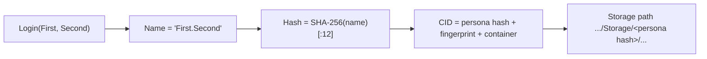

# Persona System

Everything the engine persists on a user's behalf — a WebAssembly module's saved state, a fabric's stored documents — has to be filed under *somebody*. The persona system is the engine's notion of who that somebody is. It is deliberately the smallest thing that could possibly work: a local stand-in for a real identity, just rich enough to give persistent data a stable owner key. This page explains what a persona is, how its hash scopes storage, and — importantly — what it is *not*.

The exact class surface is in the [PERSONA API reference](../api/persona/index.md).

---

## Why it exists

The engine's [storage](storage.md) and WASM stores need an answer to a single question: *under whose identity is this data kept?* Two different users on the same machine, or the same user playing two roles, should not see each other's saved state. That requires an identity key to fold into the storage path.

A full answer to "who is this user" in an open metaverse is a hard, unsolved problem — it involves real authentication, key custody, and cross-fabric identity standards that the project has not yet built. The persona system exists so that the *rest* of the engine can be built and tested against a stable identity key **now**, without waiting for that larger system. It is a proxy: a placeholder that occupies the identity slot so storage scoping, container keys, and per-user isolation can all be exercised end to end.

> **This is a testing stub, not authentication.** A persona is established by simply typing a name. There is no password, no credential, no server, and no verification of any kind. It must not be mistaken for, or relied upon as, a security boundary. It will be replaced by a real identity mechanism.

---

## What a persona is

A `PERSONA` (in namespace `SNEEZE::persona`) holds a logged-in flag, a display name, and a hash. A user "logs in" by supplying a first name and an optional second name:

- `Login("First", "Second")` composes the name `"First.Second"` (or just `"First"` if the second part is empty),
- computes the SHA-256 of that name and keeps the **first 12 hex characters** as the persona hash,
- and marks the persona logged in.

`Logout` clears the name, the hash, and the flag. There is exactly one persona per [`ENGINE`](engine.md), reachable as `ENGINE::Persona()`.

The hashing is done with BoringSSL's `SHA256`. Truncating to 12 hex characters keeps the key short enough to be a comfortable filesystem path component while remaining unique enough for the local, single-machine use this system targets.

---

## How the hash scopes storage

The persona hash is the first key in the identity triple that the engine uses to isolate persistent state. A container's identity (its [`CID`](../api/container/index.md)) combines three things:

```text
identity = persona hash  +  source fingerprint  +  container name
```

and persistent data is filed on disk under a path that begins with the persona hash:

```text
.../<persona hash>/<fingerprint>/.../Storage/...
```

The persona hash is always 12 hex characters; when no one is logged in it defaults to `000000000000` so the segment is never empty.

So switching personas switches the entire tree of saved state: the same fabric loaded under two personas reads and writes two independent stores. This is the whole point of the system — it makes per-user isolation real without yet making identity real. See [Storage](storage.md) and [Container](container.md) for how the other two keys (fingerprint and container name) are derived.



---

## Threading

`PERSONA` is a plain, unsynchronized object owned by the engine. `Login` and `Logout` mutate its fields directly and log through the engine. It is expected to be set up early in the engine's life and read (via `Hash()`) on the loading paths that build container identities; it is not designed for concurrent mutation while loads are in flight.

---

## Current limitations

- **No authentication whatsoever.** A persona is whatever name was typed. This is the defining limitation, by design — it is a stub for a future identity system.
- **Hash collisions are possible in principle.** Two distinct names whose SHA-256 shares the same first 12 hex characters would collide on storage scope. For the local testing use this targets, the probability is negligible; a real system would not truncate.
- **Single persona at a time.** The engine holds one `PERSONA`; there is no concept of multiple simultaneous identities or fast switching beyond `Logout` followed by `Login`.

---

## See also

- [PERSONA API reference](../api/persona/index.md) — exact `PERSONA` signatures.
- [Storage](storage.md) — how the persona hash scopes persisted documents.
- [Container](container.md) — the identity triple the persona hash feeds.

---

[Systems index](index.md) · Prev: [UI](ui.md) · Next: [API index](../api/index.md)
