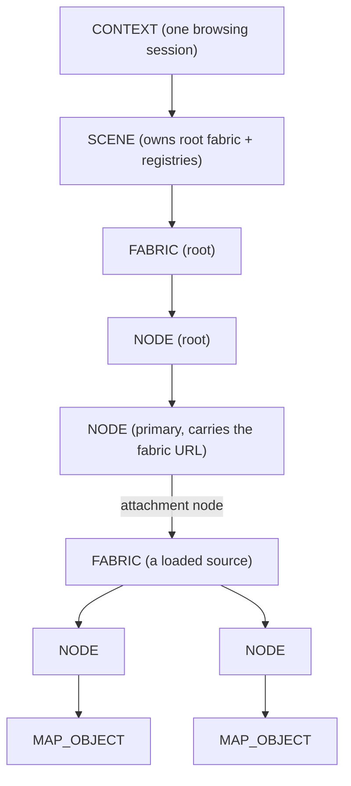
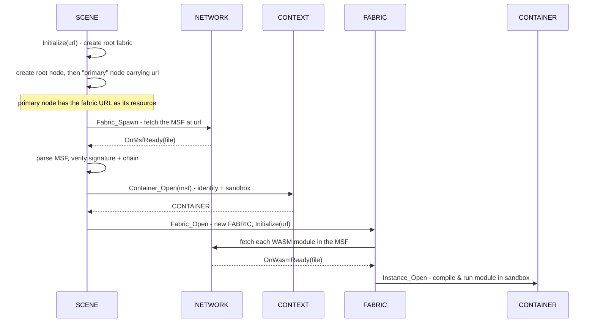

# Scene System

The scene system is the engine's model of the world — the data structure that holds everything currently being rendered, and the machinery that loads it from the network. If you think of the engine as a metaverse browser's rendering core, the scene system is its document model: the equivalent of the DOM in a web browser. This page explains what that model looks like, how a network address becomes a populated scene, who owns what, and where the sharp edges currently are.

It assumes you have read [Core Concepts](../overview/core-concepts.md). The exact class and method signatures are in the [Scene API reference](../api/scene/index.md); this page is about how and why the system works.

---

## Why it exists

Content in the open metaverse arrives as code from many independent sources, all of which want to put things into the same shared world. The engine needs one authoritative, in-memory representation of "everything in the scene right now" that:

- the renderer can walk to produce frames,
- sandboxed content code can mutate to add, move, and remove objects,
- can be assembled from *multiple* sources at once, each isolated from the others,
- and can be torn down and rebuilt when the user navigates somewhere new.

That representation is the **scene object model**, or SOM. The scene system implements it with three cooperating classes — `SCENE`, `FABRIC`, and `NODE`, declared in `include/Scene.h` — plus a payload type, `MAP_OBJECT`, declared in `include/Map_Object.h`, that carries the actual 3D properties. Two of the tables that make the model addressable live on the [`CONTAINER`](container.md), not the scene; that split is the single most important thing to understand and is called out throughout this page.

---

## The three structural classes

### NODE — a single element in the tree

A `NODE` is one element of the scene graph: a point in the tree that may have a parent and any number of children. A node by itself has no geometry; it points to a `MAP_OBJECT` that carries the spatial and visual data (position, orientation, scale, bounding volume, appearance, and an optional texture or glTF model). Separating the two means the tree structure and the renderable payload can evolve independently.

Each node has a 48-bit **object index** that identifies it. Children are held in a `std::vector<NODE*>` guarded by a plain mutex. A node also remembers its parent, the fabric it belongs to, and — if it is an *attachment point* — the child fabric attached to it (more on this below). A node can additionally own a single network fetch for its resource (a texture or a glTF model), and carries a `SEQLOCK` sequence lock intended to let the renderer read a fast-changing transform without blocking the writer. Nodes use the pimpl idiom: the public `NODE` class is a thin handle and all state lives in a private `NODE::Impl`, which also implements `IFILE` so the node can receive its own fetch callbacks.

### FABRIC — one source's branch of the tree

A `FABRIC` represents one spatial fabric's contribution to the scene: a branch of the overall tree, rooted at a single node (`Node_Root()`). Every fabric is tied to exactly one [container](container.md) — the runtime identity and sandbox of the signed source that owns it — and to the [MSF](msf.md) file that described it.

Fabrics form their own hierarchy that mirrors the node tree. When one fabric's content attaches another fabric, the attaching node in the parent fabric becomes the new fabric's **attachment node** (`Node_Attach()`), and the two fabrics are linked parent-to-child. This is how content from one source can host content from another: a node in fabric A serves as the mount point for fabric B.

A fabric is also where a source's **WebAssembly modules** are loaded. When a fabric is initialized from an MSF, it fetches each module the MSF declares and opens it as a WASM instance inside its container (`CONTAINER::Instance_Open`). The fabric owns those instances for its lifetime and closes them (`CONTAINER::Instance_Close`) when it is destroyed.

### SCENE — the root and the fabric registry

A `SCENE` is the top of the model, owned one-per-[context](context.md) (one per browsing session). It owns the **root fabric** — the structural anchor of the whole tree — and is the central registry for fabrics. One registry lives on the scene: the **fabric table** (`m_umpFabric`) mapping each fabric's scene-global index to its `FABRIC*`, allocated from a monotonically increasing counter. The scene also owns the page-wide **backdrop** (background colour) and remembers the **primary node** — the node the navigation URL's fabric mounts on.

The tables that make individual nodes addressable do *not* live on the scene. They live on the container (see the next section), because node identity is unique per-source-identity, not per-scene.

### CONTAINER — the node handle table

The **node handle table** and the map-object backing store are owned by the [`CONTAINER`](container.md), not the scene. A container holds `m_umpNode` (object index → `NODE*`), `m_apMap_Object` (a flat list of every `MAP_OBJECT` it created), and its own per-container index allocator `m_twObjectIx_Next`. The four node operations — `Node_Root`, `Node_Open`, `Node_Close`, `Node_Find` — are public methods on `CONTAINER`. A fabric reaches them through `pFabric->Container()`.

Node identity is therefore **per-container, not scene-global**: the same MSF loaded into several fabrics under one container shares a single node namespace, while different containers never collide. This matters for how content code addresses nodes and is discussed under [Object indices](#object-indices-and-the-handle-table).

### MAP_OBJECT — the renderable payload

A `MAP_OBJECT` holds everything spatial about a thing in the world: its name, type, transform (position, rotation, scale), an optional orbit, a bounding volume, material-like properties, and its visual products — an optional decoded texture and an optional built glTF/GLB render model. It is a base class, and the container's `Node_Create` chooses the derived type by switching on the class packed into the object handle:

| Type | Class (value) | Role |
|---|---|---|
| `MAP_OBJECT_ROOT` | `MAP_OBJECT_CLASS_ROOT` (70) | The scene's built-in root fabric's root and primary nodes. |
| `MAP_OBJECT_CELESTIAL` | `MAP_OBJECT_CLASS_CELESTIAL` (71) | Orbital bodies and frames; carries orbital mechanics. |
| `MAP_OBJECT_TERRESTRIAL` | `MAP_OBJECT_CLASS_TERRESTRIAL` (72) | Surface-level content. |
| `MAP_OBJECT_PHYSICAL` | `MAP_OBJECT_CLASS_PHYSICAL` (73) | Physical-scale objects; falls back to a grounded box when it carries no model. |
| `MAP_OBJECT_PANEL` | `MAP_OBJECT_CLASS_PANEL` (74) | An in-scene RmlUi panel rasterized to a textured quad. |
| `MAP_OBJECT_LIGHT` | `MAP_OBJECT_CLASS_LIGHT` (75) | A scene light (point / ambient / directional). |

The class is never stored as its own field: `MAP_OBJECT::Class()` returns the upper 16 bits of the object's `Self` handle. The renderer's [compositor](../architecture/lifecycle.md) walks map objects to draw the scene; content code populates them.

### MAP_OBJECT_LIGHT — a scene light

`MAP_OBJECT_LIGHT` is the newest derived type: a light that carries no geometry. It reuses the existing wire payload rather than adding fields — the **colour** is packed into `Properties.fColor` as `0xRRGGBB`, the **intensity** into `Properties.fBrightness`, and the **kind** is the node's `Type.bType`, valued from `MAP_OBJECT_TYPE_TYPE_LIGHT` (`NONE` = 0, `AMBIENT` = 1, `DIRECTIONAL` = 2, `POINT` = 3, `SPOT` = 4). Its world placement comes from the node's transform like any other map object.

The compositor emits an ANARI light of the matching kind at the node's world placement. A **point** light's position rides the per-scene render scale and its `1/r²` falloff is intensity-compensated so illumination stays invariant: a light authored at unit scale keeps the same brightness after it is embedded (and scaled) inside another fabric and again after the whole scene is fitted to the render volume. The compositor multiplies the intensity by `(S·R)²`, where `S` is the light's accumulated world scale (the average of its world frame's upper-3×3 column norms) and `R` is the global render scale. **Ambient** and **directional** lights have no falloff and pass through unscaled (a directional light's world-space vector is treated as a direction, not a position). The upshot for authors: place a light once at unit scale and drop it in anywhere.

---

## How the pieces relate

The defining structural fact is that any node can reach the entire engine through a short, fixed chain of owner pointers. There are no cached shortcuts — one path to everything:

```text
NODE  ->  FABRIC  ->  SCENE  ->  CONTEXT  ->  ENGINE / NETWORK / VIEWPORT
```

So a node that needs to fetch a texture asks its fabric for the scene, asks the scene for the network, and issues the request — without holding a network pointer of its own. This keeps ownership unambiguous: each object knows only its owner, and reaches everything else through it.



---

## Object indices and the handle table

Sandboxed content code does not hold raw C++ pointers — it cannot, since it runs in an isolated WebAssembly sandbox. Instead it refers to nodes by **object handle**: a single `uint64_t` (`OBJECTIX::qwComposed`) that packs two fields. The upper 16 bits are a `MAP_OBJECT_CLASS` discriminator; the low 48 bits are the object index itself. Two accessors split it — `ObjectIx()` returns the low 48 bits, `Class()` returns the upper 16 — and the `OBJECTIX_COMPOSE(eClass, twObjectIx)` macro composes them (use it rather than hand-writing 64-bit literals). The container's node handle table translates a composed handle into the real `NODE*` on the host side. This is the same pattern an operating system uses with file descriptors: hand untrusted code a number, keep the real object behind a table you control.

The container allocates indices in `CONTAINER::Node_Create` (private, driven by the public `Node_Root` / `Node_Open`). A few reserved values, defined in `Scene.h`, steer the behavior:

- `OBJECTIX_IDENTITY` (all bits set) means "assign me the next free index." The container hands out a fresh index from its own `m_twObjectIx_Next`.
- A specific in-range index means "create me at exactly this index." It is honored when free.
- `OBJECTIX_NULL` and `OBJECTIX_ERROR` are the failure signals returned to callers.

`Node_Create` reads `Head.Self.Class()`, constructs the matching derived `MAP_OBJECT`, re-stamps `Head.Self` with the composed handle, and stores the node under **the full composed key** (`qwComposed`, class + index) — so parent lookups carry the class too. The handle it returns (and that `NODE::ObjectIx()` later reports) is the composed value, so callers round-trip it unchanged through `Node_Find` / `Node_Close`. Creating a node inserts it into `m_umpNode` and appends its map object to `m_apMap_Object`; closing a node removes both and deletes them. Because the table is per-container, object handles are unique within a container, not across the whole scene.

---

## Loading a fabric: from URL to live scene

This is the heart of the system. Walking it end to end shows how every class plays its part. The flow is entirely asynchronous — network fetches happen on background threads and call back into the scene when they complete.



Step by step:

1. **Bootstrap.** `SCENE::Initialize(url)` resets the backdrop to black, then creates the root fabric (a fabric with no MSF and no attachment, bound to a synthetic root container). Through that container it creates two nodes: a root node, and a *primary node* whose map object carries the requested URL in its `Resource.sReference` and is marked with the sentinel subtype `255`. The scene remembers this primary node as `m_pNode_Primary`.

2. **Spawn.** Creating the primary node runs `NODE::Initialize`, which notices the subtype `255` and the non-empty URL and calls `SCENE::Fabric_Spawn`. This is the bridge from "a node that names a fabric" to "go load that fabric." Spawn opens a network file for the URL, using the root fabric's container's cache, and registers a callback.

3. **MSF ready.** When the file arrives, `OnMsfReady` reads the bytes, constructs an [MSF](msf.md) object, parses it, and verifies its signature and certificate chain. This is the trust gate: nothing is loaded from an MSF that fails to parse.

4. **Container.** The scene asks the context to open a `CONTAINER` for the verified MSF. The container is the source's runtime identity and sandbox; the context deduplicates and reference-counts containers so the same source loaded twice shares one. See [Container](container.md) and [Trust & Isolation](../architecture/trust-and-isolation.md).

5. **Fabric open.** `Fabric_Open` allocates a scene-global fabric index under `m_mxScene`, constructs a `FABRIC` bound to the container and the attachment node, registers it in the fabric table, and calls `FABRIC::Initialize`.

6. **Modules.** `FABRIC::Initialize` reads the module list from the MSF and starts a network fetch for each `.wasm` module. As each arrives, the fabric opens it as a WASM instance in its container. When the last module resolves, the fabric is fully live and its code can begin building the scene through the host functions — which call the container's `Node_Root` / `Node_Open` to populate the branch.

7. **Primary presentation.** If the fabric that just loaded mounted on the primary node, `OnMsfReady` calls `Primary_Apply` to read an optional `"primary"` block from the MSF payload — an initial camera pose and a background colour. Only the primary fabric drives this; attached child fabrics never touch page-wide presentation. See [Primary presentation](#backdrop-and-primary-presentation).

Resources follow the same asynchronous pattern at the node level: when a node's map object names a resource that is *not* a fabric attachment, `NODE::Initialize` requests it from the network by URL, and on completion the node dispatches by **content** — a glTF/GLB blob is built into a render model, anything else is decoded as an image texture. Either product is published onto the map object for the renderer (see [Node resources](#node-resources-fetch-by-url-dispatch-by-content)).

For the cross-subsystem view of this flow — including where trust decisions and deduplication happen — see [Fabric Loading](../architecture/fabric-loading.md).

---

## Node resources: fetch by URL, dispatch by content

A node has a single resource path, not one per resource type. When its map object carries a non-empty `Resource.sReference`, `NODE::Impl` (which inherits `IFILE`) opens one network fetch for that URL. On completion `Resource_Load` sniffs the bytes: a binary GLB (the ASCII magic `glTF`) or a glTF JSON document (a leading `{`) is parsed via `DEP::GLTF::Load` and built into a `GLTF_RENDER_MODEL` (`Gltf_Load`); anything else is decoded as an image texture via stb_image (`Texture_Load`). Both products are published onto the **`MAP_OBJECT`** — `Gltf_Render_Model(...)` (the map object takes ownership) and `SetTexture(...)` — never stored on the node itself, because visual appearance belongs to the map object and can therefore sit at any class level. The one exception is the subtype-`255` attachment URL, which is routed to `Fabric_Spawn` rather than fetched as an asset.

---

## Backdrop and primary presentation

The scene owns the page-wide **backdrop** (background colour) and feeds it to the renderer through the compositor. `SCENE::Background(const RGBA&)` stores the colour and trips a single atomic changed-flag; the compositor test-and-clears it once per build via `Background_Consume(RGBA&)` and pushes to `RENDERER::SetBackground` only on change (including scene swaps), never every frame. Every fresh load resets the backdrop to black, so a page always begins from a known colour that the primary fabric may then override.

Only the **primary** fabric drives page-wide presentation. When `OnMsfReady` opens a fabric on the primary node, `Primary_Apply` reads an optional `"primary"` block from the MSF payload:

- `primary.camera.position` (a 3-element array of absolute world metres) and `primary.camera.rotation` (a 4-element quaternion) set the viewport's initial camera pose via `VIEWPORT::Camera`.
- `primary.background` (an `"RRGGBB"` hex string) sets the backdrop via `Background`.
- `primary.ambient` and `primary.directional` set the scene-global ambient and directional ("sun") light via `SCENE::Ambient` / `SCENE::Directional`. Each takes `fBrightness` + `fColor`; the directional is aimed like a spot node — a `rotation` (4-element quaternion) rotates the identity forward (+X) into the direction the light travels (default +X). These are scene properties, not nodes — a local object cannot change global illumination — and are forwarded each frame to `RENDERER::SetSceneLighting`.

All keys are optional; a fabric with no `"primary"` block keeps the default camera, the black backdrop, and — when neither `ambient` nor `directional` is authored — a default full-intensity white ambient. Non-primary (attached child) fabrics never touch presentation.

---

## How the SOM feeds the compositor

The renderer never reads the SOM directly. Once per build the [compositor](../architecture/lifecycle.md) walks the tree from the root fabric's root node, composing each node's transform under its parent's world frame and following attachment seams into child fabrics, and gathers renderable *build* records — spheres and orbit curves for celestial bodies, boxes for model-less physical nodes, textured quads for panels, meshes for glTF models, and lights. It also accumulates the scene's spatial reach as it goes. From the reach it derives a single global **render scale** that fits the whole scene into a fixed render volume, applies that scale to every record, consumes the backdrop change, and submits the flattened data to the renderer. This is where the light intensity invariance and the panel/model placement described above are resolved. The mechanics of that flatten seam belong to the [control](../architecture/lifecycle.md) and [viewport](viewport.md) subsystems.

---

## Navigation and teardown

The scene tears the whole model down through its root fabric. `SCENE::Initialize` builds the root fabric; the scene's destructor (and `Fabric_Root_Destroy`) closes it. `include/Scene.h` also declares `bool Url(const std::string& sUrl)` as the navigation mutator — swap the root fabric to a new address — the seam an integrator would use, normally reached through the context rather than called directly.

Closing the root fabric triggers a **cascade**: deleting a node recursively deletes its children (through the owning container's `Node_Close`), and when a node is an attachment point, the fabric attached to it is closed too. By the time the root fabric is gone, every descendant fabric — including all loaded sources — has been torn down, every container reference released, and every map object freed. A leaked-fabric count is logged if anything remains registered afterward.

This cascade is the symmetric mirror of the loading flow: loading attaches fabrics to nodes and opens containers and instances; teardown closes instances, closes containers, and detaches fabrics, in reverse.

---

## Threading

The scene is touched from multiple threads: the engine's control thread, network fetch threads delivering MSF, WASM, and resource data, and the rendering thread walking the tree. The scene protects the fabric table with a recursive mutex, `m_mxScene`, held while it is mutated (`Fabric_Open`/`Fabric_Close`/`Fabric_Find`). It is recursive because closing a fabric cascades into node teardown that re-enters the same locked methods on the same thread. The **node handle table is guarded separately**, by the container's own `m_mxContainer` (also recursive), held during `Node_Root`/`Node_Open`/`Node_Close`. Within a node, the child vector has its own plain mutex, and a map object's texture pixels are guarded by a texture mutex so the decode thread and the renderer never race; a built glTF model is published write-once via an atomic flag and read locklessly.

Each node also carries a `SEQLOCK` — a sequence lock — intended to let the renderer read a node's fast-changing transform without blocking the writer that updates it. The backdrop is a single atomic changed-flag consumed by the compositor.

---

## Current limitations

These are documented honestly because they shape how the system behaves today. They come straight from the code and its in-progress markers.

- **In-flight fetches are not cancellable at the scene level.** A node owns and cancels its own resource fetch on destruction, but the `MSF_FETCH` a spawning node starts holds a raw pointer to that node and is not owned or cancelled by it. If the node is destroyed before the MSF arrives, the completion callback runs against a freed node. Tearing down the tree while a fabric MSF is still loading is therefore unsafe.

- **Teardown can race the renderer.** Tearing the tree down and rebuilding it is not coordinated with the rendering thread that may be walking it. A shared read guard (or a scene revision scheme) is the intended fix.

- **Fabric handles are not lifetime-guarded.** `Fabric_Find` returns a `FABRIC*` under the lock, but nothing prevents that fabric from being closed while a caller still holds the pointer. A capture/release reference scheme is anticipated for host calls that look fabrics up by index.

- **Duplicate-index ambiguity for the same MSF twice in one container.** Moving the node handle table from scene-global to per-container narrowed the collision scope (two unrelated containers no longer collide), but loading the same MSF into two fabrics that share one container still collides on template node indices in WASM-managed mode. The resolution depends on a planned distinction between WASM-managed and map-managed fabrics.

---

## See also

- [Scene API reference](../api/scene/index.md) — exact `SCENE`, `FABRIC`, and `NODE` signatures.
- [Container](container.md) — the identity and sandbox each fabric is bound to.
- [Network](network.md) — how MSF, module, and texture fetches are performed and cached.
- [MSF](msf.md) — the signed file format a fabric is described by.
- [Fabric Loading](../architecture/fabric-loading.md) — the same flow across subsystem boundaries.

---

[Systems index](index.md) · Next: [Network](network.md)
