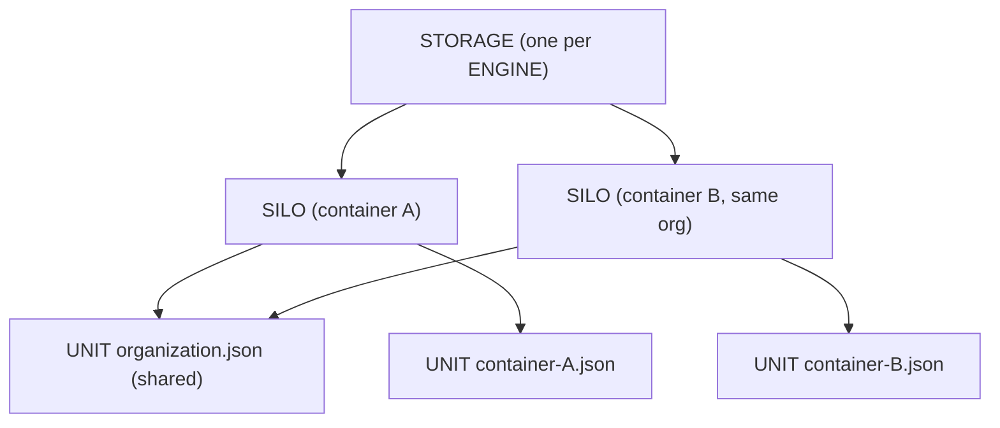
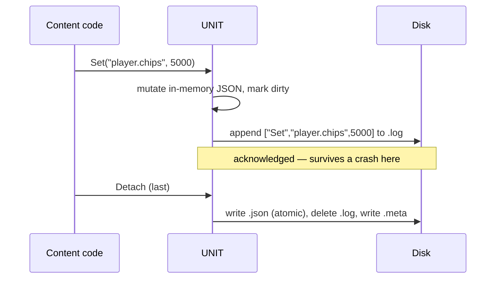

# Storage System

The storage system is the engine's persistent document store — the place where a content source keeps state that should outlive a single visit. If the [network system](network.md) is the engine's read-mostly cache of *fetched* bytes, storage is its read-write store of *authored* data: JSON documents a source writes and reads back, scoped and isolated per identity, durable across restarts and crashes. It is the engine's analog of a web browser's `localStorage` and `sessionStorage`, but holding structured JSON instead of flat strings.

It assumes you have read [Core Concepts](../overview/core-concepts.md). The exact class and method signatures are in the [Storage API reference](../api/storage/index.md); this page is about how and why the system works.

---

## Why it exists

Sandboxed content code needs somewhere to remember things — a player's name and chips, a session's progress, preferences shared across a publisher's worlds. A web page gets `localStorage`; the engine needs the equivalent, but with constraints the web does not impose:

- **Identity-scoped isolation.** A source must only see its own data, and data must be partitioned by the cryptographic identity ([container](container.md)) that owns it — not by a forgeable domain name.
- **Two lifetimes.** Some data must survive restarts (permanent); some must be wiped when the session ends (temporary).
- **Two reach levels.** Some data is private to one container; some is shared among all containers belonging to the same organization.
- **Structured access.** Content wants to read and write deep into a JSON document by path, not serialize and reserialize the whole blob for every change.
- **Crash durability.** A power loss between writes must not corrupt or lose acknowledged data.

The system meets these with three classes — `STORAGE`, `SILO`, and the private `UNIT` — and a small on-disk format of JSON documents, `.meta` sidecars, and a write-ahead changelog.

---

## The three classes

### STORAGE — the engine-owned orchestrator

There is exactly **one `STORAGE` per [`ENGINE`](../api/sneeze/ENGINE.md)**, constructed with a back-pointer to it and reached through `ENGINE::Storage()` (a [context](context.md) exposes the same singleton via `CONTEXT::Storage()`, which forwards). It is a thin orchestrator: it opens and closes silos for containers, enumerates them for the inspector, and owns the **unit cache** — a map from on-disk pathname to the live `UNIT` for that file. It holds almost no document logic itself; its job is lifecycle and deduplication. Because one store serves every context, the unit cache deduplicates *across all contexts* — two tabs that touch the same file share one `UNIT` — mirroring how the [network system](network.md)'s single `NETWORK` shares one `ASSET` per URL engine-wide.

### SILO — the per-container handle

A `SILO` is the handle a caller actually works with. It is created for one container and groups **four `UNIT`s**, one for each combination of lifetime and reach, selected by the `eSILO_SCOPE` enum:

| Scope | Lifetime | Reach |
|---|---|---|
| `kSILO_SCOPE_PERMANENT_ORG` | survives restarts | shared across the organization |
| `kSILO_SCOPE_PERMANENT_COMPANY` | survives restarts | private to this container |
| `kSILO_SCOPE_TEMPORARY_ORG` | wiped at session end | shared across the organization |
| `kSILO_SCOPE_TEMPORARY_COMPANY` | wiped at session end | private to this container |

(The "company" naming in the code denotes the per-container scope.) Every read/write call on a silo names the scope, and the silo routes it to the matching unit. The silo is the object handed to both WASM host functions and the inspector.

### UNIT — the private document, one per file

A `UNIT` is the network system's `ASSET` analog: a private internal class, declared only in the module's private header, representing **one JSON file on disk**. It owns the in-memory `nlohmann::json` document, the path-based read/write logic, the `.meta` sidecar, and the changelog. Callers never touch a unit directly — they go through a silo — but every document operation ultimately runs on a unit.

The reason units are separate from silos is **sharing**. Two containers from the same organization must see the *same* organization document. Their two silos therefore point at the *same* organization unit, deduplicated through `STORAGE`'s unit cache by pathname. Per-container units, by contrast, are unique to one silo.



---

## The two-counter UNIT model

Like the network system's asset, a unit is governed by **two independent counters**, and the distinction is again the crux of the design.

- **`m_nCount_Open`** counts how many silos *reference* this unit — its lifetime in the cache. `Unit_Open` finds-or-creates the unit and increments it; `Unit_Close` decrements, and at zero removes the unit from the cache and deletes it. This is what makes org-unit sharing work: two silos referencing `organization.json` keep its open-count at two, so neither closing alone destroys it.

- **`m_nCount_Load`** counts how many consumers have the document *loaded into memory*. `Attach` increments it and, on the `0 → 1` transition, loads the document from disk (and replays the changelog). `Detach` decrements it and, on the `1 → 0` transition, saves the `.meta` sidecar, flushes the document if dirty, and **evicts** the in-memory JSON to free the memory.

The separation lets a unit stay alive (referenced) while its data is unloaded (evicted) — and lets shared org data be loaded once and seen by every attached silo.

> **Loading is not automatic on open.** A freshly opened silo's units are referenced but not loaded. A caller must call `SILO::Attach` before reading or writing, or the document is empty. Attach/Detach is explicit — see [Explicit attach](#explicit-attach-and-detach).

---

## Path-based JSON access

A unit is read and written by **path string** rather than by handing whole documents around. The path grammar is dot-separated keys with bracketed array indices:

```text
player.name
game.scores[0]
game.poker.table[5].card-color
```

The navigator walks the document segment by segment to find the parent container and the final key. On a `Set`, intermediate objects and arrays are **auto-created** — naming `a.b.c` when `a` does not exist creates the objects along the way — and array indices **auto-extend**, padding with nulls (or empty objects, while navigating intermediate segments) up to the requested index. `Get` returns the value or an empty JSON value if the path is absent; `Has` reports presence; `Remove` deletes the leaf (erasing an array element or an object key). A bulk `Json` getter/setter reads or replaces the entire document as a serialized string.

---

## Durability: sidecars and the changelog

Each unit maps to up to three files sharing a base pathname:

```text
<base>.json    the document
<base>.meta    a JSON sidecar (identity, scope, size, timestamps, access count)
<base>.log     a JSONL write-ahead changelog
```

### Write-ahead changelog (crash recovery)

The document file is rewritten in full only at save time, which is comparatively expensive and would be ruinous to do on every mutation. Instead, **every mutation appends one line to the `.log` sidecar** before the in-memory change is considered durable. Each line is a small JSON array — `["Set", "path", value]` or `["Remove", "path"]` — written in JSONL (one JSON value per line) and flushed by append.

Recovery is replay. When a unit loads, it parses the last good `.json`, then replays every line of the `.log` on top of it, reconstructing the exact state at the moment of the crash. On a clean save the full document is written (via the same `.temp`-then-atomic-rename pattern the rest of the engine uses) and the `.log` is deleted, collapsing the accumulated changes back into the base file. A crash before that save simply leaves a `.log` to replay next time.



### The `.meta` sidecar

The sidecar records the owning container's identity (fingerprint, organization, the hashes, trust level), the scope, the document size, timestamps, and an access count. It is written on the last detach and read at construction so the inspector can list a unit's metadata without loading the full document.

### Disk layout

Permanent and temporary scopes live under different roots. Org units live at the identity (fingerprint) tier so every container under that identity shares them; container units live one level deeper, under the container itself. `SILO` derives both from `CONTAINER`'s path accessors (`Path_*_Org` for org, `Path_*_All` for container) and appends only the `Storage` segment:

```text
org scope:
<PermanentPath>/<personaHash>/<fp[0:2]>/<fp[2:24]>/Storage/
    organization.json(.meta/.log)        org permanent (shared across the org)
<TemporaryPath>/<personaHash>/<fp[0:2]>/<fp[2:24]>/Storage/
    organization.json                     org temporary

container scope:
<PermanentPath>/<personaHash>/<fp[0:2]>/<fp[2:24]>/<container>/Storage/
    container.json(.meta/.log)            this container, permanent
<TemporaryPath>/<personaHash>/<fp[0:2]>/<fp[2:24]>/<container>/Storage/
    container.json                        this container, temporary
```

Because org units share an identity-keyed path and filename, two containers from the same organization resolve to the same pathname — which is exactly the key `STORAGE` deduplicates on, giving them one shared `UNIT`.

---

## Explicit attach and detach

Engaging with a silo's data is a deliberate, reference-counted act. `SILO::Attach` attaches all four of its units (loading any that were not already in memory); `SILO::Detach` detaches them (saving and evicting any that drop to zero loaders). The silo guards this with a `m_bAttached` flag so attach/detach are idempotent at the silo level — a silo attaches its units exactly once regardless of repeated calls.

A typical lifetime: a host opens a silo for a container, attaches it, performs reads and writes by scope and path, detaches, and closes the silo. The silo's destructor detaches if the caller forgot, then closes its units — so a dropped silo still flushes its dirty data, but relying on that is poor form.

---

## Runtime behavior and notifications

Storage reports lifecycle and mutations to the host so developer tools can observe the store. The notifications form two tiers that mirror the network system exactly — the network's `Cache` handle tier plus its `File` leaf tier — and because one store now serves every context, each callback resolves its host through the silo's container (`pSilo->Container()->Context()->Host()`) rather than caching one:

- **Handle tier — silo lifecycle.** `STORAGE` fires `OnStorageSiloCreated` in `Silo_Open` and `OnStorageSiloDeleted` in `Silo_Close`. (`Silo_Close` takes the owning container explicitly, `(CONTAINER*, SILO*)`, precisely so the deletion callback can be routed — the singleton no longer stores a context.)
- **Leaf tier — unit lifecycle and mutations.** A `UNIT` fires `OnStorageUnitCreated` when a silo first opens it and `OnStorageUnitDeleted` when a silo closes it, and `OnStorageUnitChanged` on every mutation (`Set`, `Remove`, and the bulk `Json` setter, the last with an empty path).

### Change fan-out across contexts

Because a `UNIT` is deduplicated engine-wide by pathname, one shared organization unit is held by silos in several containers and contexts at once, so a mutation on any of them must reach *all* of them. Each `UNIT` therefore tracks the silos holding it in `m_apSilo` — populated by `UNIT::Open(pSilo)`, cleared by `Close(pSilo)` — and `UNIT::Notify_Changed` loops that list, firing `OnStorageUnitChanged` once per holding silo. This is the structural analog of the network system's shared `ASSET` driving `FILE::Notify_Changed` across every attached file, except that a `UNIT` is *both* the shared object and the leaf, so it drives its own fan-out. The network side already fanned out by construction — a single `ASSET` owns every `FILE` — so only storage needed the explicit silo list added.

---

## Threading model

The store carries **two independent recursive mutexes** rather than one, and each of the other two layers carries its own lock:

- **`STORAGE::Impl::m_mxStorage_Silo`** (recursive) guards the silo list, held across `Silo_Open`/`Silo_Close`/`Silo_Enum`.
- **`STORAGE::Impl::m_mxStorage_Unit`** (recursive) guards the unit cache, held across the `Unit_Open`/`Unit_Close` a silo's construction and teardown drive.
- **`UNIT::Impl::m_mxUnit`** (recursive, per unit) guards a unit's document, its holding-silo list, and all its reads, writes, loads, saves, evictions, and change fan-out.
- **`SILO::Impl::m_mxSilo`** (a plain mutex per silo) guards the silo's attach/detach transition and its `m_bAttached` flag.

The unit's own mutex makes individual document operations safe, but the silo's pass-through getters and setters do not themselves take a lock around the unit cache — they assume the unit they hold remains valid for the duration, which it does as long as the silo is open. `Notify_Changed` fires while `m_mxUnit` is held (it is recursive, matching how the network's `ASSET` notifies under its own lock), so a host callback must not re-enter storage on the same unit.

---

## Current limitations

Drawn from the code as it stands.

- **No automatic temporary wipe on session end.** The scope names distinguish permanent from temporary by writing them under different roots (`Path_Temporary` vs `Path_Permanent`); actually clearing the temporary tree is the responsibility of whoever manages that path's lifetime, not of `STORAGE` itself.
- **Reads before attach see an empty document.** Because loading is tied to attach, calling `Get`/`Has` on a silo that was opened but never attached returns empty results rather than the on-disk data. There is no lazy load on first access.
- **Silo pass-through is not independently locked.** A silo routes calls straight to its units without taking `m_mxStorage`; safety rests on the unit's own mutex and on the silo outliving the calls — there is no guard against another thread closing the silo mid-call.
- **Changelog growth is unbounded between saves.** The `.log` only collapses into the `.json` on a save (last detach or an explicit flush). A long-lived attached unit with heavy churn accumulates an ever-growing changelog until it next detaches.

---

## See also

- [Storage API reference](../api/storage/index.md) — exact `STORAGE`, `SILO`, `UNIT` signatures.
- [Container](container.md) — the identity that scopes and isolates a silo's data.
- [Network](network.md) — the sibling subsystem; same two-counter, sidecar, atomic-rename patterns.
- [Console](console.md) — the next per-context subsystem in the reading path.

---

[Systems index](index.md) · Prev: [Network](network.md) · Next: [Console](console.md)
