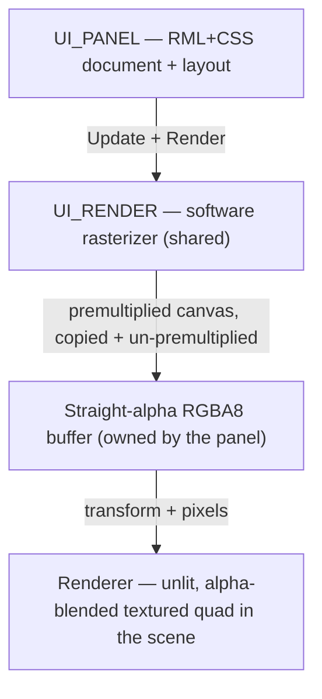
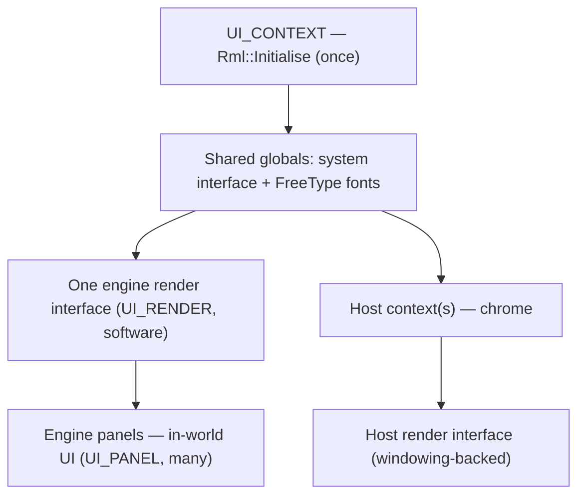

# UI System

The UI system gives the engine a retained-mode HTML/CSS toolkit. Two very different parties need to draw user interface in a metaverse browser: content sources want to put panels and overlays *inside the world*, and the host application wants its own *chrome* — the bar, menus, and inspector that frame the view. Both want to describe that interface in the familiar, declarative language of HTML and CSS rather than hand-placing pixels. This page explains why the engine standardizes on one such toolkit, how it brings the toolkit up, how an in-world panel becomes pixels, and how the engine and a host application share one library without colliding.

It wraps **RmlUi** 6.2 (an HTML/CSS retained-mode UI library) with **FreeType** for font rasterization. The classes live in namespace `SNEEZE::DEP` and an in-world panel's pixels reach the screen through the [Viewport](viewport.md).

---

## Why it exists

A 3D world is not enough on its own; people interact with it through 2D surfaces — a service's control panel floating in space, a settings dialog, a heads-up readout — and authors expect to build those the way they build web pages, with markup and stylesheets. **RmlUi** is a retained-mode UI toolkit that speaks a subset of HTML and CSS: "retained-mode" means the application hands the library a document and the library keeps and manages that tree, laying it out and updating it, rather than the application redrawing everything every frame.

Choosing one shared toolkit solves the problem from both directions at once. A host application can render its own chrome with it, and content can describe in-world UI with it, using the same engine, the same layout rules, and the same fonts. The UI system owns that toolkit's single global lifecycle and the shared services every UI document needs — a clock, a logging sink, and a font engine — and supplies an engine-side renderer that turns documents into pixels for the 3D scene.

---

## The three classes

- **`UI_CONTEXT`** — the per-engine manager. It owns RmlUi's one-time global lifecycle, the global system interface, the fonts, and the single engine-side render interface. The [engine](engine.md) creates exactly one, last among the dependency wrappers, reachable as `ENGINE::Ui_Context()`.
- **`UI_PANEL`** — one in-world UI surface: its own document and layout, rasterized into its own pixel buffer. One panel backs each in-scene UI object (see [Scene](scene.md), `MAP_OBJECT_PANEL`).
- **`UI_RENDER`** — the engine's render interface: a CPU software rasterizer that turns RmlUi's 2D geometry into an RGBA8 image. There is one instance, shared by every panel.

### Bringing the library up

`UI_CONTEXT` is constructed with the owning `ENGINE*`; its argument-less `Initialize()` installs two interfaces RmlUi requires from an embedder and then starts the library:

- **The system interface** answers the two things RmlUi needs from its host: elapsed time, from a steady clock, and logging, mapped from RmlUi's log levels onto the engine's own `Log`.
- **The render interface** is the one shared `UI_RENDER`.

It then calls `Rml::Initialise()`, which also brings up RmlUi's FreeType-backed font engine. The destructor is the exact mirror — `Rml::Shutdown()` — after which the render interface is destroyed last, because shutdown releases geometry and textures back through it. Fonts are not owned by the engine: the host application loads its faces into RmlUi's process-global font registry, which this engine instance shares, so panels render with the host's fonts without the engine touching the filesystem. Because the engine refuses to finish starting up unless `Rml::Initialise()` succeeded (the compositor that renders panels is created only after the UI context initializes), panels need no per-frame readiness guard.

---

## How a panel becomes pixels

Unlike a screen-space overlay, an in-world panel lives in the 3D scene, so its pixels are produced on the CPU and then drawn as a textured quad by the renderer. Each frame, on the render thread:

`UI_RENDER` rasterizes triangles into an RGBA8 canvas with premultiplied alpha, a top-left fill rule (shared triangle edges are not drawn twice), texture sampling for text and atlases, and scissor clipping. Each `UI_PANEL` drives its own document through the shared rasterizer, then copies the result into a buffer it owns, converting premultiplied alpha to straight alpha — the form the renderer's unlit *blend* material expects. The panel owns this format knowledge so the renderer stays UI-agnostic: it sees only a transform and a pixel buffer, the same shape as a textured box.

The path from a scene object to the screen is covered in [Scene](scene.md) (the `MAP_OBJECT_PANEL` that owns a panel), the compositor's panel build, and the [Viewport](viewport.md) (the renderer's textured-quad path).

---

## Sharing one library with a host application

`Rml::Initialise` is called **once**, by the engine, but a running browser needs more than one independent UI surface, and the host application also wants to draw its own chrome. RmlUi separates global initialization from individual `Rml::Context` objects, and it keeps a **process-global registry of render managers, keyed by render interface**. Two rules follow from that registry, and the engine is built around them:

- **The engine uses exactly one render interface for all of its panels.** Every panel binds its context to the single, engine-lifetime `UI_RENDER`. If each panel had its own interface, destroying a panel would leave RmlUi holding a render manager that points at a freed interface — and a later global release of render managers would dereference freed memory. One long-lived interface makes that impossible.
- **The engine owns global init/shutdown and the shared services; a host application brings its own chrome on top.** The system interface and font engine are process-wide and serve both sides. A host application creates its own context(s) and its own render interface tied to its windowing layer, and is responsible for tearing those down before the engine shuts the library down.

---

## Threading

RmlUi's global state — system interface, render interface, and font engine — is process-wide, and RmlUi expects its contexts to be driven from a consistent thread. The engine drives every panel on the render (compositor) thread: panels rasterize one at a time through the shared interface, reusing its canvas as scratch. `UI_CONTEXT` adds no locking of its own; the single-initialize / single-shutdown bracketing keeps the global state's lifetime unambiguous.

---

## Current limitations

Straight from the current code.

- **CPU rasterization.** `UI_RENDER` is a software rasterizer. It produces correct pixels (colors, borders, text, alpha) but the optional layer/filter/shader hooks are no-ops, so effects like soft glow or backdrop blur are deferred to a future GPU path.
- **The engine loads no fonts.** `UI_CONTEXT` brings up RmlUi's FreeType-backed font engine but registers no faces itself; the host application loads its own faces into RmlUi's process-global font registry, which this engine instance shares. Panels render with whatever the host has registered — presentation assets belong to the host.
- **One global system interface.** Timekeeping and logging are process-wide singletons shared by all UI in the process — by design for shared services.

---

## See also

- [Viewport](viewport.md) — draws a panel's pixels as an unlit textured quad in the scene.
- [Scene](scene.md) — the scene object model; `MAP_OBJECT_PANEL` owns a panel.
- [Engine](engine.md) — constructs `UI_CONTEXT` during startup and owns its lifetime.

---

[Systems index](index.md) · Previous: [XR](xr.md) · Next: [Persona](persona.md)
