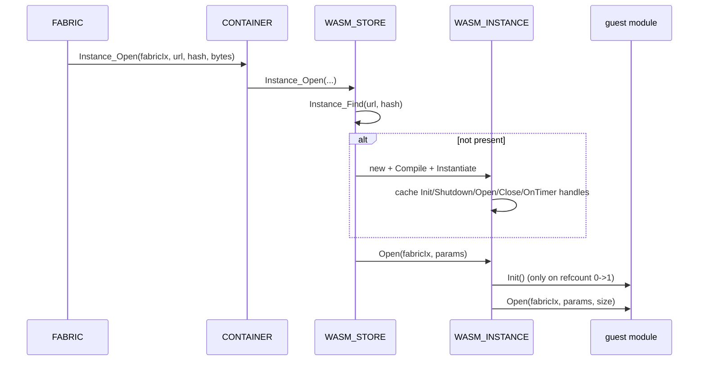

# WASM System

The WASM system is where untrusted content runs. When a spatial fabric is loaded, its logic arrives as compiled **WebAssembly** — a portable, sandboxable bytecode — and the engine executes it inside an isolated runtime that can touch the rest of the engine only through a small, deliberately narrow set of host functions. This page explains why that isolation matters, how the three runtime classes layer together, the identity rules that decide what shares a sandbox with what, and exactly which host functions are wired up today.

It builds on [Container](container.md) (the identity and sandbox a fabric is bound to) and [Scene](scene.md) (the object model content code mutates). The runtime is built on **Wasmtime** v43.0.0, whose C API this system wraps. All of the code lives in namespace `SNEEZE::DEP`.

---

## Why it exists

The open metaverse is a web of independent sources, none of which the user chose to trust in advance. Loading a fabric means running *someone else's program* on the user's machine — code that wants to create objects, animate them, read and write storage, and print to the console. That is exactly the threat model a web browser faces when it runs a page's JavaScript, and the answer is the same: never let foreign code run with the host's privileges.

WebAssembly is the engine's containment boundary. A WASM module executes against its own **linear memory** — a flat byte array it cannot grow beyond, with no way to reach a raw host pointer, no system calls, and no ambient access to the filesystem or network. The only things it can do that affect the outside world are the functions the host explicitly *imports* into it. The WASM system's job is to give each source its own sandbox, populate it with a curated import list, and mediate every crossing of the boundary in both directions. If a fabric's code is malicious or simply buggy, the blast radius is its own sandbox.

---

## The three runtime classes

The system is a strict three-level hierarchy: one runtime owns many stores, and each store owns many instances. Ownership and lifetime flow down that chain.

### WASM_RUNTIME — the engine, one per process

`WASM_RUNTIME` is the top-level manager. It owns the single shared `wasm_engine_t` — the Wasmtime engine that holds compilation settings and the JIT — and it is created once by the [engine](engine.md) during startup, first among the dependency wrappers and ahead of the SPIR-V pipeline. It is constructed with the owning `ENGINE*`; the argument-less `Initialize` then creates the Wasmtime engine, and that is all it does. If that fails, the whole WASM subsystem is unavailable and the engine logs an error.

The runtime is also the factory for sandboxes. `Store_Open` constructs a new `WASM_STORE` against the shared engine and tracks it in an internal list under a mutex; `Store_Close` removes and deletes it. The runtime deliberately holds *no* notion of identity — it does not look stores up or deduplicate them. Knowing which source should share which sandbox is the [container](container.md)'s job, not the runtime's.

### WASM_STORE — one sandbox per container

A `WASM_STORE` is one isolated execution context. It wraps a Wasmtime `wasmtime_store_t` (the owner of all instance state and linear memory for the modules inside it), a `wasmtime_linker_t` (the table of importable host functions), an opaque **host-data** pointer, and the list of instances it owns.

There is exactly **one store per [`CONTAINER`](container.md)**, and the container drives the store's whole life. When a container is created it calls `Store_Open`, then immediately does two things that make the sandbox usable:

1. **Wires identity in.** It sets the store's host data to its own `CONTAINER*` (`HostData(pContainer)`). This single pointer is how every host function later recovers *who is calling* — the store carries no identity of its own, so the container behind it is the source of truth for the persona, fingerprint, and container-name triple that defines a content source. Two fabrics from the same source therefore share one container and one store; two different sources never do.
2. **Builds the import table.** It calls `Linker_Initialize`, which creates the linker and registers every host function (see below) under its module name.

The store also exposes a **fabric reference count** (`Fabric_AddRef` / `Fabric_ReleaseRef` / `Fabric_RefCount`), intended to track how many fabrics are sharing the sandbox so it can be torn down when the last one leaves. The counter exists and is thread-safe, but the container layer presently owns store lifetime directly; see [Current limitations](#current-limitations).

### WASM_INSTANCE — one compiled module

A `WASM_INSTANCE` is a single compiled module living inside a store. Its identity is the pair **(URL, SHA-256)**: the same bytecode fetched from two URLs is two instances, and the hash guards against a URL serving different bytes than expected. The store keeps a flat list and finds instances by that pair (`Instance_Find`).

An instance moves through a precise lifecycle, and the symmetry of it is the whole point:

- **Compile.** `Compile` turns raw bytes into a `wasmtime_module_t`. This is parse-and-validate only; nothing runs yet.
- **Instantiate.** `Instantiate` uses the store's linker to resolve the module's imports and produce a live instance, then looks up and caches handles to the guest's exported entry points — `Init`, `Shutdown`, `Open`, `Close`, and `OnTimer` — recording which ones the module actually exports. A module that omits an entry point simply does not receive that callback.
- **Open / Close.** These are the reference-counted lifecycle calls a fabric drives. `Open` increments the refcount; the first open (0 → 1) fires the guest's `Init`, then its `Open`. `Close` fires the guest's `Close`, then decrements; the last close (1 → 0) fires `Finalize`, which calls the guest's `Shutdown`. So the same `.wasm` shared by several fabrics is initialized once and shut down once, with `Open`/`Close` bracketing each fabric in between.

Instances cannot be unloaded from a live store. When their refcount hits zero they go **dormant** (state flips from `INSTANCE_STATE_ACTIVE` back to `INSTANCE_STATE_DORMANT`) and stop receiving calls; their memory is reclaimed only when the entire store is destroyed.

```text
WASM_RUNTIME  (one per engine, owns wasm_engine_t)
  └── WASM_STORE        (one per CONTAINER, owns linker + host data)
        ├── WASM_INSTANCE   (URL + SHA-256)
        └── WASM_INSTANCE   (URL + SHA-256)
```

---

## How a module comes alive

The trigger comes from the [scene](scene.md): when a `FABRIC` initializes from its verified [MSF](msf.md), it fetches each declared `.wasm` module and asks its container to open it. The call chain crosses cleanly from the per-context layer into this dependency wrapper.



On teardown the mirror runs: `FABRIC` calls `Instance_Close` for each module it opened, the instance fires the guest's `Close`, and the last close fires `Shutdown`. This is the same add-before-init / remove-after-shutdown symmetry the rest of the engine follows.

The `Open` call also passes the **fabric index** (`twFabricIx`) and a parameter blob to the guest, so a single module instance can serve multiple fabrics and tell them apart by the index it receives.

---

## Crossing the boundary: host functions

A sandbox is only useful if the code inside can do something, and only safe if that something is tightly scoped. The bridge is the set of **host functions** the store registers with its linker in `Linker_Initialize`. Each is grouped under a module name the guest imports from (`Console`, `Storage`, `Scene`, `Timer`), and each receives the calling `WASM_STORE*` as its environment pointer. From that pointer every function recovers the owning `CONTAINER*` (via the host data set at store creation) and, through it, the per-context subsystem it forwards to. That recovery is what makes the calls *attributable*: a function always knows which source invoked it, so console output lands in the right stream and storage writes land in the right scope.

Because the guest can only hand the host integers (its world is a flat byte array), strings and structs cross as a **(pointer, length)** pair into linear memory. Helper routines move the bytes safely: `ReadWasmString` and `ReadWasmBytes` copy *out* of guest memory only after bounds-checking the range against the memory's actual size, and `WriteWasmString` copies *in*, returning the full size the value needs so a guest can detect truncation and re-query with a larger buffer (passing a zero length asks for the size without writing).

The functions registered today fall into four groups.

**Console** (14 functions) forwards the browser console API — `Log`, `Debug`, `Info`, `Warn`, `Error`, `Assert`, `Group`, `GroupCollapsed`, `GroupEnd`, `Count`, `CountReset`, `Time`, `TimeEnd`, `TimeLog` — straight to the container's [console](console.md) `STREAM`. These are fully wired.

**Storage** (6 functions) forwards to the container's [storage](storage.md) `SILO`: `Get`, `Set`, `Remove`, `Has` operate on a dot-notation path within a scope selector (organization/container × permanent/temporary), and `GetJson` / `SetJson` read and replace a whole scope document. Values cross as JSON text in both directions; `Get` and `GetJson` return the full byte size so the caller can size its buffer. These are fully wired.

**Scene** (12 functions) is how content builds the world. Two calls create whole subtrees at once: `Node_Root` and `Node_Open` create a single root or child node from a fixed-size `RMCOBJECT` payload (528 bytes) copied out of guest memory, returning a composed object index, and `Node_Map` goes further — given a dot-separated path argument, it reads a node tree out of the fabric's verified [MSF](msf.md) `data` block (the generic `map.wasm` passes its hardcoded `"scene"`, so the tree lives at `data.scene` and the rest of `data` is free for other use) and builds the entire node graph host-side in one call, a stand-in for a map service injecting nodes with no per-node guest round-trips. `Node_Panel` mirrors `Node_Open` but forces the new node's class to panel and sets its RML+CSS source, backing an in-world [UI](ui.md) surface (`MAP_OBJECT_PANEL`). `Node_Close` removes a node. The seven mutators — `Node_Position`, `Node_Scale`, `Node_Bound`, `Node_Color`, `Node_Name`, `Node_Radius`, `Node_Texture` — look the node up by its index through the container's handle table and mutate its `MAP_OBJECT`. Critically, the guest never holds a `NODE*`; it holds an opaque index the host translates, the same file-descriptor pattern that keeps the sandbox honest. These are wired to the live scene.

**Timer** (2 functions) — `Set` and `Clear` — are registered so guests can link against them, but they are **stubs today**: `Set` returns 0 and `Clear` does nothing. Correspondingly, the `OnTimer` export is looked up and cached on every instance but never invoked. Timer-driven content is declared but not yet delivered.

---

## Threading

Wasmtime stores are not thread-safe across concurrent use, and the engine respects that. Each `WASM_STORE` guards its instance list, linker setup, and refcount mutations with its own mutex, and `WASM_RUNTIME` guards its store list with another. The host functions themselves execute synchronously on whatever thread is driving the guest call — there is no internal worker pool dispatching WASM work in parallel. Keeping all calls into one store serialized on one logical owner (its container) is what keeps the underlying Wasmtime context sound.

---

## Current limitations

These come straight from the code and its in-progress markers.

- **Timer host functions are stubs.** `Timer_Set` and `Timer_Clear` are registered but inert, and the cached `OnTimer` guest export is never called. Content that schedules callbacks links and runs but its timers never fire.

- **The store's fabric refcount is not the lifetime authority.** `WASM_STORE` exposes `Fabric_AddRef` / `Fabric_ReleaseRef`, but the container layer currently opens and closes the store directly rather than through that counter. The two mechanisms have not yet been unified.

- **Instances are never reclaimed early.** By design a dormant instance keeps its compiled module and memory until the whole store is destroyed. Long-lived sessions that load and unload many fabrics accumulate dormant instances inside a surviving store.

- **No parameter or result marshaling beyond raw bytes.** The boundary helpers move strings, byte ranges, and fixed-size structs; there is no richer serialization layer, so guest and host must agree on exact binary layouts (for example the `RMCOBJECT` size the scene functions expect).

---

## See also

- [Container](container.md) — the identity and sandbox each store is bound to; the host data that makes host calls attributable.
- [Scene](scene.md) — the object model the `Scene` host functions build and mutate, and the handle table behind object indices.
- [Console](console.md) — the `STREAM` the `Console` host functions forward to.
- [Storage](storage.md) — the `SILO` the `Storage` host functions forward to.
- [MSF](msf.md) — the signed file that declares which modules a fabric loads.

---

[Systems index](index.md) · Previous: [MSF](msf.md) · Next: [SPIR-V](spirv.md)
